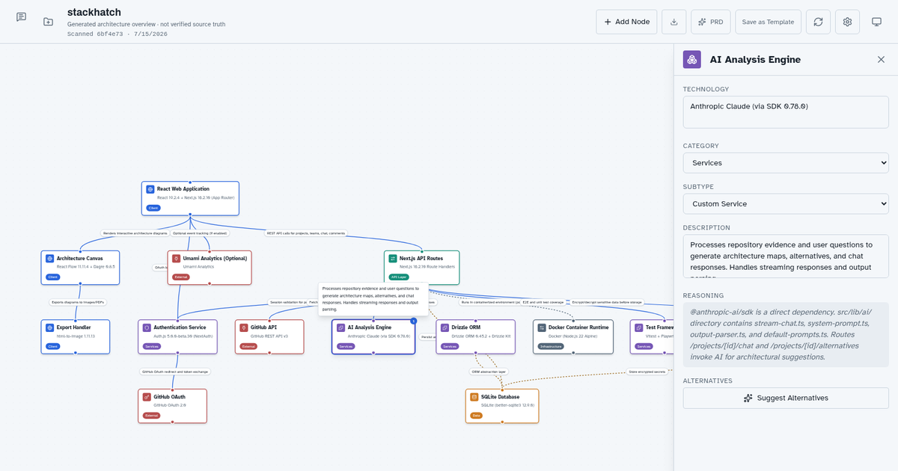

# StackHatch

Keep your architecture in view—without giving StackHatch your data.

StackHatch is a free, MIT-licensed, local-first architecture workspace. Start with a blank canvas,
a requirements file, a public GitHub repository, or a reusable template. Explore the system, ask
architecture questions, compare alternatives, and export the result.

[Try StackHatch](https://stackhatch.io) · [Help](https://stackhatch.io/support) ·
[Privacy](https://stackhatch.io/privacy) · [Terms](https://stackhatch.io/terms)



## Privacy by architecture

- No account, sign-in, application database, product analytics, or StackHatch data API.
- Maps, messages, repository evidence, templates, and preferences live in IndexedDB in the browser
  profile that created them.
- Blank editing is offline-capable after the application assets load.
- Public repository scans go directly from the browser to GitHub after an explicit action.
- AI actions go directly from the browser to Anthropic using the user's key after an explicit
  disclosure and confirmation.
- Keys stay in session memory by default. Remembering a key is explicit, device-local, and reversible.
- Backups exclude provider credentials. Clearing browser/site data can permanently remove local work.
- The production artifact is static and its host policy permits connections only to the site itself,
  GitHub's API, and Anthropic's API.

The static host still receives ordinary requests for application files, and GitHub or Anthropic
process the direct requests a user approves. The exact boundary is described in the
[privacy policy](https://stackhatch.io/privacy).

## Features

- Blank, requirements, public-repository, and personal-template starting points
- Editable React Flow canvas with typed nodes, connections, notes, locking, and auto-layout
- Contextual architecture chat, alternatives, and PRD generation with BYOK Anthropic access
- Bounded public GitHub evidence with partial-analysis warnings and revision provenance
- PNG, SVG, JSON, YAML, Markdown PRD, project backup, and full-vault backup exports
- Device-local themes, model preference, custom node subtypes, and reusable templates
- Conflict-safe writes, cross-tab coordination, storage recovery, and explicit destructive controls

Generated maps are explanations based on bounded evidence, not complete code or security audits.
Review output before using it for production decisions.

## Local development

Requirements: Node.js 22+ and npm 10+. No database, OAuth app, or server secret is required.

```bash
npm ci
cp .env.local.example .env.local
npm run dev
```

Open `http://localhost:3000`. Enter an Anthropic key in Settings only if you want to exercise AI
features. Do not put provider credentials in environment files.

## Quality and static release

```bash
npm test
npm run typecheck
npm run lint
npm run build
npm run test:e2e
```

`npm run build` creates `out/`, derives exact CSP hashes for its inline scripts, produces
`dist-host/Caddyfile`, and verifies the static artifact and network boundary. The export also
contains an `_headers` policy for compatible static hosts.

Build and run the production-equivalent, read-only static container:

```bash
docker compose --profile prod up --build
```

The container serves port 3000 with Caddy. It runs no Node process, accepts no runtime secrets, and
mounts no application data volume. Put TLS at the edge when exposing it publicly. Any alternate
host must preserve the generated CSP and security headers, serve extensionless routes from their
matching `.html` files, return `404.html` for unknown paths, and avoid injecting scripts or
analytics.

## Architecture

- Next.js produces the static application and public pages.
- React and React Flow run the workspace in the browser.
- IndexedDB owns durable workspace data; session memory or an isolated device store owns provider
  credentials according to the user's choice.
- The browser calls the official GitHub and Anthropic origins directly.
- Caddy serves only the final export with a read-only filesystem and restrictive headers.

See [docs/features.md](docs/features.md) for product behavior and
[docs/operations/local-first-cutover.md](docs/operations/local-first-cutover.md) for the
human-gated production transition.

## Contributing and security

Contributions are welcome; see [CONTRIBUTING.md](CONTRIBUTING.md). Use GitHub issues for ordinary
bugs and questions, without posting keys or private content. Report vulnerabilities through the
private process in [SECURITY.md](SECURITY.md).

StackHatch is available under the [MIT License](LICENSE).
