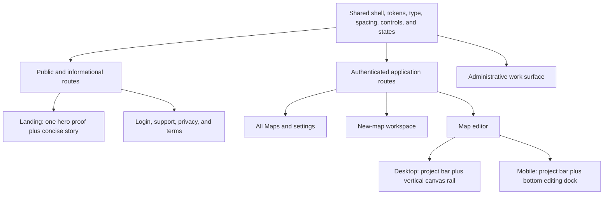

# System-Wide UI/UX Polish - Plan

## Goal Capsule

- **Objective:** Make every StackHatch route feel like part of one globally polished, quiet, and direct developer tool while simplifying the editor, new-map flow, and landing page.
- **Product authority:** The confirmed Product Contract governs visual hierarchy, behavior removals, and scope; the existing single-entry map-flow contract remains authoritative for resume and new-map navigation behavior.
- **Open blockers:** None before planning. Planning must preserve all behavior not explicitly changed here and must treat responsive and accessibility behavior as part of the product outcome.

---

## Product Contract

### Summary

StackHatch will receive one system-wide UI/UX polish pass across public, authenticated, administrative, and informational routes.
The editor will separate project actions from canvas tools, the new-map flow will remove redundant prompts, the landing page will tell a shorter proof-led story, and every remaining route will adopt the same visual and interaction grammar.

### Problem Frame

The current product has strong individual surfaces but does not yet read as one finished system.
The editor mixes labeled and icon-only controls in wrapping toolbars, the new-map workspace repeats actions inside already-clickable choices, and the landing page repeats product screenshots through multiple animated sections and a carousel.

Secondary routes use different widths, headers, back-navigation language, and control treatments.
Users therefore have to re-read interface hierarchy as they move through StackHatch, and the overall experience feels less restrained than the product's architecture-focused identity.

### Actors

- A1. A prospective developer evaluating StackHatch from the public landing, login, support, or legal routes.
- A2. An authenticated developer resuming, creating, browsing, or editing architecture maps.
- A3. An administrator managing users, node subtypes, or AI prompts in a deliberately dense work surface.
- A4. A keyboard, touch, or assistive-technology user who needs the same actions and state feedback without relying on hover, color, or desktop width.

### Key Decisions

- **Polish the whole product in one pass.** (session-settled: user-directed — chosen over a focused or authenticated-only pass: the result must feel globally polished.) No route may remain an obvious visual outlier at completion.
- **Use a canvas tool surface instead of another crowded top bar.** (session-settled: user-directed — chosen over a compact icon bar or primary-action-plus-overflow toolbar: editing tools and project actions need clear spatial separation.) Desktop uses a vertical canvas rail; mobile adapts it to a bottom dock.
- **Use a bottom dock on mobile.** (session-settled: user-directed — chosen over a collapsible side launcher or second toolbar row: mobile should preserve canvas width and keep frequent editing controls within thumb reach.) The dock yields when chat or node-detail panels take focus.
- **Make repository mapping a new-map-only capability.** (session-settled: user-directed — chosen over moving the existing-map action into overflow: attaching a repository should begin through the canonical new-map flow.) Repository-backed maps retain their re-scan behavior.
- **Keep one product proof on the landing page.** (session-settled: user-directed — chosen over an all-editorial page or a more compressed one-scroll page: one hero image proves the product is real without repeating screenshots.) The horizontal ticker, feature screenshot stack, and screenshot carousel are removed.
- **Unify presentation without rewriting substantive informational content.** (session-settled: user-directed — chosen over a content redesign: support, privacy, and terms should retain their meaning while adopting the shared system.)
- **Prefer icon-only controls only when recognition is strong.** All Maps, close, theme, repeated canvas tools, and familiar utilities may use icons with accessible names and non-hover discoverability; primary, destructive, or unfamiliar actions retain visible language where an icon would create ambiguity.
- **Keep density appropriate to the task.** (session-settled: user-approved — chosen over making every route visually identical: admin remains efficient and legal pages remain reading-first inside the shared system.) Coherence comes from common hierarchy, tokens, navigation, and interaction behavior rather than one universal layout.

The shared system and its route-specific compositions follow this shape:

### Requirements

**Global visual and interaction system**

- R1. Every user-facing route must use a coherent StackHatch shell, including landing, login, All Maps, new-map, editor, settings, admin, support, privacy, and terms.
- R2. Navigation, wordmark treatment, back behavior, page-width rhythm, typography, spacing, borders, elevation, and surface hierarchy must feel intentionally related across routes.
- R3. Controls must follow one hierarchy: a small number of visible primary actions, familiar icon-only utilities, clearly named unfamiliar actions, and visually distinct destructive actions.
- R4. Icon-only controls must expose accessible names, visible keyboard focus, and a discoverable label that does not depend exclusively on pointer hover.
- R5. Every changed surface must preserve keyboard access, 44-pixel touch targets where space permits, reduced-motion behavior, responsive layouts, status announcements, recoverable errors, and non-color-only state communication.
- R6. Light and dark themes must receive equal visual QA, with no route treated as a theme-specific afterthought.

**Editor hierarchy**

- R7. The editor's project bar must contain project identity, navigation, and project-level actions without wrapping into a second action row at supported desktop widths.
- R8. Desktop editing and canvas-view controls must live in a stable vertical canvas rail rather than compete with project actions in the project bar.
- R9. On phone-sized layouts, the canvas rail must become a thumb-reachable bottom dock that preserves full canvas width and does not compete with device-safe areas.
- R10. The rail or dock must yield when chat, node details, connection selection, or another focused editor panel would otherwise overlap or obscure it.
- R11. All Maps navigation in the editor must become an icon-only control with an accessible label, while the project title and relevant provenance remain readable and protected from action crowding.
- R12. Infrequent project workflows must be grouped or demoted so Add Node, chat, and canvas navigation read as the primary editing controls.
- R13. Projects without repository provenance must no longer expose Map repository or any equivalent attach-to-current-map action.
- R14. Repository-backed projects must retain their existing re-scan, confirmation, provenance, and failure-recovery behavior.

**New-map workspace**

- R15. Each source card must remain one keyboard- and pointer-activatable choice, and the redundant Use this source line must be removed.
- R16. Each source choice must show only the information needed to decide: its name, a short outcome, and any material prerequisite or accepted input.
- R17. Cancel map creation must become a conventional close control with an accessible name and must retain the existing safe return behavior.
- R18. The workspace must expose one clear All Maps escape and must not repeat the same navigation at both the top and bottom of the chooser.
- R19. The Start a new map introduction and surrounding chrome must be compressed so the four source choices become the dominant content.

**Landing page**

- R20. The landing page must retain one real product image in the hero as its sole screenshot-driven proof.
- R21. The horizontal word ticker, animated feature screenshot stack, and screenshot use-case carousel must be removed.
- R22. The page must present a direct sequence of hero promise, compact trust proof, concise capability story, short workflow, and final start action without repeating the same message in standalone sections.
- R23. Feature and use-case explanations must use concise text, restrained icons, or typographic structure rather than additional product screenshots.
- R24. Landing navigation and calls to action must prioritize Start a map while keeping sign-in, source, theme, and informational destinations available without equal visual weight.

**Application and informational routes**

- R25. All Maps, settings, and admin must adopt the shared shell and control hierarchy while preserving their existing data, permissions, operations, and feedback states.
- R26. All Maps must keep New map as its visible primary action and retain clear, accessible open and delete behaviors for each map.
- R27. Settings must preserve API-key, model, and theme behavior while reducing repeated framing and aligning form, status, and action treatments with the shared system.
- R28. Admin must preserve productive density, responsive data access, destructive confirmation, and impersonation clarity rather than adopting marketing-page spacing.
- R29. Login, support, privacy, and terms must use the shared public shell and reading rhythm without changing authentication behavior or the substantive support and legal content.
- R30. Public and authenticated navigation labels must use the single-entry vocabulary established by the existing map-flow contract: Start or resume a map, New map, and All Maps.

### Key Flows

- F1. Evaluate StackHatch
  - **Trigger:** A1 arrives on the landing page.
  - **Steps:** Read the product promise, inspect the single hero proof, scan capabilities and trust, then choose Start a map, sign in, or source information.
  - **Outcome:** The visitor understands what StackHatch does without navigating a screenshot-heavy page.
  - **Covered by:** R1-R6, R20-R24, R29-R30.
- F2. Work in the editor
  - **Trigger:** A2 opens a map on desktop or mobile.
  - **Steps:** Read project identity in the project bar, use the rail or dock for editing and canvas controls, and open secondary project workflows without toolbar wrapping.
  - **Outcome:** The map remains the dominant surface and controls have a predictable spatial hierarchy.
  - **Covered by:** R3-R14.
- F3. Start or cancel a map
  - **Trigger:** A2 enters the new-map workspace.
  - **Steps:** Scan four concise source cards, activate the whole chosen card, or use the close control to return safely.
  - **Outcome:** Source selection is immediate, non-redundant, and consistent across input modes.
  - **Covered by:** R15-R19, R30.
- F4. Move across the product
  - **Trigger:** A1, A2, or A3 navigates between public, application, admin, or informational routes.
  - **Steps:** Recognize the shared shell, use consistent navigation and controls, and encounter route-appropriate density without relearning the interface.
  - **Outcome:** Every route feels intentionally part of StackHatch.
  - **Covered by:** R1-R6, R25-R30.

### Acceptance Examples

- AE1. Desktop editor hierarchy
  - **Given:** A repository-backed map is open at a supported desktop width.
  - **When:** The editor renders with all available actions.
  - **Then:** The project bar remains one row, editing tools occupy the canvas rail, All Maps is icon-only and accessible, and re-scan remains available as a secondary project workflow.
  - **Covers:** R7-R12, R14.
- AE2. Existing standalone map
  - **Given:** A blank, requirements, or template map has no repository provenance.
  - **When:** The user inspects every project and overflow action.
  - **Then:** No Map repository or equivalent attach-to-current-map action is available; repository mapping begins only through New map.
  - **Covers:** R13, R30.
- AE3. Mobile editing
  - **Given:** A map is open on a phone-sized viewport.
  - **When:** The canvas is active and no focused panel is open.
  - **Then:** Editing controls appear in the bottom dock without consuming canvas width; opening chat or node details removes the dock from competition with that panel.
  - **Covers:** R9-R10.
- AE4. New-map choice
  - **Given:** The source chooser is visible.
  - **When:** A keyboard, touch, or screen-reader user selects a source or cancels.
  - **Then:** The whole source card activates once, no Use this source label is present, and the close control returns to the safe origin with an accessible name.
  - **Covers:** R15-R19.
- AE5. Landing proof
  - **Given:** The landing page is fully loaded.
  - **When:** A visitor scans from hero to final action.
  - **Then:** Exactly one product screenshot appears in the hero, no ticker or screenshot carousel appears, and each remaining section adds a distinct part of the product story.
  - **Covers:** R20-R24.
- AE6. Secondary-route coherence
  - **Given:** A user visits settings, admin, support, privacy, or terms in both themes and at desktop and mobile widths.
  - **When:** They compare navigation, page rhythm, controls, states, and content.
  - **Then:** Each route belongs to the shared system while admin remains dense and informational content remains unchanged in meaning.
  - **Covers:** R1-R6, R25, R27-R29.

### Success Criteria

- Every user-facing route passes a single cross-route visual review in light and dark themes at phone and desktop widths, with no legacy shell or control treatment left as an obvious outlier.
- The editor project bar stays on one row at supported desktop widths and the mobile canvas retains full width behind a reachable bottom dock.
- The new-map chooser communicates all four sources without redundant action text or duplicate escape navigation.
- The landing page contains one hero product image and no marquee, feature-story screenshot stack, or use-case screenshot carousel.
- All changed icon-only actions are operable and understandable by keyboard, touch, and assistive technology without relying on hover or color.
- Existing automated behavior remains green except where tests intentionally change for the removal of existing-map repository attachment and the confirmed presentation changes.

### Scope Boundaries

**Included**

- Shared shells, visual tokens, typography, spacing, page-width rhythm, control hierarchy, interaction states, and responsive behavior across every user-facing route.
- Structural simplification of the editor chrome, new-map workspace, and landing page.
- Route-specific polish for All Maps, settings, admin, login, support, privacy, and terms.
- Removal of repository attachment from existing non-repository maps.

**Excluded**

- Rewriting the substantive support, privacy, or terms content.
- A new brand identity, logo system, illustration system, pricing model, or marketing campaign.
- Net-new editor capabilities, repository-analysis behavior, AI providers, authentication methods, project data models, or analytics collection.
- Broad application architecture changes that do not directly enable the confirmed user-facing requirements.

### Dependencies and Assumptions

- The primary audience remains developers evaluating or working with architecture maps; no new audience or product positioning is introduced.
- `docs/plans/2026-07-16-001-single-entry-map-flow-plan.md` remains authoritative for resume, New map, All Maps, safe-return, and compatibility behavior.
- Existing functionality remains in scope for regression protection unless a requirement above explicitly removes or changes it.
- Global polish means shared principles with route-appropriate density, not identical component composition on every page.

### Sources and Research

- `docs/plans/2026-07-16-001-single-entry-map-flow-plan.md` — existing navigation, creation, compatibility, accessibility, and responsive contract.
- `docs/prds/launch-positioning-redesign.md` — established quiet, direct, developer-instrument visual direction and productive-density constraint.
- `src/app/project/[id]/page.tsx` — current mixed and wrapping editor toolbar, repository attachment, editor panels, and responsive shell.
- `src/components/projects/ProjectStartWorkspace.tsx` — current whole-card source choices, redundant action copy, cancellation, and chooser navigation.
- `src/app/page.tsx` — current hero proof, word ticker, screenshot-driven feature stories, use-case carousel, trust, and call-to-action sequence.
- `src/app/globals.css` and representative secondary routes under `src/app/` — current tokens, focus and motion rules, theme behavior, and independent route shells.
