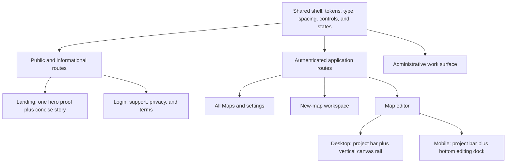
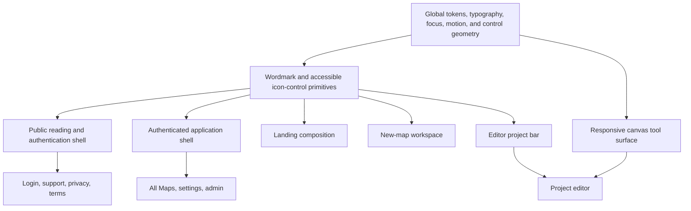
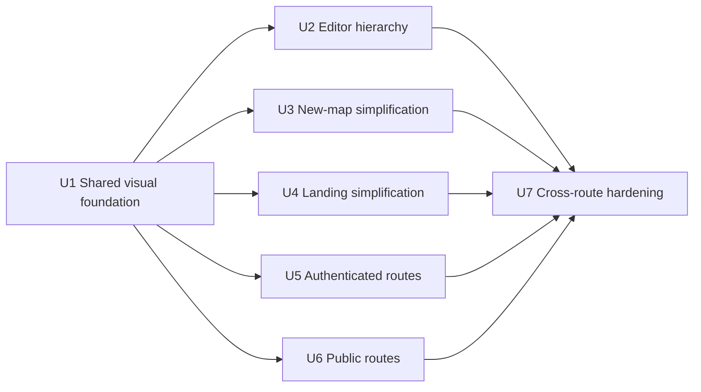

# System-Wide UI/UX Polish - Plan

## Goal Capsule

- **Objective:** Make every StackHatch route feel like part of one globally polished, quiet, and direct developer tool while simplifying the editor, new-map flow, and landing page.
- **Product authority:** The confirmed Product Contract governs visual hierarchy, behavior removals, and scope; the existing single-entry map-flow contract remains authoritative for resume and new-map navigation behavior.
- **Open blockers:** None before planning. Planning must preserve all behavior not explicitly changed here and must treat responsive and accessibility behavior as part of the product outcome.

---

## Product Contract

### Summary

StackHatch will receive one system-wide UI/UX polish pass across public, authenticated, administrative, and informational routes.
The implementation will add shared presentation primitives, separate editor project actions from canvas tools, simplify map creation and the landing page, and preserve each route's existing business behavior and appropriate density.

### Problem Frame

The current product has strong individual surfaces but does not yet read as one finished system.
The editor mixes labeled and icon-only controls in wrapping toolbars, the new-map workspace repeats actions inside already-clickable choices, and the landing page repeats product screenshots through multiple animated sections and a carousel.

Secondary routes use different widths, headers, back-navigation language, and control treatments.
Users therefore have to re-read interface hierarchy as they move through StackHatch, and the overall experience feels less restrained than the product's architecture-focused identity.

### Actors

- A1. A prospective developer evaluating StackHatch from the public landing, login, support, or legal routes.
- A2. An authenticated developer resuming, creating, browsing, or editing architecture maps.
- A3. An administrator managing users, node subtypes, or AI prompts in a deliberately dense work surface.
- A4. A keyboard, touch, or assistive-technology user who needs the same actions and state feedback without relying on hover, color, or desktop width.

### Key Decisions

- **Polish the whole product in one pass.** (session-settled: user-directed — chosen over a focused or authenticated-only pass: the result must feel globally polished.) No route may remain an obvious visual outlier at completion.
- **Use a canvas tool surface instead of another crowded top bar.** (session-settled: user-directed — chosen over a compact icon bar or primary-action-plus-overflow toolbar: editing tools and project actions need clear spatial separation.) Desktop uses a vertical canvas rail; mobile adapts it to a bottom dock.
- **Use a bottom dock on mobile.** (session-settled: user-directed — chosen over a collapsible side launcher or second toolbar row: mobile should preserve canvas width and keep frequent editing controls within thumb reach.) The dock yields when chat or node-detail panels take focus.
- **Make repository mapping a new-map-only capability.** (session-settled: user-directed — chosen over moving the existing-map action into overflow: attaching a repository should begin through the canonical new-map flow.) Repository-backed maps retain their re-scan behavior.
- **Keep one product proof on the landing page.** (session-settled: user-directed — chosen over an all-editorial page or a more compressed one-scroll page: one hero image proves the product is real without repeating screenshots.) The horizontal ticker, feature screenshot stack, and screenshot carousel are removed.
- **Unify presentation without rewriting substantive informational content.** (session-settled: user-directed — chosen over a content redesign: support, privacy, and terms should retain their meaning while adopting the shared system.)
- **Prefer icon-only controls only when recognition is strong.** All Maps, close, theme, repeated canvas tools, and familiar utilities may use icons with accessible names and non-hover discoverability; primary, destructive, or unfamiliar actions retain visible language where an icon would create ambiguity.
- **Keep density appropriate to the task.** (session-settled: user-approved — chosen over making every route visually identical: admin remains efficient and legal pages remain reading-first inside the shared system.) Coherence comes from common hierarchy, tokens, navigation, and interaction behavior rather than one universal layout.

The shared system and its route-specific compositions follow this shape:



### Requirements

**Global visual and interaction system**

- R1. Every user-facing route must use a coherent StackHatch shell, including landing, login, All Maps, new-map, editor, settings, admin, support, privacy, and terms.
- R2. Navigation, wordmark treatment, back behavior, page-width rhythm, typography, spacing, borders, elevation, and surface hierarchy must feel intentionally related across routes.
- R3. Controls must follow one hierarchy: a small number of visible primary actions, familiar icon-only utilities, clearly named unfamiliar actions, and visually distinct destructive actions.
- R4. Icon-only controls must expose accessible names, visible keyboard focus, and a discoverable label that does not depend exclusively on pointer hover.
- R5. Every changed surface must preserve keyboard access, 44-pixel touch targets where space permits, reduced-motion behavior, responsive layouts, status announcements, recoverable errors, and non-color-only state communication.
- R6. Light and dark themes must receive equal visual QA, with no route treated as a theme-specific afterthought.

**Editor hierarchy**

- R7. The editor's project bar must contain project identity, navigation, and project-level actions without wrapping into a second action row at supported desktop widths.
- R8. Desktop editing and canvas-view controls must live in a stable vertical canvas rail rather than compete with project actions in the project bar.
- R9. On phone-sized layouts, the canvas rail must become a thumb-reachable bottom dock that preserves full canvas width and does not compete with device-safe areas.
- R10. The rail or dock must yield when chat, node details, connection selection, or another focused editor panel would otherwise overlap or obscure it.
- R11. All Maps navigation in the editor must become an icon-only control with an accessible label, while the project title and relevant provenance remain readable and protected from action crowding.
- R12. Infrequent project workflows must be grouped or demoted so Add Node, chat, and canvas navigation read as the primary editing controls.
- R13. Projects without repository provenance must no longer expose Map repository or any equivalent attach-to-current-map action.
- R14. Repository-backed projects must retain their existing re-scan, confirmation, provenance, and failure-recovery behavior.

**New-map workspace**

- R15. Each source card must remain one keyboard- and pointer-activatable choice, and the redundant Use this source line must be removed.
- R16. Each source choice must show only the information needed to decide: its name, a short outcome, and any material prerequisite or accepted input.
- R17. Cancel map creation must become a conventional close control with an accessible name and must retain the existing safe return behavior.
- R18. The workspace must expose one clear All Maps escape and must not repeat the same navigation at both the top and bottom of the chooser.
- R19. The Start a new map introduction and surrounding chrome must be compressed so the four source choices become the dominant content.

**Landing page**

- R20. The landing page must retain one real product image in the hero as its sole screenshot-driven proof.
- R21. The horizontal word ticker, animated feature screenshot stack, and screenshot use-case carousel must be removed.
- R22. The page must present a direct sequence of hero promise, compact trust proof, concise capability story, short workflow, and final start action without repeating the same message in standalone sections.
- R23. Feature and use-case explanations must use concise text, restrained icons, or typographic structure rather than additional product screenshots.
- R24. Landing navigation and calls to action must prioritize Start a map while keeping sign-in, source, theme, and informational destinations available without equal visual weight.

**Application and informational routes**

- R25. All Maps, settings, and admin must adopt the shared shell and control hierarchy while preserving their existing data, permissions, operations, and feedback states.
- R26. All Maps must keep New map as its visible primary action and retain clear, accessible open and delete behaviors for each map.
- R27. Settings must preserve API-key, model, and theme behavior while reducing repeated framing and aligning form, status, and action treatments with the shared system.
- R28. Admin must preserve productive density, responsive data access, destructive confirmation, and impersonation clarity rather than adopting marketing-page spacing.
- R29. Login, support, privacy, and terms must use the shared public shell and reading rhythm without changing authentication behavior or the substantive support and legal content.
- R30. Public and authenticated navigation labels must use the single-entry vocabulary established by the existing map-flow contract: Start or resume a map, New map, and All Maps.

### Key Flows

- F1. Evaluate StackHatch
  - **Trigger:** A1 arrives on the landing page.
  - **Steps:** Read the product promise, inspect the single hero proof, scan capabilities and trust, then choose Start a map, sign in, or source information.
  - **Outcome:** The visitor understands what StackHatch does without navigating a screenshot-heavy page.
  - **Covered by:** R1-R6, R20-R24, R29-R30.
- F2. Work in the editor
  - **Trigger:** A2 opens a map on desktop or mobile.
  - **Steps:** Read project identity in the project bar, use the rail or dock for editing and canvas controls, and open secondary project workflows without toolbar wrapping.
  - **Outcome:** The map remains the dominant surface and controls have a predictable spatial hierarchy.
  - **Covered by:** R3-R14.
- F3. Start or cancel a map
  - **Trigger:** A2 enters the new-map workspace.
  - **Steps:** Scan four concise source cards, activate the whole chosen card, or use the close control to return safely.
  - **Outcome:** Source selection is immediate, non-redundant, and consistent across input modes.
  - **Covered by:** R15-R19, R30.
- F4. Move across the product
  - **Trigger:** A1, A2, or A3 navigates between public, application, admin, or informational routes.
  - **Steps:** Recognize the shared shell, use consistent navigation and controls, and encounter route-appropriate density without relearning the interface.
  - **Outcome:** Every route feels intentionally part of StackHatch.
  - **Covered by:** R1-R6, R25-R30.

### Acceptance Examples

- AE1. Desktop editor hierarchy
  - **Given:** A repository-backed map is open at a supported desktop width.
  - **When:** The editor renders with all available actions.
  - **Then:** The project bar remains one row, editing tools occupy the canvas rail, All Maps is icon-only and accessible, and re-scan remains available as a secondary project workflow.
  - **Covers:** R7-R12, R14.
- AE2. Existing standalone map
  - **Given:** A blank, requirements, or template map has no repository provenance.
  - **When:** The user inspects every project and overflow action.
  - **Then:** No Map repository or equivalent attach-to-current-map action is available; repository mapping begins only through New map.
  - **Covers:** R13, R30.
- AE3. Mobile editing
  - **Given:** A map is open on a phone-sized viewport.
  - **When:** The canvas is active and no focused panel is open.
  - **Then:** Editing controls appear in the bottom dock without consuming canvas width; opening chat or node details removes the dock from competition with that panel.
  - **Covers:** R9-R10.
- AE4. New-map choice
  - **Given:** The source chooser is visible.
  - **When:** A keyboard, touch, or screen-reader user selects a source or cancels.
  - **Then:** The whole source card activates once, no Use this source label is present, and the close control returns to the safe origin with an accessible name.
  - **Covers:** R15-R19.
- AE5. Landing proof
  - **Given:** The landing page is fully loaded.
  - **When:** A visitor scans from hero to final action.
  - **Then:** Exactly one product screenshot appears in the hero, no ticker or screenshot carousel appears, and each remaining section adds a distinct part of the product story.
  - **Covers:** R20-R24.
- AE6. Secondary-route coherence
  - **Given:** A user visits settings, admin, support, privacy, or terms in both themes and at desktop and mobile widths.
  - **When:** They compare navigation, page rhythm, controls, states, and content.
  - **Then:** Each route belongs to the shared system while admin remains dense and informational content remains unchanged in meaning.
  - **Covers:** R1-R6, R25, R27-R29.

### Success Criteria

- Every user-facing route passes a single cross-route visual review in light and dark themes at phone and desktop widths, with no legacy shell or control treatment left as an obvious outlier.
- The editor project bar stays on one row at supported desktop widths and the mobile canvas retains full width behind a reachable bottom dock.
- The new-map chooser communicates all four sources without redundant action text or duplicate escape navigation.
- The landing page contains one hero product image and no marquee, feature-story screenshot stack, or use-case screenshot carousel.
- All changed icon-only actions are operable and understandable by keyboard, touch, and assistive technology without relying on hover or color.
- Existing automated behavior remains green except where tests intentionally change for the removal of existing-map repository attachment and the confirmed presentation changes.

### Scope Boundaries

**Included**

- Shared shells, visual tokens, typography, spacing, page-width rhythm, control hierarchy, interaction states, and responsive behavior across every user-facing route.
- Structural simplification of the editor chrome, new-map workspace, and landing page.
- Route-specific polish for All Maps, settings, admin, login, support, privacy, and terms.
- Removal of repository attachment from existing non-repository maps.

**Excluded**

- Rewriting the substantive support, privacy, or terms content.
- A new brand identity, logo system, illustration system, pricing model, or marketing campaign.
- Net-new editor capabilities, repository-analysis behavior, AI providers, authentication methods, project data models, or analytics collection.
- Broad application architecture changes that do not directly enable the confirmed user-facing requirements.

### Dependencies and Assumptions

- The primary audience remains developers evaluating or working with architecture maps; no new audience or product positioning is introduced.
- `docs/plans/2026-07-16-001-single-entry-map-flow-plan.md` remains authoritative for resume, New map, All Maps, safe-return, and compatibility behavior.
- Existing functionality remains in scope for regression protection unless a requirement above explicitly removes or changes it.
- Global polish means shared principles with route-appropriate density, not identical component composition on every page.

### Sources and Research

- `docs/plans/2026-07-16-001-single-entry-map-flow-plan.md` — existing navigation, creation, compatibility, accessibility, and responsive contract.
- `docs/prds/launch-positioning-redesign.md` — established quiet, direct, developer-instrument visual direction and productive-density constraint.
- `src/app/project/[id]/page.tsx` — current mixed and wrapping editor toolbar, repository attachment, editor panels, and responsive shell.
- `src/components/projects/ProjectStartWorkspace.tsx` — current whole-card source choices, redundant action copy, cancellation, and chooser navigation.
- `src/app/page.tsx` — current hero proof, word ticker, screenshot-driven feature stories, use-case carousel, trust, and call-to-action sequence.
- `src/app/globals.css` and representative secondary routes under `src/app/` — current tokens, focus and motion rules, theme behavior, and independent route shells.

---

## Planning Contract

### Product Contract Preservation

The Product Contract above is preserved as the authority for behavior and scope. This Planning Contract only resolves implementation shape, responsive thresholds, component boundaries, sequencing, and verification. If implementation evidence conflicts with a Product Contract decision, stop and resolve the conflict instead of silently changing the requirement.

### Key Technical Decisions

- KTD1. Build a small presentation layer from `IconControl`, `StackHatchWordmark`, `PublicPageShell`, and `AppPageShell`; keep route data loading, mutations, authorization, and feedback state in their current owners. (session-settled: user-approved — chosen over route-by-route polish or a universal stateful shell: shared presentation creates coherence without coupling unrelated behavior.)
- KTD2. Treat `src/app/globals.css` and `.impeccable.md` as the visual baseline: quiet broad planes, small radii, restrained elevation, warm technical color, existing typography variables, and no gradients, glass effects, or decorative animation.
- KTD3. Split editor controls by task. The project bar contains All Maps, New map, project identity/provenance, repository re-scan when applicable, export, a secondary actions menu for PRD and Save as Template, and theme. The canvas tool surface contains chat, Add Node, zoom, fit view, and editor display settings. (session-settled: user-approved — chosen over keeping export, PRD, template, Add Node, and canvas controls in one wrapping toolbar: project and editing actions need separate spatial hierarchy.)
- KTD4. Render the canvas tool surface as a vertical rail at `min-width: 768px` and a bottom dock below 768px. Use compact project actions from 768–1023px and require a single-row project bar from 1024px upward. (session-settled: user-approved — chosen over a desktop-only rail or a second mobile toolbar row: the same editing model must remain reachable without consuming mobile canvas width.)
- KTD5. Hide the mobile dock while chat, node details, connection selection, or a modal owns focus; restore it when the canvas becomes active. Keep a dock-originated popover's trigger present while that popover is open, reserve `env(safe-area-inset-bottom)`, and preserve the impersonation banner height offset.
- KTD6. Remove the non-repository project's attach-to-current-map state, form, and button from the editor only. Keep `scanTrigger`, repository provenance, re-scan confirmation, replacement semantics, focus restoration, and recovery for repository-backed maps. (session-settled: user-directed — chosen over moving Map repository into overflow: repository mapping begins through New map.)
- KTD7. Keep `ProjectStartWorkspace` as the creation-flow owner. Replace an existing safe-return cancel link with an X-shaped `IconControl`, retain the accessible name `Cancel map creation`, and show it only when a validated `returnTo` exists. Direct entry keeps one All Maps escape, while source subflows retain Choose another source. (session-settled: user-approved — chosen over showing an ambiguous X on direct entry: close must have a known safe destination.)
- KTD8. Recompose the landing page as hero promise and single proof, compact trust evidence, concise capability story, short workflow, and final start action. Delete the ticker, `ProductStoryStack`, and `UseCaseCarousel`; remove GSAP packages and non-hero screenshots after reference checks prove they are unused. (session-settled: user-directed — chosen over an all-editorial page or retaining multiple screenshot sections: one real product proof is sufficient.)
- KTD9. Use two shared shell compositions rather than one universal layout. Public reading/authentication routes use `PublicPageShell`; authenticated library/settings/admin routes use `AppPageShell`, with an explicit dense mode for admin. Landing, new-map, and editor reuse primitives and tokens but retain purpose-built composition. (session-settled: user-approved — chosen over one identical shell everywhere: coherence must not reduce editor or admin productivity.)
- KTD10. Icon-only controls use one convention: 44px target where space permits, `aria-label`, decorative icons hidden from assistive technology, visible focus, and a label visible on hover and keyboard focus. Touch users receive familiar icons only; unfamiliar, primary, and destructive actions retain text.
- KTD11. Keep visual changes data-model-free and API-compatible. No schema, authentication, authorization, analytics payload, repository-analysis, or project-start route contract changes are permitted.

### High-Level Technical Design



The editor remains the owner of project, canvas, selection, chat, and modal state. A presentational `EditorToolSurface` receives that state and callbacks, renders inside the canvas positioning context, and switches rail/dock orientation with CSS. This avoids moving React Flow state or project mutations into a global shell.

The route shells accept slots for identity, navigation, page heading, actions, content, and optional footer. They do not fetch session data or perform mutations. Existing route tests remain the behavioral authority; shell tests cover only semantic structure and icon discoverability that route tests cannot express cleanly.

### Editor Control Inventory

| Surface          | Control                     | Responsive behavior                                              | Visibility and state                                                           |
| ---------------- | --------------------------- | ---------------------------------------------------------------- | ------------------------------------------------------------------------------ |
| Project bar      | All Maps                    | Icon-only at all widths                                          | Accessible label and focus-visible tooltip                                     |
| Project bar      | New map                     | Icon-only at all widths                                          | Preserves `returnTo=/project/[id]`                                             |
| Project bar      | Project identity/provenance | Truncates before actions; commit/status may compact below 1024px | Repository metadata remains readable through title or stacked compact text     |
| Project bar      | Re-scan repository          | Icon-only                                                        | Repository-backed projects only; current confirmation and recovery stay intact |
| Project bar      | Export                      | Icon-only secondary utility                                      | Non-empty maps only; existing export choices remain available                  |
| Project bar      | More actions                | Icon-only trigger, labeled menu items                            | Contains PRD and Save as Template for non-empty maps                           |
| Project bar      | Theme                       | Existing icon control                                            | Remains available in editor chrome                                             |
| Canvas rail/dock | Chat                        | Icon-only with pressed state                                     | Opens the current chat panel; dock yields while the panel is active on mobile  |
| Canvas rail/dock | Add Node                    | Existing labeled dropdown may compact to its icon trigger        | Remains the primary edit action                                                |
| Canvas rail/dock | Zoom in, zoom out, fit view | Familiar icon-only controls                                      | Reuse React Flow behavior and keyboard access                                  |
| Canvas rail/dock | Display settings            | Existing icon-only dropdown                                      | Dock stays present while its anchored popover is open                          |

### Responsive and Focus-State Rules

| State                    | Below 768px                                             | 768–1023px                                            | 1024px and above                      |
| ------------------------ | ------------------------------------------------------- | ----------------------------------------------------- | ------------------------------------- |
| Canvas active            | Bottom dock above safe area                             | Vertical rail, compact project actions                | Vertical rail, single-row project bar |
| Chat open                | Dock hidden; existing stacked chat owns interaction     | Rail remains beside side panel if it does not overlap | Rail remains beside side panel        |
| Node details open        | Dock hidden; drawer remains unobscured                  | Rail remains unless the drawer overlaps its hit area  | Rail remains                          |
| Connection selector open | Dock hidden unless opened from a dock control           | Rail remains                                          | Rail remains                          |
| Save/re-scan modal open  | Dock and rail inert behind modal                        | Dock and rail inert behind modal                      | Dock and rail inert behind modal      |
| Impersonation active     | Dock/rail and editor height account for banner variable | Same                                                  | Same                                  |

### System-Wide Impact

- **Data and APIs:** no migrations or endpoint changes. Editor repository-attachment UI is deleted without changing the repository re-scan endpoint.
- **Authentication and authorization:** existing redirects, admin role checks, impersonation banner, callback sanitization, and safe-return handling remain in their current modules.
- **Dependencies:** `@gsap/react` and `gsap` are removed only after all runtime references disappear; `lucide-react`, Tailwind, React Flow, and existing theme infrastructure remain.
- **Accessibility:** shell landmarks, heading order, dialog focus behavior, status announcements, reduced motion, touch targets, and icon-control names are regression requirements.
- **Performance:** deleting scroll animation code and redundant screenshots must not add a replacement animation library or client-side landing bundle work.
- **Content:** support, privacy, and terms wording remains substantively unchanged. Landing copy may be condensed only from existing approved claims and current single-entry vocabulary.

### Implementation Constraints

- Preserve the route and safe-return behavior in `docs/plans/2026-07-16-001-single-entry-map-flow-plan.md`.
- Keep the editor's existing `--impersonation-banner-height` contract and reduced-motion behavior.
- Do not nest interactive controls inside other buttons when composing project menus or tool surfaces.
- Do not hide destructive actions behind unlabeled icons; map deletion and admin destructive operations retain visible or context-specific labels and confirmations.
- Do not make landing layout changes by importing application-shell density or card grids into the marketing page.
- Delete screenshot assets only when `rg` confirms no remaining code, metadata, test, README, or stylesheet reference.
- Preserve current analytics components and event semantics; removing a presentation region must not invent replacement analytics.

### Sequencing



U2–U6 may proceed independently after U1. Keep each unit in an atomic conventional commit; U7 is the integration and browser-hardening commit after the route units have landed.

### Risks and Mitigations

- **Editor geometry regressions:** the chat panel, node drawer, React Flow controls, modals, dock, rail, and impersonation banner can compete for space. Mitigate with explicit state predicates, 320/390/768/1024/1440 viewport coverage, and overlap assertions.
- **Creation cancellation regression:** a visual X could bypass the existing pending `FileReader` cancellation. Keep the current cancellation callback and safe URL validation wired to the new control, with stale-read regression tests unchanged.
- **Repository feature over-removal:** deleting `scanTrigger` or shared scan state would break re-scan. Remove only the standalone attach form/state and add an explicit absence test beside the existing re-scan suite.
- **Shell over-abstraction:** one configurable component could accumulate route business branches. Restrict shells to layout slots and style variants; leave fetching, mutations, roles, and copy with the route.
- **Theme drift:** broad polish can look correct in one theme only. Browser verification must exercise light and dark for every shell family and editor controls.
- **Brittle presentation tests:** replace text-position assertions with semantic roles, accessible names, screenshot counts, region presence/absence, overflow, and focus behavior.

---

## Implementation Units

### U1. Establish the shared visual foundation

**Goal:** Create the minimal presentation primitives and global control/surface rules that later route units can reuse without moving business logic.

**Dependencies:** None.

**Requirements:** R1–R6, R29. **Flows:** F4. **Acceptance:** AE6. **Decisions:** KTD1, KTD2, KTD9–KTD11.

**Files:**

- `src/app/globals.css`
- `src/components/ui/IconControl.tsx` (new)
- `src/components/ui/IconControl.test.tsx` (new)
- `src/components/shells/StackHatchWordmark.tsx` (new)
- `src/components/shells/PublicPageShell.tsx` (new)
- `src/components/shells/AppPageShell.tsx` (new)
- `src/components/shells/PageShells.test.tsx` (new)

**Approach:**

1. Normalize shared control geometry, quiet surface hierarchy, focus-visible treatment, tooltip styling, page gutters, and shell width variables in global CSS. Preserve existing semantic color variables and light/dark values unless contrast verification requires a targeted adjustment.
2. Implement `IconControl` for button and link use without nested interactive elements. Support accessible label, icon, optional pressed/disabled state, and a tooltip exposed by hover and `:focus-visible`.
3. Extract the current StackHatch wordmark treatment into a semantic home/resume link with a route-supplied destination and accessible label.
4. Implement public and authenticated page shells as presentational slot compositions. Add a dense variant for admin, a reading-width variant for legal content, and responsive header/action wrapping that preserves 44px controls.
5. Keep landing, editor, and creation layout bespoke; they consume tokens and primitives rather than being forced into a shell intended for document/application pages.

**Test Scenarios:**

- U1-T1. Keyboard focus on an icon button and icon link exposes both a visible outline and its text label; decorative SVGs remain hidden from the accessibility tree.
- U1-T2. Pressed, disabled, and active icon states communicate through semantics and shape/text treatment, not color alone.
- U1-T3. Public, authenticated, dense, and reading shell variants render one primary landmark and preserve caller-supplied navigation and headings.
- U1-T4. Global reduced-motion rules still collapse animation and transition duration without removing focus or state feedback.

**Verification:**

```bash
npm test -- src/components/ui/IconControl.test.tsx src/components/shells/PageShells.test.tsx
npm run typecheck
```

### U2. Rebuild the editor hierarchy around a project bar and responsive tool surface

**Goal:** Keep the map dominant by separating project workflows from frequent canvas controls, removing attach-to-current-map, and preserving repository re-scan.

**Dependencies:** U1.

**Requirements:** R3–R14, R30. **Flows:** F2. **Acceptance:** AE1–AE3. **Decisions:** KTD3–KTD6, KTD10–KTD11.

**Files:**

- `src/app/project/[id]/page.tsx`
- `src/app/project/[id]/page.test.tsx`
- `src/components/canvas/EditorToolSurface.tsx` (new)
- `src/components/canvas/EditorToolSurface.test.tsx` (new)
- `src/components/canvas/AddNodeDropdown.tsx`
- `src/components/canvas/AddNodeDropdown.test.tsx`
- `src/components/canvas/EditorDisplaySettingsDropdown.tsx`
- `src/components/canvas/ExportDropdown.tsx`
- `src/components/canvas/ExportDropdown.test.tsx`
- `src/components/chat/ChatSidebar.tsx`
- `src/components/chat/ChatSidebar.test.tsx`
- `src/app/globals.css`

**Approach:**

1. Replace the wrapping toolbar with a one-row project bar. Protect identity/provenance with `min-width: 0`, truncate only the project name, and keep full repository details available through compact secondary text or accessible title text.
2. Convert All Maps to `IconControl`. Preserve New map and repository re-scan as accessible icon utilities and keep the current `returnTo` and confirmation flows.
3. Keep export as a familiar secondary icon utility. Add an accessible More actions menu with labeled PRD and Save as Template items, preserving loading, disabled, modal, and focus-restoration behavior.
4. Remove `showScanInput`, `scanUrlInput`, the Map repository button, and its inline form for projects without `repoUrl`. Do not remove `scanTrigger`, `startRepositoryRescan`, re-scan confirmation state, or repository provenance updates.
5. Add `EditorToolSurface` inside the canvas positioning context. Compose chat, Add Node, React Flow zoom/fit controls, and display settings; render vertical at 768px and above and horizontal below 768px.
6. Derive one `toolSurfaceObscured` state for phone layouts from chat, node-detail, connection-selection, and modal state. Keep the surface mounted for dock-originated popovers and make background tools inert while dialogs are active.
7. Account for `--impersonation-banner-height` and `env(safe-area-inset-bottom)`. Ensure the dock does not narrow the canvas, cover attribution/controls, or create horizontal overflow.

**Test Scenarios:**

- U2-T1. A non-repository project has no Map repository button, repository field, or equivalent More-menu item, while New map remains available.
- U2-T2. A repository-backed map retains accessible re-scan, replacement confirmation, focus trap/restoration, updated provenance, stale-selection cleanup, and recoverable failure behavior.
- U2-T3. At 1024px and 1440px the project bar has one row; project name/provenance does not push actions into a second row.
- U2-T4. At 768px the vertical rail is present and project actions use their compact form without overlap.
- U2-T5. At 320px and 390px the bottom dock preserves full canvas width, 44px targets, focus order, and safe-area clearance.
- U2-T6. Opening chat, node details, a connection selector, Save Template, or re-scan confirmation hides or inerts the mobile dock as specified; closing the focused surface restores it.
- U2-T7. An impersonated session reserves the banner height for the editor, chat toggle, rail, and dock.
- U2-T8. All Maps, New map, export, re-scan, More, theme, chat, Add Node, fit, zoom, and display settings are named and keyboard operable without relying on hover.

**Verification:**

```bash
npm test -- 'src/app/project/[id]/page.test.tsx' src/components/canvas/EditorToolSurface.test.tsx src/components/canvas/AddNodeDropdown.test.tsx src/components/canvas/ExportDropdown.test.tsx src/components/chat/ChatSidebar.test.tsx
npm run typecheck
```

### U3. Simplify the new-map workspace without changing creation behavior

**Goal:** Make the four source choices dominant, remove redundant prompts and navigation, and preserve all safe-return and asynchronous cancellation behavior.

**Dependencies:** U1.

**Requirements:** R1–R6, R15–R19, R30. **Flows:** F3. **Acceptance:** AE4. **Decisions:** KTD7, KTD10–KTD11.

**Files:**

- `src/components/projects/ProjectStartWorkspace.tsx`
- `src/components/projects/ProjectStartWorkspace.test.tsx`
- `src/app/project/new/page.tsx`
- `src/app/project/new/page.test.tsx`
- `e2e/new-project.test.ts`

**Approach:**

1. Compress the workspace header and Start a new map introduction so the source grid appears earlier and carries the page hierarchy.
2. Keep each source as one semantic button with icon, name, short outcome, and only material prerequisite/input metadata. Remove `Use this source` and its arrow from every card.
3. When `returnTo` is valid, render an X-shaped cancel link using `IconControl`; call the current requirements-read cancellation handler and preserve `aria-disabled` during submission.
4. On direct entry, omit the X and keep one All Maps escape in the workspace header. Remove the duplicate chooser footer link and redundant explanatory footer chrome.
5. Preserve Choose another source in requirements, repository, and template subflows. Do not change blank one-shot intent, file validation, repository normalization, BYOK continuation, template copying, analytics, or recoverable error state.
6. Reduce border density and vertical padding while retaining two-column source choices when space permits and a single column at phone widths.

**Test Scenarios:**

- U3-T1. The chooser exposes four keyboard-reachable source buttons and contains no `Use this source` text.
- U3-T2. Existing-map entry shows one X named `Cancel map creation`; activation returns to the validated project and prevents a pending requirements read from creating a map later.
- U3-T3. Direct `/project/new` has no ambiguous X and exactly one All Maps escape.
- U3-T4. Blank creates once; requirements reject empty/unreadable content; repository preserves BYOK return context; template copies without an AI-key check.
- U3-T5. Submission errors remain recoverable and successful double submission remains prevented.
- U3-T6. The chooser and each subflow fit at 320px without clipped cards, duplicate navigation, or inaccessible controls.

**Verification:**

```bash
npm test -- src/components/projects/ProjectStartWorkspace.test.tsx src/app/project/new/page.test.tsx
npm run test:e2e -- e2e/new-project.test.ts
```

### U4. Recompose the landing page around one proof and a shorter story

**Goal:** Make the public value proposition direct and polished while removing screenshot repetition and animation-only code.

**Dependencies:** U1.

**Requirements:** R1–R6, R20–R24, R29–R30. **Flows:** F1, F4. **Acceptance:** AE5–AE6. **Decisions:** KTD2, KTD8, KTD10–KTD11.

**Files:**

- `src/app/page.tsx`
- `src/app/page.test.tsx`
- `src/app/landing.module.css`
- `src/components/public/ProductStoryStack.tsx` (delete)
- `src/components/public/UseCaseCarousel.tsx` (delete)
- `src/components/public/UseCaseCarousel.test.tsx` (delete)
- `package.json`
- `package-lock.json`
- `public/screenshots/ask-and-compare.webp` (delete after reference check)
- `public/screenshots/ask-and-compare-mobile.webp` (delete after reference check)
- `public/screenshots/note-node-and-rescan.webp` (delete after reference check)
- `public/screenshots/note-node-and-rescan-mobile.webp` (delete after reference check)
- `e2e/launch-experience.test.ts`

**Approach:**

1. Keep the existing hero promise, Start a map priority, sign-in/source/theme access, responsive hero proof, and GitHub trust signal. Align the header wordmark and icon-control treatment with U1.
2. Remove the marquee and its duplicated input vocabulary.
3. Replace the sticky screenshot story and carousel with one concise capability sequence using editorial rows, restrained Lucide icons, and short existing claims. Avoid repetitive icon-card grids.
4. Compress the current start, workflow, use-case, and trust material into the agreed sequence: hero and proof, compact trust, capability story, short workflow, final action. Each section must contribute a distinct claim.
5. Delete `ProductStoryStack`, `UseCaseCarousel`, their obsolete tests/selectors, `@gsap/react`, and `gsap`. Regenerate the lockfile through the package manager.
6. Preserve `architecture-overview.webp`, `architecture-overview-mobile.webp`, and `architecture-overview-og.png`. Delete the four non-hero screenshots only after a repository-wide reference search returns no consumer.
7. Replace animation-specific tests with structural, responsive, theme, overflow, reduced-motion, and exactly-one-product-screenshot assertions.

**Test Scenarios:**

- U4-T1. The landing page renders exactly one in-page product screenshot, using the existing responsive hero sources; social-preview metadata remains unchanged.
- U4-T2. No marquee, sticky story stack, carousel, or carousel navigation is present.
- U4-T3. The page order is hero/proof, trust, capabilities, workflow, and final CTA; Start a map remains the strongest action and sign-in/source/informational links remain available.
- U4-T4. The page has no horizontal overflow at 320px, keeps the hero proof in the initial desktop experience, and remains usable in reduced-motion mode.
- U4-T5. Light and dark themes retain readable contrast, quiet surfaces, visible focus, and no theme-specific missing borders or images.
- U4-T6. Production dependencies and static assets contain no orphaned GSAP or removed-screenshot references.

**Verification:**

```bash
npm test -- src/app/page.test.tsx
npm run test:e2e -- e2e/launch-experience.test.ts
test -z "$(npm ls @gsap/react gsap --parseable 2>/dev/null)"
```

The final dependency assertion must return an empty installed-package list; treat any output as a failed cleanup.

### U5. Apply the authenticated shell to All Maps, settings, and admin

**Goal:** Give authenticated secondary routes one navigation and control grammar while preserving their data, permission, and feedback behavior.

**Dependencies:** U1.

**Requirements:** R1–R6, R25–R28, R30. **Flows:** F4. **Acceptance:** AE6. **Decisions:** KTD1–KTD2, KTD9–KTD11.

**Files:**

- `src/components/AllMapsPage.tsx`
- `src/components/AllMapsPage.test.tsx`
- `src/app/app/maps/page.tsx`
- `src/app/settings/page.tsx`
- `src/app/settings/settings-page.test.tsx`
- `src/app/admin/page.tsx`
- `src/app/admin/page.test.tsx`
- `src/components/ImpersonationBanner.tsx`
- `src/components/ImpersonationBanner.test.tsx`

**Approach:**

1. Move All Maps into `AppPageShell`; keep New map as the sole visible primary action and retain theme, settings, conditional admin, avatar, open, retry, empty, delete, and footer behavior.
2. Align map-card spacing, focus, hover, metadata, and delete affordance with the shared hierarchy. Keep delete context-specific, accessible, and confirmed.
3. Move settings into the shared shell with an icon back control and route-provided safe `returnTo`. Reduce repeated card framing while preserving BYOK status, key actions, model persistence, theme buttons, setup continuation, toast messages, and callback sanitization.
4. Move admin into the dense shell variant. Preserve tabs, role checks, loading/error state, subtype and prompt operations, destructive confirmation, responsive data access, and Resume map vocabulary.
5. Verify the impersonation banner remains visually distinct, readable in both themes, and compatible with sticky headers and the editor height variable.

**Test Scenarios:**

- U5-T1. All Maps renders owned maps in API order, keeps one New map primary action, and preserves retry, empty, open, and confirmed delete flows.
- U5-T2. All authenticated utility icons have names and focus labels; conditional Admin navigation still follows the supplied role.
- U5-T3. Settings preserves key/model/theme mutations, rollback/error feedback, setup context, and sanitized return paths after shell adoption.
- U5-T4. Admin preserves authorized operations and dense responsive access without marketing-sized spacing or hidden destructive context.
- U5-T5. Impersonation remains unmistakable and does not obscure authenticated headers or editor controls.

**Verification:**

```bash
npm test -- src/components/AllMapsPage.test.tsx src/app/settings/settings-page.test.tsx src/app/admin/page.test.tsx src/components/ImpersonationBanner.test.tsx
npm run typecheck
```

### U6. Apply the public shell to login, support, privacy, and terms

**Goal:** Make public secondary routes feel intentionally related to the landing page while preserving authentication and substantive informational content.

**Dependencies:** U1, U4.

**Requirements:** R1–R6, R24, R29–R30. **Flows:** F1, F4. **Acceptance:** AE6. **Decisions:** KTD1–KTD2, KTD9–KTD11.

**Files:**

- `src/app/login/page.tsx`
- `src/app/login/login-page.test.tsx`
- `src/app/support/page.tsx`
- `src/app/support/page.test.tsx` (new)
- `src/app/privacy/page.tsx`
- `src/app/privacy/page.test.tsx` (new)
- `src/app/terms/page.tsx`
- `src/app/terms/page.test.tsx` (new)
- `src/components/shells/PublicPageShell.tsx`
- `src/app/globals.css`

**Approach:**

1. Use the public shell's shared wordmark, home/back navigation, theme utility, page gutters, and footer treatment across login, support, privacy, and terms.
2. Keep login's compact centered task, GitHub authentication form, callback sanitization, repository/start context, and private-repository disclaimer unchanged.
3. Keep support's contact path, BYOK/evidence guidance, trust links, source actions, anchors, and mail address unchanged in meaning. Polish hierarchy and reduce unnecessary card repetition.
4. Keep privacy and terms text verbatim except markup-only changes. Use the reading-width shell, consistent effective-date treatment, semantic sections, and readable line height.
5. Ensure each route has one H1, one main landmark, usable mobile navigation, and visible light/dark focus and link states.

**Test Scenarios:**

- U6-T1. Login accepts safe callbacks, rejects unsafe callbacks, preserves repository context, and submits the same GitHub sign-in destination after shell adoption.
- U6-T2. Support retains contact, BYOK, evidence, privacy, terms, source, and star destinations with the same substantive guidance.
- U6-T3. Privacy and terms headings, effective dates, support references, and substantive paragraph text remain unchanged.
- U6-T4. Each public secondary route fits at 320px, exposes theme and home navigation, and remains readable in light and dark themes.

**Verification:**

```bash
npm test -- src/app/login/login-page.test.tsx src/app/support/page.test.tsx src/app/privacy/page.test.tsx src/app/terms/page.test.tsx
npm run typecheck
```

### U7. Integrate and harden the cross-route experience

**Goal:** Prove the route families work as one system across theme, viewport, keyboard, touch-target, and focused-panel states.

**Dependencies:** U2, U3, U4, U5, U6.

**Requirements:** R1–R30. **Flows:** F1–F4. **Acceptance:** AE1–AE6. **Decisions:** KTD1–KTD11.

**Files:**

- `e2e/ui-polish.test.ts` (new)
- `e2e/launch-experience.test.ts`
- `e2e/new-project.test.ts`
- `e2e/full-flow.test.ts`
- `e2e/smoke.test.ts`
- Any route/component file from U1–U6 requiring a regression fix discovered by browser verification

**Approach:**

1. Add a Playwright UI-polish suite covering representative public, authenticated, admin, creation, and editor routes rather than snapshotting every DOM detail.
2. Exercise light and dark themes at 390×844 and 1440×900 for every shell family. Add editor-specific checks at 320×720, 768×900, and 1024×768.
3. Assert no horizontal overflow, visible H1/main landmarks, one clear primary action, icon accessible names, and route-appropriate density.
4. Drive editor chat, node details, dock/rail, connection selection where fixture data permits, re-scan confirmation, and impersonation geometry. Verify bounding boxes do not overlap active controls.
5. Run a keyboard pass through navigation, icon controls, source cards, menus, dialogs, and destructive confirmations. Verify focus returns to invokers and never moves behind active modal content.
6. Capture baseline screenshots as CI artifacts only when a failure needs diagnosis; do not commit brittle pixel snapshots unless the repository establishes a visual-regression service.
7. Fix integration defects within the owning unit's component rather than layering route-specific CSS overrides in the e2e unit.

**Test Scenarios:**

- U7-T1. Landing, login, support, privacy, terms, All Maps, settings, admin, new-map, and editor routes share wordmark/control/spacing grammar without losing route-specific density.
- U7-T2. All changed routes pass light/dark and phone/desktop checks with no horizontal scrolling, clipped primary action, or missing focus state.
- U7-T3. Editor tool surface and panels satisfy the control inventory and responsive state table without overlap at all target widths.
- U7-T4. Existing end-to-end map start, creation, open, edit, repository re-scan, settings, admin, and error flows remain green except for intentionally removed editor repository attachment.
- U7-T5. Reduced-motion mode disables decorative movement without making menus, dialogs, status, or focus changes undiscoverable.

**Verification:**

```bash
npm run test:e2e -- e2e/ui-polish.test.ts e2e/launch-experience.test.ts e2e/new-project.test.ts e2e/full-flow.test.ts e2e/smoke.test.ts
```

---

## Verification Contract

### Unit and Integration Gates

Run focused tests while each unit is active, then run the complete suite after U7:

```bash
npm test
npm run typecheck
npm run lint
npm run build
```

Run the changed-route browser suite after the production build gate succeeds:

```bash
npm run test:e2e -- e2e/ui-polish.test.ts e2e/launch-experience.test.ts e2e/new-project.test.ts e2e/full-flow.test.ts e2e/smoke.test.ts
```

The repository-wide Prettier baseline has known unrelated failures tracked separately. Format every changed supported file and verify the diff-scoped set:

```bash
git diff --name-only --diff-filter=ACMRTUXB origin/main...HEAD -- '*.ts' '*.tsx' '*.css' '*.md' '*.json' | xargs --no-run-if-empty npx prettier --check
```

### Behavioral Proof Matrix

| Proof                        | Automated evidence                                | Browser evidence                                              |
| ---------------------------- | ------------------------------------------------- | ------------------------------------------------------------- |
| Shared control accessibility | `IconControl` and route component tests           | Keyboard focus labels and 44px target inspection              |
| Editor desktop hierarchy     | Project editor unit tests                         | 1024/1440 one-row bar and rail geometry                       |
| Editor mobile hierarchy      | Tool-surface and project tests                    | 320/390 dock, safe area, panel-yield, and focus order         |
| Repository boundary          | Standalone absence and re-scan regression tests   | Non-repo menu inspection and repo re-scan confirmation        |
| New-map simplification       | Workspace and route tests                         | Four cards, no redundant action text, X/direct-entry behavior |
| Landing simplification       | Landing component tests                           | Exactly one proof, no ticker/carousel, light/dark/320px       |
| Secondary-route coherence    | All Maps/settings/admin/login and new route tests | Public/app shell matrix with route-appropriate density        |
| Behavior preservation        | Full Vitest and selected Playwright suites        | Map start/open/edit/settings/admin/error smoke flows          |

### Manual Visual Review

Use a real browser after automated gates. Review landing, login, support, privacy, terms, All Maps, settings, admin, new-map, a standalone editor, and a repository-backed editor in light and dark themes at 390×844 and 1440×900. Review editor additionally at 320×720, 768×900, and 1024×768. Check hierarchy, spacing rhythm, contrast, clipping, control discoverability, safe-area behavior, panel overlap, loading/error/empty states, destructive confirmation, and impersonation clarity.

The result fails visual review if any route retains an obvious legacy header/control treatment, if admin becomes unnecessarily spacious, if legal text meaning changes, or if a control can only be understood through pointer hover.

### Cleanup Gates

- Repository-wide search finds no `ProductStoryStack`, `UseCaseCarousel`, marquee selector, `@gsap/react`, `gsap`, editor `showScanInput`/`scanUrlInput` state, attach-to-current-map form, `Use this source`, or deleted screenshot reference outside historical documentation. The New map repository source may retain its `Map repository` action label.
- No abandoned shell variant, duplicate icon-control implementation, temporary CSS override, commented experiment, or unused asset remains.
- `package-lock.json` matches `package.json`, and `test -z "$(npm ls @gsap/react gsap --parseable 2>/dev/null)"` confirms the removed packages are absent.
- `git diff --check` reports no whitespace errors.

### Failure Handling

- If a shell migration breaks route behavior, revert that route to its existing business owner and narrow the shell to presentation slots; do not copy state logic into the shell.
- If the editor dock cannot avoid a focused panel at a target width, hide it for that state and restore it on panel close; do not shrink targets below 44px.
- If deleting a landing asset reveals a non-obvious metadata or documentation consumer, retain the asset and remove only runtime code that is proven unused.
- If a Product Contract decision conflicts with an existing route invariant, stop execution and surface the conflict before changing scope.

---

## Definition of Done

### Global Completion

- Every Product Contract requirement is implemented and traced to a passing unit scenario or browser proof.
- Every listed route uses the shared visual grammar with appropriate public, reading, authenticated, admin, creation, or editor composition.
- The full unit, type, lint, build, selected e2e, diff-scoped format, cleanup, and whitespace gates pass.
- Light/dark and phone/desktop manual visual review is complete, including editor panel and impersonation states.
- No schema, API, authentication, authorization, project-start, repository-analysis, or substantive legal/support behavior changed outside the explicit Product Contract.
- Experimental approaches, obsolete animation code, unused dependencies/assets, duplicate primitives, and dead CSS are removed from the final diff.

### Unit Completion

- U1 is done when shared primitives and shell compositions are semantic, tested, theme-complete, and contain no route business logic.
- U2 is done when the project bar/rail/dock match the control inventory, standalone repository attachment is absent, re-scan is preserved, and geometry tests pass.
- U3 is done when source cards and navigation are simplified while safe return, cancellation, source creation, BYOK continuation, and recoverable errors remain green.
- U4 is done when the landing page contains one in-page product screenshot, the removed presentation stack and dependencies are absent, and responsive/theme browser tests pass.
- U5 is done when All Maps, settings, and admin share authenticated grammar without losing data, permissions, density, feedback, or impersonation clarity.
- U6 is done when login/support/privacy/terms share public grammar without changing authentication or substantive informational content.
- U7 is done when the cross-route browser matrix passes and any integration defect is fixed in its owning component.

### Traceability

| Product scope                        | Implementation units | Required proof                                                                  |
| ------------------------------------ | -------------------- | ------------------------------------------------------------------------------- |
| R1–R6 global system                  | U1–U7                | Shared primitive tests, route shell matrix, light/dark and responsive review    |
| R7–R14 editor hierarchy              | U2, U7               | Editor unit tests, control inventory, desktop/mobile geometry and re-scan proof |
| R15–R19 new-map workspace            | U3, U7               | Workspace tests, direct/safe-return browser paths, 320px chooser proof          |
| R20–R24 landing                      | U4, U6, U7           | Landing unit/e2e assertions, dependency/asset cleanup, one-proof review         |
| R25–R28 authenticated routes         | U5, U7               | All Maps/settings/admin tests and authenticated route review                    |
| R29–R30 public routes and vocabulary | U1–U7                | Public/authenticated navigation, content-preservation tests, and route review   |
| F1 evaluate StackHatch               | U4, U6, U7           | Landing-to-start/sign-in/source/info browser paths                              |
| F2 work in editor                    | U2, U7               | Desktop/mobile edit, panel, project-action, and repository-state paths          |
| F3 start or cancel a map             | U3, U7               | Four source paths, safe cancel, direct entry, and recoverable errors            |
| F4 move across product               | U1, U4, U5, U6, U7   | Cross-route navigation, shell, theme, and density matrix                        |
| AE1–AE3 editor examples              | U2, U7               | Repository desktop, standalone absence, and mobile dock scenarios               |
| AE4 new-map example                  | U3, U7               | Whole-card activation, no redundant label, accessible X/safe origin             |
| AE5 landing example                  | U4, U7               | Exactly one proof and no ticker/story/carousel                                  |
| AE6 route coherence                  | U1, U4, U5, U6, U7   | Public/app/admin/reading shells in both themes and viewport classes             |
