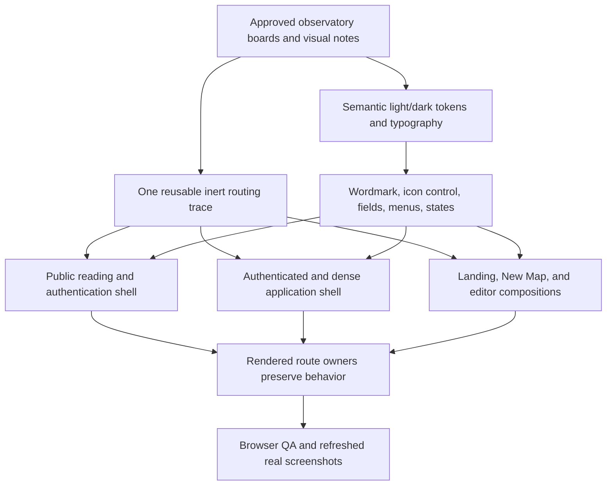

# StackHatch Observatory UI Redesign - Plan

## Goal Capsule

- **Objective:** Translate the approved architecture-observatory concept boards into the live StackHatch interface across every rendered route while preserving current behavior, content authority, accessibility, and productive editor density.
- **Authority hierarchy:** The current request and `docs/design/stackhatch-observatory/` govern visual direction; `docs/plans/2026-07-16-002-feat-system-wide-ui-ux-polish-plan.md` and `docs/plans/2026-07-16-001-single-entry-map-flow-plan.md` govern existing behavior; route tests and current source govern details the documents do not specify.
- **Stop conditions:** Stop rather than invent a mockup-only feature, weaken an established accessibility or navigation contract, alter an API/data model, or make a visual choice that fails contrast in either theme.
- **Execution profile:** Treat this as a behavior-preserving presentation change. Establish shared primitives first, use focused component tests for semantic structure, and use real-browser inspection for responsive and visual fidelity.
- **Tail ownership:** The LFG pipeline owns simplification, review remediation, browser QA, commit, PR creation, and CI through a decided state.

---

## Product Contract

### Summary

StackHatch will adopt the architecture-observatory system shown in the two approved concept boards: pale mineral work surfaces, deep technical typography, Blueprint/Oxide/Signal accents, crisp one-pixel boundaries, and a single graph-derived routing trace. The redesign covers the landing page, sign-in, All Maps, map creation, editor, settings, admin, support, privacy, and terms. `/app` remains a resolver rather than gaining a standalone screen.

### Problem Frame

The July polish pass made the product coherent, but the live interface still reads as a restrained generic developer dashboard. The approved boards give StackHatch a product-specific identity derived from its architecture graphs. The implementation must make that identity real without copying fictional navigation, data, or product capabilities from the mockups.

### Actors

- A1. A prospective developer evaluating StackHatch on the landing, sign-in, support, or legal routes.
- A2. An authenticated developer browsing, creating, and editing architecture maps.
- A3. An administrator managing users, node subtypes, and AI prompts in a dense work surface.
- A4. A keyboard, touch, reduced-motion, or assistive-technology user who needs the same information and actions without relying on color, pointer hover, or desktop width.

### Requirements

#### Shared visual language

- R1. Every rendered route must use the Fog, Paper, Ink, Blueprint, Oxide, and Signal semantic system in both light and dark themes, with theme-specific values that preserve each role.
- R2. Archivo, Atkinson Hyperlegible, and IBM Plex Mono must retain their display, body, and utility roles with a tighter, instrument-like hierarchy.
- R3. Each rendered page composition must expose exactly one non-interactive routing trace derived from architecture-map edges; it must be hidden from assistive technology, clipped inside the viewport, and independent of motion.
- R4. Shared controls, boundaries, focus states, status colors, modals, menus, and empty/error states must use precise one-pixel borders, small radii, restrained elevation, and accessible contrast.
- R5. Oxide and Signal may not carry normal-size text on Fog or Paper at the concept values; normal text must use Ink or a darker semantic foreground, and state meaning must never depend on color alone.
- R6. The wordmark and shared shell must become recognizably part of the observatory system without changing destination semantics or adding unsupported navigation.

#### Public routes

- R7. The landing page must preserve its hero, one real product screenshot, trust, capabilities, workflow, and final action sequence while adopting the new composition and trace.
- R8. Landing navigation and copy must remain grounded in current destinations and claims; mockup-only Product, Solutions, Pricing, Teams, customer logos, and collaboration claims must not be added.
- R9. Sign-in must keep GitHub authentication, safe callback/start-source context, and the public-repository disclaimer while adopting the focused observatory panel.
- R10. Support, privacy, and terms must preserve substantive content and links while gaining the shared reading shell, clear section rhythm, and responsive trace treatment.

#### Authenticated and administrative routes

- R11. All Maps must retain current API ordering, loading, error, retry, empty, open, and delete states; one New map action remains primary, and no star, team, search, pagination, trash, or sharing data may be invented.
- R12. Settings must retain only its Anthropic key, default model, appearance, setup-return, persistence, and feedback behavior while presenting them as compact instrument sections.
- R13. Admin must retain its current Users, Node Subtypes, and Prompts tabs, including roles, impersonation, deletion, subtype editing, and AI prompt editing, while remaining dense and horizontally usable on small screens.
- R14. Authenticated pages may use contextual navigation or section rails only when they point to existing routes or real in-page sections; compact mobile layouts must not introduce horizontal page overflow.

#### Creation and editor

- R15. New Map must keep exactly four whole-card sources and all current blank, requirements, repository, template, BYOK, safe-return, retry, and error behavior; it must not become a fictional review wizard.
- R16. The editor must preserve its single-row project bar, desktop rail/mobile dock, map-dominant canvas, no-MiniMap contract, repository-only re-scan, safe-area handling, impersonation offset, and focus restoration.
- R17. Architecture nodes, edges, labels, legend, chat, detail panel, menus, dialogs, and canvas states must adopt the observatory system without changing graph data, domain types, editing semantics, or export boundaries.
- R18. The trace decoration must remain visually distinct from real React Flow edges and must never enter the graph viewport or its accessibility semantics.

#### Compatibility and verification

- R19. Authentication, authorization, analytics payloads, API routes, database schema, resolver behavior, project-start URLs, support/legal meaning, and settings persistence must remain compatible.
- R20. Existing stable test IDs and accessible names must remain unless a structural change requires an intentional test update; keyboard access, visible focus, 44-pixel direct controls where space permits, reduced motion, and status announcements remain regression requirements.
- R21. The real product screenshots used by the landing page and repository preview must be refreshed after the live editor styling stabilizes so public proof does not show the retired visual system.

### Key Flows

- F1. Evaluate the product: A1 scans the landing promise and real product proof, then follows an existing start, sign-in, source, support, or legal destination without encountering fictional capabilities.
- F2. Move through the application: A2 recognizes the same wordmark, trace, semantic surfaces, and control hierarchy across All Maps, New Map, Settings, and the editor while each route retains its task-appropriate density.
- F3. Work on a map: A2 uses project actions, canvas tools, chat, node details, and dialogs at desktop or phone width without the decorative system competing with graph content.
- F4. Administer safely: A3 uses the current admin operations in a denser observatory composition with permissions, confirmations, and responsive table access intact.

### Acceptance Examples

- AE1. Given any listed route in light or dark mode, when it renders, then it uses the semantic observatory tokens, contains one inert trace without overflow, communicates state beyond color, and keeps normal text at accessible contrast.
- AE2. Given the landing page at 320×720 or 1440×900, when it loads, then the five existing regions remain in order, exactly one real product screenshot appears, current navigation and claims remain, and the trace does not obscure content or focus.
- AE3. Given All Maps in loading, error, empty, populated, or delete-confirmation state, when the user interacts at desktop or phone width, then current ordering and operations remain, one New map action is primary, no board-only fields appear, and the page does not overflow horizontally.
- AE4. Given direct or safe-return New Map entry, when a keyboard or touch user chooses a source or exits, then exactly four sources remain, direct entry has one All Maps escape and no ambiguous cancel, safe-return entry restores its origin, and every source flow behaves as before.
- AE5. Given an editor at 320, 390, 768, 1024, or 1440 pixels, when chat, node details, connection selection, menus, modals, long titles, or impersonation are active, then the project bar and 44-pixel tools remain reachable, the rail/dock yields correctly, and the map remains dominant.
- AE6. Given Settings or Admin in either theme, when actual form, table, tab, success, error, confirmation, and rollback states appear, then only current sections and operations render and all current state transitions remain intact.
- AE7. Given sign-in, support, privacy, or terms at desktop or phone width, when the route renders, then it has one main landmark and one H1, preserves callback/content/link behavior, and remains readable without horizontal overflow.

### Success Criteria

- Every rendered route matches one coherent observatory system in light and dark themes, with no obvious legacy visual outlier.
- The routing trace is recognizable across route families but appears only once per page composition and never interferes with interaction or graph semantics.
- All current Vitest and Playwright behavior contracts pass after intentional structure-test updates.
- Browser review covers desktop and phone widths, route-specific states, both themes, focus, reduced motion, contrast, and horizontal overflow.
- Public screenshots show the redesigned live product rather than an image-generated mockup or retired chrome.

### Scope Boundaries

#### Included

- Semantic design tokens, typography hierarchy, wordmark treatment, trace primitive, shared shells, controls, responsive structure, and route-specific visual composition.
- Restyling of the landing page, sign-in, public reading routes, All Maps, New Map, Settings, Admin, editor chrome, graph nodes/edges, chat, details, menus, modals, and empty/error/loading states.
- Updates to structural UI tests, browser geometry checks, and real product screenshots required by the redesign.

#### Excluded

- New teams, collaboration, sharing, search, starring, pagination, billing, notification, audit, usage, role, repository-owner, tag, community, or status-page capabilities shown illustratively in the boards.
- New routes, APIs, data fields, schema changes, authentication methods, AI providers, analytics events, editor capabilities, or repository-analysis behavior.
- Rewriting support or legal substance, changing the single-entry map flow, adding React Flow MiniMap, or replacing current graph editing semantics.
- Broad pixel-snapshot coverage; real-browser inspection is preferred over locking every responsive/theme combination to image diffs.

### Assumptions

- The light-only boards define roles rather than literal dark-theme values; the implementation will derive accessible dark counterparts.
- Board copy, sample data, and secondary controls are illustrative; current route owners, tests, and data contracts are authoritative.
- Existing semantic HTML, accessible names, and stable test IDs are retained wherever possible to separate visual change from behavioral churn.

---

## Planning Contract

### Visual Token Contract

| Role          | Light     | Dark      | Intended use                                  |
| ------------- | --------- | --------- | --------------------------------------------- |
| Fog           | `#EEF3F3` | `#101B23` | Page and canvas background                    |
| Paper         | `#FAFCFB` | `#172730` | Raised panels, menus, and reading surfaces    |
| Ink           | `#10222F` | `#EDF5F4` | Primary text and high-contrast controls       |
| Blueprint     | `#23658A` | `#77B7E0` | Primary actions, active navigation, and focus |
| Oxide         | `#3C9B92` | `#69C2B8` | Service categories and positive state         |
| Signal        | `#E47B43` | `#F0A172` | Data categories and warning attention         |
| Boundary      | `#C8D6D8` | `#35505D` | One-pixel borders and dividers                |
| Muted surface | `#E1E9E9` | `#223640` | Hover, selected, and subdued regions          |
| Muted text    | `#526875` | `#A9BDC3` | Secondary copy and utility metadata           |

Ink is the default text on Fog and Paper. Blueprint may carry normal text on light surfaces; Oxide and Signal use Ink on filled light surfaces or their lighter dark variants on dark surfaces. Status, focus, and selection always pair color with text, iconography, shape, or boundary change.

### Route Information Architecture Contract

| Route family               | Global/header destinations                                               | Contextual navigation                                         | Mobile behavior                                                                                       |
| -------------------------- | ------------------------------------------------------------------------ | ------------------------------------------------------------- | ----------------------------------------------------------------------------------------------------- |
| Landing `/`                | Features, workflow, source, sign in, support, theme, Start a map         | None; hero carries the page trace                             | Collapse secondary text links before the primary start action; keep one row without document overflow |
| Sign-in `/login`           | Home wordmark and theme                                                  | None; authentication remains the sole task                    | Center the focused sign-in panel and keep callback context above the form                             |
| Support `/support`         | Home wordmark and theme                                                  | Existing `first-map`, `byok`, and `evidence` sections         | Render section navigation as a contained horizontal list above content                                |
| Legal `/privacy`, `/terms` | Home wordmark and theme                                                  | Privacy and Terms, with current-page state                    | Render the two legal destinations above the reading column                                            |
| All Maps `/app/maps`       | Resume wordmark, New map, Settings, role-gated Admin, theme/user actions | None; the map list is the task surface                        | Stack map metadata and keep open/delete actions reachable without a wide page table                   |
| Settings `/settings`       | All Maps, role-gated Admin, theme/user actions                           | Anthropic API key, Default model, Appearance anchors          | Move anchors above the form as a contained horizontal list                                            |
| Admin `/admin`             | All Maps, Settings, theme/user actions                                   | Existing Users, Node Subtypes, and Prompts tabs               | Keep tabs reachable above content and allow only the data table itself to scroll horizontally         |
| New Map `/project/new`     | All Maps, Settings, theme                                                | None; source cards and the active source subflow own the page | Stack source choices and preserve the safe-return control rules                                       |
| Editor `/project/[id]`     | Existing project bar actions                                             | Existing desktop canvas rail/mobile dock                      | Preserve the editor's 768-pixel rail/dock breakpoint and focused-panel yielding                       |
| Resolver `/app`            | None; redirect status only                                               | None                                                          | Center the transient status within one trace-bearing main landmark                                    |

### Responsive Contract

| Width            | Shared/public routes                                                                                                 | Application routes                                                                                                                                  | New Map                                                           |
| ---------------- | -------------------------------------------------------------------------------------------------------------------- | --------------------------------------------------------------------------------------------------------------------------------------------------- | ----------------------------------------------------------------- |
| Below 640px      | Compact header, single-column hero/reading content, contained contextual navigation, full-width primary actions      | Stacked All Maps rows and settings sections; admin tabs above content with table-local scrolling                                                    | One source card per row and single-column source forms            |
| 640-1023px       | Expanded header where space permits; landing proof remains below copy until the desktop composition fits             | Two-column sections where content supports them; contextual navigation remains above content; All Maps stays a readable list                        | Two-by-two source grid and constrained detail forms               |
| 1024px and above | Full observatory header and board-inspired wide landing composition; reading routes may use a narrow contextual rail | App shell may place real contextual navigation in a fixed-width rail; All Maps uses aligned data rows; Settings and Admin retain productive density | Four source cards in one row when labels and 44-pixel targets fit |

Intermediate checks at 768 and 1024 pixels are required for every shell transformation. The editor keeps its existing independent breakpoint contract from R16.

### Key Technical Decisions

- KTD1. Use the architecture-observatory boards as the visual authority. (session-settled: user-approved — chosen over retaining the current generic blue-neutral developer dashboard: the graph-derived system gives StackHatch a product-specific identity.)
- KTD2. Carry the approved Fog/Paper/Ink/Blueprint/Oxide/Signal roles, existing three-font stack, small radii, precise borders, and single routing trace through every route family. (session-settled: user-approved — chosen over multiple decorative motifs or a page-by-page palette: one graph-native signature creates coherence without clutter.)
- KTD3. Treat current product behavior as authoritative when the boards show illustrative features. (session-settled: user-approved — chosen over copying mockup-only routes, fields, or controls: the approved design notes explicitly separate visual direction from application contracts.)
- KTD4. Keep semantic tokens and shared geometry in `src/app/globals.css`, landing composition in `src/app/landing.module.css`, and route behavior in existing owners; do not add a second styling framework or move fetching/mutations into shells.
- KTD5. Add one reusable, decorative routing-trace primitive or shell slot with `aria-hidden`, `pointer-events: none`, viewport clipping, and no motion requirement. Landing, shared shells, New Map, and editor chrome reuse it rather than duplicating bespoke SVG or pseudo-element networks.
- KTD6. Extend `PublicPageShell` and `AppPageShell` with presentation-only slots or contextual navigation where the boards require stronger structure. Every rendered item must map to a current destination, current in-page section, or current tab.
- KTD7. Adapt the board's desktop tables and rails into responsive list/rail compositions that stack or collapse on phones; preserve route landmarks and mobile flow instead of forcing wide mockup geometry.
- KTD8. Restyle the editor incrementally around its existing state ownership. Keep React Flow data and event wiring untouched, use `src/lib/node-config.ts` and semantic CSS variables for category colors, and keep decorative trace markup outside `.react-flow__viewport`.
- KTD9. Preserve stable accessible names and test IDs such as `data-landing-region`, `hero-copy`, `hero-proof`, `project-card-*`, `settings-content`, `editor-project-bar`, `editor-tool-surface`, `add-node-*`, `edge-legend*`, `node-detail-panel`, and `react-flow-canvas` unless the plan explicitly updates the matching test.
- KTD10. Refresh product screenshots from the implemented application only after route and editor styling pass browser QA; do not ship the imagegen mockups as product proof.

### High-Level Technical Design

The visual layer flows inward from shared semantic tokens and one decorative trace, while state, data, mutations, permissions, and route navigation remain in their current owners. This boundary allows every surface to change visibly without recoupling application behavior.

### System-Wide Impact

- **Data and APIs:** No schema or endpoint changes. Existing API payloads remain the only source for route content.
- **Authentication and authorization:** Login callback sanitization, development auth, role checks, impersonation, and route redirects remain unchanged.
- **Themes:** `next-themes` and saved user preference remain the mechanism; both theme classes receive complete observatory token sets.
- **Exports:** Node and edge restyling intentionally changes exported map appearance, but editor chrome and the decorative trace remain outside the exported React Flow viewport.
- **Accessibility:** Landmarks, heading order, names, focus, keyboard operation, status announcements, reduced motion, touch targets, and non-color state communication are release criteria.
- **Performance:** The trace must be static lightweight markup/CSS. No animation library, raster background, or page-level JavaScript is introduced for decoration.

### Risks and Mitigations

- **Illustrative-board scope creep:** Copying fictional fields would create dead UI or force data work. Mitigation: trace every displayed item to existing source and tests.
- **Contrast regression:** Oxide and Signal fail normal-text contrast on light surfaces at the concept values. Mitigation: reserve them for borders/fills/icons, use Ink or darker foreground variants for text, and inspect computed contrast in both themes.
- **Styling fragmentation:** The app mixes a CSS module, global CSS, and Tailwind utility classes. Mitigation: establish tokens first, then update route JSX only where composition cannot be expressed through shared primitives.
- **Editor regression:** `src/app/project/[id]/page.tsx` owns many overlays and focus paths. Mitigation: change presentation around existing handlers/state, preserve test hooks, and verify each responsive panel state.
- **Trace overflow or semantic confusion:** A graph-like line can be mistaken for real data or exceed phone width. Mitigation: exactly one inert trace per composition, clipped within its owning header/heading, with no placement inside the canvas viewport.
- **Stale public proof:** Existing screenshots show prior chrome. Mitigation: refresh all three screenshot assets from the stabilized live editor in U6.

---

## Implementation Units

### U1. Build the observatory foundation

**Goal:** Establish semantic tokens, accessible contrast roles, shared typography/geometry, wordmark treatment, and the reusable routing trace.

**Requirements:** R1-R6, R20; KTD1-KTD5, KTD9.

**Dependencies:** None.

**Files:** `src/app/globals.css`, `src/app/layout.tsx`, `src/components/shells/StackHatchWordmark.tsx`, `src/components/shells/PublicPageShell.tsx`, `src/components/shells/AppPageShell.tsx`, `src/components/ui/IconControl.tsx`, a new shared trace component under `src/components/shells/`, `src/components/AppResolver.tsx`, `src/components/AppResolver.test.tsx`, `src/components/shells/PageShells.test.tsx`, `src/components/ui/IconControl.test.tsx`, and the trace component test.

**Approach:** Replace light and dark token values by semantic role, retain the installed font families, and make shared borders, controls, menus, focus, and feedback states derive from the tokens. Introduce one inert trace primitive with layout variants suitable for shared shells and bespoke compositions. Keep both shells presentational and slot-driven.

**Test scenarios:**

1. Render each shell and the resolver status, then verify one main landmark, one visible page title, existing wordmark destinations, current action/navigation semantics, and exactly one `aria-hidden` trace.
2. Verify the trace cannot receive focus or pointer interaction and shared controls retain accessible names and tooltip/focus behavior.
3. Verify compact shell composition retains actions/navigation without duplicate landmarks or unsupported links.

**Verification:** Shared component tests pass, light/dark variables cover every existing semantic token, and the trace remains clipped within a 320-pixel-wide viewport without introducing JavaScript animation.

### U2. Recompose the landing and public routes

**Goal:** Apply the observatory composition to the landing, sign-in, support, privacy, and terms routes while preserving public content and destinations.

**Requirements:** R7-R10, R19-R20; F1; AE2, AE7; KTD3, KTD6-KTD7, KTD9.

**Dependencies:** U7.

**Files:** `src/app/page.tsx`, `src/app/landing.module.css`, `src/app/page.test.tsx`, `src/app/login/page.tsx`, `src/app/login/login-page.test.tsx`, `src/app/support/page.tsx`, `src/app/support/page.test.tsx`, `src/app/privacy/page.tsx`, `src/app/privacy/page.test.tsx`, `src/app/terms/page.tsx`, `src/app/terms/page.test.tsx`, `e2e/launch-experience.test.ts`.

**Approach:** Match the board's broad front-on composition using current page regions and copy. Use the real hero screenshot, one dominant start action, precise trust/capability rows, and the shared trace. Make sign-in focused and reading routes narrow and structured without adding board-only navigation or rewriting substantive text.

**Test scenarios:**

1. Covers F1 / AE2. At landing desktop and phone widths, retain the five region order, one hero proof, current Start a map/sign-in/source/support destinations, and no deprecated or mockup-only sections.
2. Covers AE7. Sign-in preserves safe callback, repository/start context, GitHub form action, and private-repository disclaimer inside the new shell.
3. Support preserves email, source, star, privacy, and terms destinations; privacy and terms preserve all substantive headings and paragraphs.
4. Public routes render in both themes with one H1/main, visible focus, no horizontal overflow, and trace geometry that does not obscure content.

**Verification:** Targeted route tests and landing Playwright coverage pass; browser captures at 1440×900, 390×844, and 320×720 show a coherent public system in light, dark, and reduced-motion modes.

### U3. Recompose authenticated and admin work surfaces

**Goal:** Translate the All Maps, Settings, and Admin boards into real, responsive product surfaces using only current data and operations.

**Requirements:** R11-R14, R19-R20; F2, F4; AE3, AE6; KTD3, KTD6-KTD7, KTD9.

**Dependencies:** U7.

**Files:** `src/components/shells/AppPageActions.tsx`, `src/components/AllMapsPage.tsx`, `src/components/AllMapsPage.test.tsx`, `src/app/app/maps/page.test.tsx`, `src/app/settings/page.tsx`, `src/app/settings/settings-page.test.tsx`, `src/app/settings/settings-theme.test.tsx`, `src/app/admin/page.tsx`, `src/app/admin/page.test.tsx`, `e2e/ui-polish.test.ts`, `e2e/tierless-byok.test.ts`.

**Approach:** Use the shared app shell and real contextual destinations to create a compact observatory workspace. Present All Maps as a responsive data list/table using name, description, updated time, open, and delete only. Group Settings into key/model/appearance instrument sections. Keep Admin's real tabs and operations dense, using scrollable tables and compact panels rather than board-only sections.

**Test scenarios:**

1. Covers AE3. All Maps preserves API order and loading, network error, retry, empty, populated, open, delete-confirm, delete-success, and role-gated Admin states with one New map action.
2. Covers AE6. Settings preserves key masking/save/clear, supported model save, light/dark/system persistence, failure rollback, setup return, and status announcements.
3. Covers AE6. Admin preserves loading, access denial, Users, Node Subtypes, and Prompts tabs, create/role/impersonate/delete flows, subtype edits, prompt accordions, and dense small-screen table access.
4. Authenticated routes show only existing links, sections, and fields; desktop and phone layouts avoid document-level horizontal overflow.

**Verification:** Targeted component and route tests pass, tierless/BYOK assertions remain unchanged, and both themes are inspected at 1440×900 and 390×844 including loading, empty, error, and modal states.

### U4. Recompose the New Map workspace

**Goal:** Apply the observatory chooser and source-detail styling without changing the canonical project-start flow.

**Requirements:** R15, R19-R20; F2; AE4; KTD3, KTD5, KTD7, KTD9.

**Dependencies:** U7.

**Files:** `src/components/projects/ProjectStartWorkspace.tsx`, `src/components/projects/ProjectStartWorkspace.test.tsx`, `src/components/templates/TemplatePicker.tsx`, `src/components/templates/TemplatePicker.test.tsx`, `src/app/project/new/page.test.tsx`, `e2e/new-project.test.ts`.

**Approach:** Make the four sources the dominant canvas, use category accents and the shared trace, and keep mode details compact. Preserve direct-entry versus safe-return chrome, file-reader cancellation, one-shot blank creation, repository normalization, template copying, BYOK continuation, focus movement, and error recovery.

**Test scenarios:**

1. Covers AE4. Direct entry renders exactly four whole-card choices, one All Maps escape, and no cancel control; safe-return entry renders the accessible cancel control to the validated origin.
2. Each source preserves its existing input, submission, prerequisite, success navigation, and recoverable failure path.
3. File validation/read cancellation, repeated blank gestures, template selection, settings retry, and authentication continuation remain unchanged.
4. The chooser and each subflow retain keyboard reachability, visible focus, status announcements, and no phone overflow.

**Verification:** Project-start and template tests pass, New Map Playwright coverage passes, and all chooser/subflow states are inspected in both themes at desktop and phone widths.

### U5. Restyle the architecture editor and graph surfaces

**Goal:** Make the editor match the observatory board while preserving every graph, panel, responsive, and focus contract.

**Requirements:** R16-R20; F3; AE5; KTD5, KTD8-KTD9.

**Dependencies:** U7.

**Files:** `src/app/project/[id]/page.tsx`, `src/app/project/[id]/page.test.tsx`, `src/components/chat/ChatSidebar.tsx`, `src/components/chat/ChatSidebar.test.tsx`, `src/components/canvas/StackNode.tsx`, `src/components/canvas/StackNode.test.tsx`, `src/components/canvas/StackEdge.tsx`, `src/components/canvas/StackEdge.test.tsx`, `src/components/canvas/NodeDetailPanel.tsx`, `src/components/canvas/NodeDetailPanel.test.tsx`, `src/components/canvas/EditorToolSurface.tsx`, `src/components/canvas/EditorToolSurface.test.tsx`, `src/components/canvas/EdgeLegend.tsx`, `src/components/canvas/EdgeLegend.test.tsx`, and related canvas menu/dropdown components and tests when their surfaces change.

**Approach:** Restyle the project bar, rail/dock, canvas background, category nodes, edge labels, legend, chat, detail panel, overlays, menus, and dialogs around current state wiring. Use existing node configuration and semantic CSS variables. Use a shared trace-bearing editor-state wrapper for recovery, loading, and not-found/error returns; keep the trace in editor chrome for the active editor, always outside React Flow and export capture.

**Execution note:** Preserve handler/state structure first, then change class composition and shared primitives; use existing editor tests as characterization coverage before adjusting structural assertions.

**Test scenarios:**

1. Covers AE5. Preserve desktop rail at 768 pixels and above, mobile dock below 768, 44-pixel controls, safe-area placement, panel yielding, and impersonation-banner separation.
2. Preserve project identity/provenance, All Maps/New Map, export, more actions, repository-only re-scan, dialogs, focus restoration, toast/error recovery, and long-title truncation.
3. Preserve empty/generating/populated canvases, graph editing, node selection/locking/notes, connection selection, six edge types, legend, chat, details, alternatives, and no MiniMap.
4. Verify the decorative trace is separate from `.react-flow__viewport`, absent from exports, and not confused with interactive edges or labels.
5. Inspect 1440, 1024, 768, 390, and 320 widths with both themes across chat, details, menus, modals, empty canvas, and populated canvas states.
6. Verify recovery, loading, and not-found/error branches each render one main landmark, one H1, and one inert trace without changing retry or navigation behavior.

**Verification:** Editor and canvas component suites pass; `full-flow`, `error-paths`, and `personal-tools` Playwright coverage remains green; the map keeps the dominant area without clipped controls or document overflow.

### U7. Validate the observatory vertical slice

**Goal:** Falsify the load-bearing palette, trace, and geometry choices against one public surface and the highest-risk editor surface before broad route activation.

**Requirements:** R1-R6, R16-R18, R20; AE1, AE2, AE5; KTD1-KTD5, KTD8.

**Dependencies:** U1.

**Files:** `src/app/globals.css`, `src/app/page.tsx`, `src/app/landing.module.css`, `src/app/project/[id]/page.tsx`, `src/components/canvas/StackNode.tsx`, `src/components/canvas/StackEdge.tsx`, focused adjacent tests, and `e2e/ui-polish.test.ts` or `e2e/launch-experience.test.ts` for the representative checks.

**Approach:** Make the new semantic token layer and trace opt-in at a route root until the representative slice passes. Apply it to the landing hero and a populated editor with real nodes, edges, rail/dock, and details. Validate both themes at desktop and phone widths, including trace-versus-edge distinction and map density, before U2-U5 activate the system across their route families.

**Test scenarios:**

1. Render the landing hero and populated editor with the observatory opt-in and verify one inert trace, accessible contrast, visible focus, and no overflow in both themes.
2. At desktop and phone widths, verify the editor trace cannot be mistaken for or overlap a React Flow edge and the map retains usable canvas area.
3. Verify removing the opt-in restores the existing semantic layer during the validation stage, so an invalid visual choice can be reversed without partial global activation.

**Verification:** The representative browser captures match the approved board roles, the editor remains productive at 1440 and 390 pixels, and any token or trace correction lands in U1 before downstream route work begins.

### U6. Complete cross-route browser QA and refresh product proof

**Goal:** Validate the integrated redesign, update real product screenshots, and close remaining cross-route visual inconsistencies.

**Requirements:** R1-R21; AE1-AE7; KTD10.

**Dependencies:** U2-U5.

**Files:** `e2e/ui-polish.test.ts`, `e2e/launch-experience.test.ts`, other existing E2E files only when a stable semantic/geometry contract needs updating, `public/screenshots/architecture-overview.webp`, `public/screenshots/architecture-overview-mobile.webp`, `public/screenshots/architecture-overview-og.png`, documentation only if capture/QA behavior requires clarification, and U1-U5 source files identified by integrated browser QA when inconsistencies require correction at their source.

**Approach:** Update browser assertions to stable landmarks, data hooks, responsive geometry, theme, contrast, and overflow rather than brittle pixel layout. Drive every route family and high-risk state in a real browser, fix inconsistencies at their source, then capture the redesigned live editor from a deterministic local fixture containing synthetic or explicitly public data. Hide account-specific identifiers, strip image metadata, and inspect final pixels plus the asset diff for secrets or identifying information before commit.

**Test scenarios:**

1. Covers AE1-AE7. Execute the cross-route desktop/phone light/dark matrix with one H1/main, one inert trace, visible focus, no overflow, and route-specific operations intact.
2. Exercise reduced motion, keyboard navigation, loading/error/empty/success states, destructive confirmations, long text, panel overlap, and impersonation.
3. Verify computed color use keeps normal text at 4.5:1 and meaningful interactive boundaries/states at the applicable 3:1 threshold.
4. Verify refreshed screenshots are real application captures with the observatory editor, correct dimensions, readable graph content, no generated mockup UI, no account identifiers or private data, and no retained image metadata.

**Verification:** Full Vitest, lint, typecheck, production build, and full Playwright suites pass; representative browser captures are reviewed against both approved boards; refreshed PNG/WebP assets load on the landing page and in metadata.

---

## Verification Contract

- **Baseline gate before U1:** Run and record the full Vitest and Chromium Playwright results before presentation changes. Name any pre-existing failure, and require every later structural-test edit to preserve the passing baseline behavior or document the intentional requirement change that replaces it.
- **Targeted during implementation:** Run the adjacent Vitest files for each unit and the relevant Playwright files: `launch-experience`, `ui-polish`, `new-project`, and `tierless-byok`, plus `full-flow`, `error-paths`, and `personal-tools` for editor work.
- **Static gates:** `npm run lint`, `npm run typecheck`, and `npm run build` must pass.
- **Behavior gate:** `npm test` must pass the complete Vitest suite.
- **Browser gate:** `npm run test:e2e` must pass the complete Chromium suite using the existing serial temporary-database/dev-auth harness.
- **Formatting:** Run Prettier on changed source, test, and plan files; the repository-wide historical Prettier baseline remains tracked separately by `stackhatch-13d`.
- **Visual gate:** Inspect landing at 1440×900 and 390×844 in both themes plus 320×720 dark/reduced motion; public secondary routes at 1440 and 390; All Maps/New Map/Settings/Admin at 1440 and 390 in both themes; editor at 1440, 1024, 768, 390, and 320 across empty/populated and panel/modal states.
- **Accessibility gate:** Verify keyboard reachability, visible focus, one H1/main, semantic names, inert decoration, 44-pixel direct editor controls, status announcements, non-color state, reduced motion, contrast, and no horizontal document overflow.
- **Behavioral skill gate:** Run `ce-test-browser` in pipeline mode after code review fixes; its captures and interaction results are required evidence for the visual implementation.

---

## Definition of Done

- U1-U6 satisfy their listed requirements, test scenarios, and verification outcomes.
- All rendered routes visibly belong to the approved observatory system in light and dark themes.
- No illustrative board-only route, field, claim, or capability appears in the live product.
- Existing auth, role, data, project-start, settings, admin, editor, export, support, and legal behavior remains compatible.
- The single trace is decorative, non-interactive, viewport-bounded, and visually distinct from real graph edges.
- All static, unit, build, browser, and accessibility gates pass.
- Landing and social preview assets show the implemented live redesign.
- Tests or test hooks changed only where the intended structure changed, with semantic behavior coverage preserved.
- Dead-end styling experiments, duplicate trace implementations, unused assets, obsolete classes, debug output, and abandoned code are removed from the final diff.

---

## Sources and Research

- `docs/design/stackhatch-observatory/README.md` and its two PNG boards define the approved visual roles and route coverage.
- `docs/plans/2026-07-16-002-feat-system-wide-ui-ux-polish-plan.md` defines the current cross-route accessibility, density, and behavior contract.
- `docs/plans/2026-07-16-001-single-entry-map-flow-plan.md` defines resolver, New Map, All Maps, and safe-return behavior.
- `docs/prds/launch-positioning-redesign.md` defines the precise developer-instrument positioning and prohibits unsupported product claims.
- `src/app/globals.css`, `src/app/landing.module.css`, shared shells, route owners, editor/canvas components, adjacent Vitest tests, and `e2e/` provide the implementation and verification patterns.
