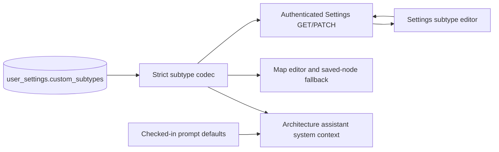

# Self-Service Account Controls - Plan

## Goal Capsule

- **Objective:** Remove StackHatch's administrator product surface and replace its remaining legitimate responsibilities with self-service account deletion, per-user node subtype settings, checked-in prompt defaults, and a deliberately narrow operator account command.
- **Authority hierarchy:** The confirmed scope in this planning session governs product intent; the current schema, authentication flow, tests, and route owners govern implementation details; `docs/prds/free-byok.md` and other current product documents must be revised where they still describe administrator behavior.
- **Stop conditions:** Stop rather than ship a migration that can silently discard malformed subtype data, a deletion path that can target a client-supplied user ID, a stale-session path that can access deleted-account data, or a subtype change that strands existing saved nodes.
- **Execution profile:** Ship the schema, runtime consumers, authentication simplification, self-service deletion, and operator command as one coordinated change. Use data-aware migration preflight, one shared deletion primitive, focused unit/API tests, and browser coverage for the destructive user flow.
- **Tail ownership:** The implementation workflow owns review remediation, migration fixtures, full quality gates, browser QA, commit, push, and CI through a decided state.

---

## Product Contract

### Summary

StackHatch is a free, bring-your-own-key application and no longer needs a privileged in-product administration area. The Users, Node Subtypes, and Prompts administration tabs will be retired. Prompt defaults will be immutable application code, custom subtype configuration will belong to each user, and users will be able to permanently remove their own account and owned records from the active application data model in Settings; WAL files and backups follow their documented retention lifecycle. Exceptional account lookup and deletion will remain available only through a host-authorized operator command; impersonation and application roles will disappear entirely.

### Problem Frame

The existing administrator surface creates a privileged role, route family, environment configuration, impersonation mode, shared mutable AI behavior, and global subtype configuration even though the product has no paid account operations or team administration. Removing only the page would leave those security and data-model concepts alive elsewhere. This work must simplify the complete stack while preserving existing users' subtype configuration, BYOK/model/theme settings, saved maps, and safe assistant behavior.

### Actors

- A1. An authenticated StackHatch user configuring their AI key, model, theme, and personal node subtypes or permanently deleting their account.
- A2. A returning GitHub user whose former StackHatch account was deleted and who may create a fresh, empty account by signing in again.
- A3. A host-authorized operator performing exact, exceptional account lookup and deletion directly against a selected StackHatch database.

### Requirements

#### Single-level application identity

- R1. StackHatch must remove the `/admin` UI, `/api/admin/**` endpoints, administrator navigation, `users.role`, role-bearing session fields, administrator environment variables, and all administrator-only tests and documentation.
- R2. StackHatch must remove impersonation routes, cookies, banners, layout offsets, identity branching, and resume-state exceptions. A signed-in request has one effective identity: the database user corresponding to the authenticated GitHub subject.
- R3. Deleted, unknown, or stale JWT sessions must not read or mutate application data. Protected page and API resolution must require the authenticated subject to resolve to a current database user, while the login page must not bounce a raw but orphaned session back into the app.

#### Version-controlled prompts and per-user subtype settings

- R4. Chat, alternatives, and PRD export must use the checked-in defaults in `src/lib/ai/default-prompts.ts`; database prompt overrides and their read/write helpers must be removed.
- R5. Every user must own a validated `custom_subtypes` setting. Settings GET/PATCH, the map editor, node configuration, and the architecture assistant must resolve the same user's catalog, with no global or cross-user fallback.
- R6. Custom subtype input must be a strict structured object keyed only by known node categories. Each category may contain at most 20 entries; each entry requires only a unique kebab-case slug of 1-40 characters, a trimmed display name of 1-60 characters with no line breaks, and a Lucide icon name supported by the renderer. Custom slugs must not collide with built-in slugs in that category.
- R7. Removing a custom subtype must not make an existing map or template uneditable. A saved node using a retired slug must retain its stored category/subtype, render with stable category-level fallback presentation, and expose its current value as deprecated until the user selects a replacement.

#### Permanent self-service deletion

- R8. Settings must contain a distinct danger-zone action that explains the irreversible consequences and requires the exact, case-sensitive phrase `DELETE MY ACCOUNT`. Cancel, mismatch, malformed input, or any failure before the deletion commit must preserve the account and keep the dialog actionable.
- R9. `POST /api/account/delete` must derive the target only from the authenticated database-backed identity and accept no user identifier. It must validate the confirmation phrase, delete the parent user in a short synchronous transaction, rely on declared cascades for owned data, and return a success response only after the database commit.
- R10. Successful self-deletion must remove the active user, projects, messages, templates, settings, and resume state with no recovery or tombstone. It must then clear the Auth.js session using the framework's server-side sign-out mechanism and redirect to the public landing page. If sign-out or navigation fails after the commit, deletion remains authoritative and the client must report a committed deletion rather than a retryable account-preserving failure.
- R11. A copied or second-device JWT that survives deletion must become harmless because all protected reads and writes fail database-backed identity resolution. A later GitHub login may provision a new internal user with empty application data.
- R12. Development authentication must not pretend deletion is durable: the account-deletion endpoint must reject the operation in dev-auth mode and Settings must explain that the fixed development user is recreated.

#### Safe shared deletion and operator access

- R13. Self-service and operator deletion must call one server-only deletion primitive keyed by internal user ID. It must be retry-safe, delete only the parent user, expose whether a row was deleted, and never accept secrets or project content as command output.
- R14. The operator command must require an explicit database target, support read-only exact lookup by internal ID, GitHub ID, or email, and return only redacted identity plus owned-record counts. Because email is not unique, deletion must accept only a uniquely selected internal user ID and a second exact confirmation containing that ID.
- R15. An assistant response finishing concurrently with account deletion must not recreate or append account-owned data. Its final persistence transaction must revalidate project ownership; either the response commits first and is removed by the later cascade, or deletion commits first and the response is not persisted.

#### Migration, storage, and documentation

- R16. Before schema mutation, migration preflight must parse and strictly validate the legacy global `customSubtypes` value when present. Missing data maps to `{}`; malformed or invalid data aborts startup with recovery instructions rather than being normalized or discarded silently.
- R17. Migration must add `user_settings.custom_subtypes`, copy the valid legacy catalog to every existing user (including users without a `user_settings` row), preserve every existing encrypted key/model/theme value, add indexes for cascade child keys, and only then drop the global `settings` table and `users.role` column within the migration transaction.
- R18. SQLite connections must enable `PRAGMA secure_delete=ON`. Deletion must not synchronously run `VACUUM`; privacy copy must accurately state that deletion removes active application records while WAL files and backups follow their storage-retention lifecycle.
- R19. Current PRDs, feature/readiness documentation, examples, robots rules, environment templates, and tests must describe the simplified identity and settings model and must no longer advertise administrator access, prompt editing, global subtypes, or impersonation.

### Key Flows

- F1. Configure personal subtypes: A1 opens Settings, edits a validated subtype catalog, saves it, and sees that catalog on the next editor load and in their next architecture-assistant system context without affecting another user.
- F2. Delete an account: A1 opens the danger-zone dialog, reads the consequences, enters the exact phrase, submits once, and is returned signed out to the public site after the account and descendants commit as deleted.
- F3. Handle a stale session: A1 deletes the account in one browser while another request or device retains a JWT; the stale session resolves no database identity, receives no protected data, and cannot persist an in-flight assistant response.
- F4. Rejoin after deletion: A2 signs in later with the same GitHub account and receives a new internal user with defaults and no restored maps, messages, templates, key, settings, or resume state.
- F5. Perform an exceptional operator deletion: A3 points the command at an explicit database, previews an exact candidate and owned-record counts, copies the returned internal ID into the confirmation, and invokes the same cascade deletion primitive without entering the web application.

### Acceptance Examples

- AE1. Given Users A and B, when A saves a valid custom subtype, then it appears in A's Settings, editor choices, and assistant prompt but not in B's Settings, editor, or prompt.
- AE2. Given a subtype payload with an unknown category, extra key, invalid icon, built-in collision, newline, duplicate slug, or exceeded limit, when Settings PATCH validates it, then the request fails without changing the saved catalog.
- AE3. Given an existing map or template that references a custom subtype, when that subtype is removed from Settings, then the saved node still renders, opens, and round-trips without mutation while its current subtype is marked deprecated until replaced.
- AE4. Given an authenticated user with projects, messages, templates, BYOK configuration, theme, and resume state, when the phrase is absent or wrong, then the deletion API rejects the request and every row and session remains intact.
- AE5. Given that same user and an unrelated control user, when the exact phrase is submitted, then only the target user and all target descendants disappear, the control user's rows remain, the browser becomes signed out, and a replay cannot restore data.
- AE6. Given a valid legacy global subtype catalog and users with and without `user_settings` rows, when migration runs, then every user receives the catalog while existing encrypted key/model/theme values remain unchanged and prompt overrides are retired. Given malformed legacy subtype data, migration aborts before schema mutation.
- AE7. Given an assistant stream and account deletion racing on the same project, when both reach persistence, then either the completed message is subsequently cascaded away or the final write is rejected; no orphan or resurrected account data remains.
- AE8. Given the operator command, when lookup is ambiguous, the database target is missing, or confirmation does not exactly contain the selected internal ID, then no data changes. With an exact internal ID and confirmation, the command deletes through the shared primitive and reports counts without secrets or content.
- AE9. Given an old `/admin` URL, an old `/api/admin/**` request, or an old impersonation cookie after deployment, when it is used, then the removed route returns 404, the cookie has no effect, and the request never gains a privileged identity.

### Success Criteria

- There is no administrator, role, or impersonation code path in the built application, configuration surface, current product documentation, or active test suite.
- Prompt behavior has one version-controlled source, and subtype behavior has one validated per-user source shared by Settings, editor rendering, and assistant context.
- Migration preserves all valid user settings and subtype data, rejects malformed legacy subtype data before mutation, and passes foreign-key integrity checks.
- Self-service and operator deletion remove the same ownership graph through one primitive, preserve unrelated users, and cannot be redirected to a client-selected target.
- Stale sessions and in-flight AI work cannot access or recreate deleted-account data.
- The Settings danger zone is understandable, keyboard-usable, responsive, and honest about permanence, development mode, WAL, and backups.

### Scope Boundaries

#### Included

- Removal of the administrator UI/API, roles, impersonation, related environment configuration, navigation, styling, tests, and current documentation.
- Checked-in AI prompt defaults, per-user custom subtype storage/editor/assistant context, and compatibility for retired subtype values in saved documents.
- Permanent self-service account deletion, Auth.js session cleanup, stale-session denial, secure-delete configuration, and in-flight assistant write protection.
- A narrow host-authorized account lookup/deletion command with preview, redaction, explicit database selection, and exact confirmation.
- A data-aware migration, cascade indexes, privacy copy, and focused/unit/integration/browser regression coverage.

#### Excluded

- Billing, plans, quotas, moderation, analytics, teams, organization administration, or a replacement operator dashboard.
- Soft delete, recovery windows, tombstones that block later GitHub re-registration, backup erasure orchestration, or synchronous forensic file compaction.
- User-editable AI prompts, per-project subtype catalogs, shared subtype marketplaces, or cross-device live synchronization of an open Settings form.
- General Auth.js replacement, OAuth reauthentication/step-up, remote support impersonation, or new privileged application roles.
- Exposing account deletion, BYOK secrets, or operator account tools to the architecture assistant.

### Assumptions

- GitHub remains the sole production identity provider and its immutable provider subject remains the provisioning key.
- A deleted person may deliberately sign in again and receive a new, empty StackHatch account; no identity tombstone is required.
- Settings uses whole-document, last-write-wins persistence for custom subtypes. A failed PATCH restores or retains the last confirmed server state; cross-tab conflict resolution is not introduced.
- Existing ownership foreign keys remain the authority for deletion. The migration adds child-key indexes for predictable cascade work but does not duplicate child-by-child deletes.
- Host access to the selected SQLite database is the operator authorization boundary; the command adds safety rails, not a second application authorization system or persistent audit subsystem.

---

## Planning Contract

### Key Technical Decisions

- KTD1. Remove the full administrator UI, administrator API, and application role model. (session-settled: user-approved — chosen over retaining a dormant administrator console: the free BYOK product has no continuing in-product administration requirement.)
- KTD2. Remove impersonation completely. (session-settled: user-approved — chosen over keeping support impersonation without demonstrated support volume: it expands identity and authorization risk without a current product need.)
- KTD3. Use only checked-in prompt constants at runtime. (session-settled: user-approved — chosen over database prompt overrides: prompt changes should be reviewed, tested, and deployed like application behavior.)
- KTD4. Store custom subtype catalogs per user. (session-settled: user-approved — chosen over shipped-defaults-only or a global catalog: users retain customization without imposing vocabulary on one another.)
- KTD5. Provide irreversible self-service deletion with no recovery window. (session-settled: user-approved — chosen over soft delete and recovery: the product should minimize retained account data and avoid introducing recovery operations.)
- KTD6. Keep exceptional account operations in a narrow host-authorized command. (session-settled: user-approved — chosen over a replacement operator dashboard: the expected operational frequency does not justify another privileged web surface.)
- KTD7. Model confirmation as `POST /api/account/delete` with a command body rather than a DELETE request body. The authenticated subject determines the target; `DELETE MY ACCOUNT` confirms intent but is not treated as identity proof.
- KTD8. Centralize deletion in a server-only function that synchronously deletes `users.id` inside a short Drizzle transaction and relies on SQLite `ON DELETE CASCADE`. Add indexes on `messages.project_id` and `templates.user_id` before relying on the full cascade at scale.
- KTD9. Commit deletion before calling Auth.js `signOut({ redirect: false })`. If cookie cleanup fails after commit, the account remains deleted and database-backed identity resolution makes the residual JWT harmless; the operation never recreates a user to compensate.
- KTD10. Validate legacy subtype data in `src/db/migrate.ts` before Drizzle applies the new migration. A valid catalog is copied to every user; invalid data blocks startup with remediation guidance so the transactional schema migration cannot partially discard it.
- KTD11. Preserve removed subtype references at the document boundary rather than scanning or blocking settings changes. Rendering uses a category-level fallback, and the detail editor synthesizes a disabled/deprecated current option until the node is moved to a supported subtype.
- KTD12. Recheck `(project.id, project.user_id)` inside the final assistant-write transaction. This creates a serializable ownership boundary with account deletion without attempting to cancel an already-running provider request.
- KTD13. Enable SQLite `secure_delete` on each application connection but keep WAL checkpointing, backup retention, and physical compaction outside the synchronous request path. Product copy promises removal from the active data model, not immediate byte-level erasure from every storage layer.

### High-Level Technical Design



Prompt text has no mutable database path. A single strict subtype codec defines persisted structure and validation; authenticated Settings, editor behavior, and assistant context all resolve the current user's catalog through that boundary.

```mermaid
sequenceDiagram
  participant Human as User or operator
  participant Entry as Settings API or operator command
  participant Core as Shared account deletion service
  participant DB as SQLite ownership graph
  participant Auth as Auth.js session

  Human->>Entry: Exact target context and confirmation
  Entry->>Entry: Authenticate/authorize and validate intent
  Entry->>Core: deleteAccount(internalUserId)
  Core->>DB: Begin short transaction
  Core->>DB: Delete parent users row
  DB-->>Core: Cascade projects/messages/templates/settings/state
  Core->>DB: Commit and return deleted count
  alt Self-service deletion committed
    Entry->>Auth: signOut without redirect
    Entry-->>Human: Deleted; navigate to public landing
  else Operator deletion committed
    Entry-->>Human: Redacted deletion result and counts
  end
```

Both entry points converge only after applying their own authority and confirmation rules. The shared primitive takes an internal ID, performs no identity lookup by email, and treats the parent row plus declared cascades as the complete deletion boundary.

### Migration Contract

1. `src/db/migrate.ts` checks whether the legacy `settings` table and `customSubtypes` row exist. If present, it parses the JSON with the production strict subtype schema; an invalid row throws an actionable error before `migrate()` begins.
2. The custom Drizzle migration adds non-null `user_settings.custom_subtypes` with the serialized empty object as its default and adds indexes for `messages.project_id` and `templates.user_id`.
3. The migration inserts a default `user_settings` row for every user missing one, preserving the current model/theme defaults and timestamps, then writes the validated legacy subtype JSON to every user's row. Existing encrypted API keys, model values, theme values, and original creation timestamps are not overwritten.
4. The migration drops the global `settings` table and removes `users.role` with SQLite's supported native column-drop operation. It must not rebuild or drop the parent `users` table while foreign keys are enabled, because that can fire ownership cascades. Foreign keys and ownership relationships remain intact.
5. Migration tests cover valid, absent, malformed, and structurally invalid subtype data; mixed users with and without settings; preserved encrypted values; schema/index shape; rollback; and `PRAGMA foreign_key_check` after completion.

### Data and API Contracts

| Boundary                        | Contract                                                                                                                                                                                                                    |
| ------------------------------- | --------------------------------------------------------------------------------------------------------------------------------------------------------------------------------------------------------------------------- |
| `user_settings.custom_subtypes` | Non-null JSON text encoding the strict `CustomSubtypesMap`; default `{}`; parsed and serialized only by the shared codec.                                                                                                   |
| `GET /api/settings`             | Returns `hasAnthropicKey`, normalized `model`, `theme`, and structured `customSubtypes` for the authenticated database user. It no longer returns `role` or `isAdmin`.                                                      |
| `PATCH /api/settings`           | Accepts any valid combination of the existing key/model/theme commands plus structured `customSubtypes`; rejects an empty update, conflicting key commands, unknown keys, and invalid subtype content atomically.           |
| `POST /api/account/delete`      | Accepts exactly `{ "confirmation": "DELETE MY ACCOUNT" }`; no target ID; returns validation/auth/dev-mode errors without mutation and a committed-deletion result with Auth.js cookie cleanup on success.                   |
| Shared deletion result          | Internal user ID, whether the parent row was deleted, and pre-delete owned-record counts suitable for redacted operator reporting; no email, API key, project title, message, canvas, or repository content.                |
| Operator lookup                 | Exact internal ID, GitHub ID, or email against an explicitly selected database; reports zero, one, or multiple redacted candidates and counts. Deletion proceeds only by internal ID plus an exact ID-bearing confirmation. |

### System-Wide Impact

- **Authentication:** `src/lib/auth.ts` becomes the single database-backed identity resolver for protected surfaces. An existing JWT remains valid only while one current row matches both its signed internal user ID and GitHub subject; it must never rebind by GitHub ID to a later replacement account. `src/lib/auth-config.ts` provisions users without promotion logic and stores no role in JWT/session types. Session materialization suppresses cached name/email/image for an orphaned binding or database failure, and the login route cannot bounce that token into the app.
- **Database:** `settings` and `users.role` disappear; `user_settings` gains subtype state; ownership cascades remain unchanged; child-key indexes and `secure_delete` strengthen destructive operations.
- **AI:** Chat, alternatives, and PRD export import checked-in prompts. Chat loads only the requesting user's subtype catalog. Active streams retain the original authenticated user ID, stop forwarding output when ownership disappears, abort the provider request where supported, and recheck ownership in the final write transaction. Data already sent to the provider before deletion cannot be recalled.
- **Editor:** Settings and the project page exchange structured subtype data. Node rendering and details tolerate a retired saved subtype without rewriting the canvas document.
- **Operations:** There is no browser-based privileged action. The TypeScript script wrapper delegates lookup/deletion logic to tested code under `src/lib/` so it participates in the existing Vitest include pattern. Preview and delete remain in one process on one canonicalized database connection, and confirmation binds both that database identity and the internal user ID.
- **Routing:** Removed page and route-handler files naturally produce 404 responses. Old impersonation cookies become inert because no runtime reads them.
- **Privacy:** Public copy points users to Settings for active-store erasure and explains storage-retention limits without promising immediate WAL or backup destruction.

### Risks and Mitigations

- **Silent migration loss:** The legacy subtype JSON may be syntactically valid but structurally unsafe. Mitigation: use the same strict codec for preflight and runtime, abort before migration, and test database rollback and remediation text.
- **Parent-table cascade during migration:** Rebuilding or dropping `users` with foreign keys enabled can erase the ownership graph. Mitigation: use supported native `DROP COLUMN` for `role`, prohibit a generated parent-table rebuild, and compare descendant counts/content fingerprints before and after migration.
- **Preflight/migration race:** Another process could change the legacy subtype row after validation but before the migration copies it. Mitigation: deploy with traffic and old instances stopped, retain the exact validated source fingerprint through the migration boundary, and reopen traffic only after post-migration checks.
- **Wrong-account deletion:** A client or operator could supply an ambiguous target. Mitigation: self-service ignores target IDs entirely; operator lookup is preview-only and deletion requires an internal ID plus exact ID-bearing confirmation.
- **Wrong database deletion:** Internal user IDs can exist in copied databases, and paths can be swapped between preview and delete. Mitigation: canonicalize the database file, hold one connection, fingerprint the database identity, and bind/revalidate both fingerprint and internal ID in the confirmation.
- **Residual JWT access:** JWT sessions cannot be globally revoked by deleting a database row. Mitigation: every protected path requires both the signed internal ID and provider subject to match one current row, session materialization strips orphaned identity, the login page detects orphaned sessions, and successful deletion invokes framework sign-out rather than guessing cookie names.
- **Cross-site destructive request:** The public phrase confirms intent but is not a CSRF secret. Mitigation: the deletion route requires strict JSON, exact keys, and a same-origin Origin/Host check in addition to database-backed authentication and cookie policy.
- **Partial deletion or cascade latency:** Redundant child deletes can drift from the ownership graph, and unindexed child keys can make cascades expensive. Mitigation: delete one parent in a short synchronous transaction, add child indexes, and assert foreign-key integrity.
- **In-flight AI activity after deletion:** A provider response may continue using a decrypted BYOK key or emit output after the user row is gone. Mitigation: retain the original owner context, revalidate before forwarding stream output, abort the provider request when ownership disappears, owner-scope every final project/message mutation, and never recreate missing account state.
- **Subtype prompt injection or UI breakage:** User-controlled labels and icons enter UI and prompt context. Mitigation: strict keys, counts, lengths, no newlines, kebab slugs, built-in collision checks, supported-icon allowlisting, and deterministic serialization.
- **Saved-node compatibility:** Removing a catalog entry can hide the current selection. Mitigation: retain the raw saved value, render category fallback, and show a deprecated current option until explicit replacement.
- **False deletion guarantees:** WAL pages and backups may outlive active rows. Mitigation: enable secure deletion, avoid blocking VACUUM, document the active-store boundary, and align backup statements with actual retention practice.
- **Documentation drift:** Historical plans correctly describe prior decisions but current PRDs may mislead implementation. Mitigation: leave historical plans intact and update only current product/source/config documentation in the same change.

---

## Implementation Units

### U1. Establish the data-aware settings migration

**Goal:** Move global subtype configuration into every user's settings, remove role/global-settings schema, and make cascades predictable without losing valid data.

**Requirements:** R5-R7, R16-R18; AE3, AE6; KTD4, KTD8, KTD10-KTD11, KTD13.

**Dependencies:** None.

**Files:** `src/lib/custom-subtypes.ts`, a new `src/lib/custom-subtypes.test.ts`, `src/db/schema.ts`, `src/db/migrate.ts`, `src/db/migrate.test.ts`, `src/db/db.test.ts`, `src/db/index.ts`, the next generated/custom SQL migration and matching files under `drizzle/meta/`.

**Approach:** Define the strict subtype schema and serializer as a dependency of migration preflight. During a quiesced deployment, retain a fingerprint of the validated legacy source through the migration boundary. Add `custom_subtypes` in place, update only that column on existing settings rows, insert complete defaults only for users with no row, and add the two child indexes. Remove `role` with the supported native SQLite column-drop operation; explicitly prohibit a generated `users` table rebuild because dropping the parent table with foreign keys enabled can fire cascades. Drop `settings` only after the copy. Enable `secure_delete` next to the existing foreign-key/WAL pragmas. Keep the migration transactional and do not nest a manual transaction inside Drizzle's migrator.

**Test scenarios:**

1. Migrate an empty database and a current-schema database with no global subtype row; every user receives `{}` and the final schema has the expected defaults, indexes, and foreign keys.
2. Migrate valid legacy subtypes across users with and without settings rows; catalogs are identical while encrypted keys, models, themes, row identity, and existing timestamps remain byte-for-byte intact.
3. Attempt migration with malformed JSON and with each structurally invalid subtype variant; preflight aborts before schema mutation and explains how to back up and repair the row.
4. Force a migration failure after backfill setup; the original tables/data remain available and a subsequent corrected migration succeeds.
5. Compare exact descendant counts/content fingerprints before and after the native role drop, then delete fixture users after migration; cascades remove their ownership graph, preserve control users, and `foreign_key_check` returns no violations.

**Verification:** Migration fixtures prove preservation and rollback, the schema snapshot matches runtime declarations, and a fresh database plus upgraded database both pass database tests with `secure_delete` and foreign keys enabled.

### U2. Make subtype customization per-user and compatibility-safe

**Goal:** Give each user a focused subtype editor whose validated catalog is shared by Settings, the map editor, and assistant context without stranding saved values.

**Requirements:** R5-R7; F1; AE1-AE3; KTD4, KTD10-KTD11.

**Dependencies:** U1.

**Files:** `src/lib/ai/settings.ts`, `src/lib/ai/settings.test.ts`, `src/app/api/settings/route.ts`, `src/app/api/settings/settings-api.test.ts`, `src/app/settings/page.tsx`, `src/app/settings/settings-page.test.tsx`, a focused subtype settings component and test under `src/components/settings/`, `src/app/project/[id]/page.tsx`, `src/app/project/[id]/page.test.tsx`, `src/lib/node-config.ts`, `src/components/canvas/StackNode.tsx`, `src/components/canvas/NodeDetailPanel.tsx`, and their focused tests.

**Approach:** Consume U1's strict subtype codec and add a typed per-user resolver. Return structured subtype data from Settings and accept whole-document updates alongside existing settings fields. Keep editing state in a focused Settings section with field-level validation, add/remove affordances, confirmed-server rollback on failure, and no raw JSON UI. Thread the resolved catalog into editor nodes and expose the resolver for assistant consumption. When a node's saved subtype is absent, synthesize a deprecated current choice and category fallback rather than changing stored canvas data.

**Test scenarios:**

1. Save and refetch a valid mixed-category catalog; slug normalization rules, display labels, and supported icons round-trip deterministically.
2. Reject unknown/extra keys, invalid category names, duplicate or built-in-colliding slugs, unsupported icons, newlines, blank/overlong strings, and per-category overflow without partial persistence.
3. Fetch Settings and a project as two users; each sees only their own catalog, including in the generated system prompt.
4. Simulate PATCH failure in the subtype editor; feedback is announced and the last confirmed catalog remains visible/editable.
5. Load and edit a saved map whose subtype was removed; the node renders with fallback presentation, the current value is labeled deprecated, unrelated edits preserve it, and selecting a replacement removes the compatibility option.

**Verification:** Focused codec/API/component/editor tests establish validation, isolation, rollback, and saved-document compatibility; no runtime consumer reads a global subtype row.

### U3. Make prompt behavior immutable and version-controlled

**Goal:** Eliminate mutable database prompt overrides and make every AI entry point consume the reviewed defaults directly.

**Requirements:** R4, R19; KTD3.

**Dependencies:** U1 for removal of the global settings table; coordinate the consumer switch in the same deploy.

**Files:** `src/lib/ai/default-prompts.ts`, `src/lib/ai/settings.ts`, `src/lib/ai/settings.test.ts`, `src/lib/ai/stream-chat.ts`, `src/lib/ai/stream-chat.test.ts`, `src/lib/ai/system-prompt.ts`, `src/lib/ai/system-prompt.test.ts`, `src/app/api/projects/[id]/alternatives/route.ts`, `src/app/api/projects/[id]/export-prd/route.ts`, and focused route tests for alternatives and PRD export.

**Approach:** Remove `getSettings`/`getPrompt` and all settings-table reads. Import the chat, alternatives, and PRD prompt constants at their route/service owners. Keep prompt construction testable as pure composition, while custom subtype text comes only from the authenticated user's validated catalog. Delete administrator prompt mutation coverage rather than replacing it with another runtime API.

**Test scenarios:**

1. Chat composes the checked-in base prompt with only the current user's validated subtype catalog and the existing request-specific context.
2. Alternatives and PRD export use their checked-in defaults regardless of any legacy fixture row that existed before migration.
3. The assistant prompt remains stable for an empty subtype catalog and safely renders maximum-length valid entries without control-character injection.

**Verification:** AI unit/route tests assert exact prompt-source ownership, and repository search finds no runtime settings-table or prompt-override access.

### U4. Remove administrator roles and impersonation end to end

**Goal:** Collapse authentication and navigation to one database-backed user identity and make former privileged routes disappear.

**Requirements:** R1-R3, R19; AE9; KTD1-KTD2.

**Dependencies:** U1 removes the persisted role; U3 removes the prompt administration dependency.

**Files:** Delete `src/app/admin/`, `src/app/api/admin/`, `src/lib/roles.ts`, `src/components/ImpersonationBanner.tsx`, and their dedicated tests; simplify `src/lib/auth.ts`, `src/lib/auth.test.ts`, `src/lib/auth-config.ts`, `src/types/next-auth.d.ts`, `src/app/api/me/route.ts`, `src/components/Providers.tsx`, `src/components/UserAvatar.tsx`, `src/components/UserAvatar.test.tsx`, `src/components/AllMapsPage.tsx`, `src/components/AllMapsPage.test.tsx`, `src/components/shells/AppPageActions.tsx`, `src/components/shells/PageShells.test.tsx`, `src/app/api/projects/[id]/open/route.ts`, `src/app/globals.css`, `src/app/project/[id]/page.tsx`, `.env.example`, `.env.local.example`, `package.json`, `playwright.config.ts`, `src/app/robots.ts`, and affected e2e tests.

**Approach:** Remove role promotion and session augmentation, administrator predicates, actual-versus-effective user helpers, impersonation cookie handling, banner/provider wiring, route/nav props, and the impersonation-only resume exception. Keep a single authenticated-user result keyed to a current database record. Remove development-role flags from scripts and Playwright setup. Let deleted admin route files resolve as normal 404s and ignore historical impersonation cookies.

**Test scenarios:**

1. Production and development authentication resolve one identity shape without a role, promotion environment variable, or impersonation branch.
2. App shells, All Maps, avatars, and `/api/me` expose only current identity/actions and never render an Admin destination or impersonation state.
3. Project open/resume state updates consistently for the owning user because no impersonation exception remains.
4. Requests to each removed page/API route produce 404 rather than redirecting, leaking route details, or honoring an old impersonation cookie.
5. Repository/config searches find no active role/admin/impersonation variable or cookie contract outside historical plans and migration history.

**Verification:** Auth, shell, maps, avatar, open-route, and route-removal tests pass with the reduced identity type, and production/development builds require no administrator environment configuration.

### U5. Add permanent self-service deletion and lifecycle safety

**Goal:** Let a user irreversibly delete their own ownership graph from Settings while making session and assistant races fail closed.

**Requirements:** R3, R8-R13, R15, R18; F2-F4; AE4, AE5, AE7; KTD5, KTD7-KTD9, KTD12-KTD13.

**Dependencies:** U1 provides the final cascade graph; U4 provides single-identity auth.

**Files:** A new shared deletion module and test under `src/lib/`, a new `src/app/api/account/delete/route.ts` and route test, a focused deletion component and test under `src/components/settings/`, `src/app/settings/page.tsx`, `src/app/settings/settings-page.test.tsx`, `src/lib/auth.ts`, `src/app/login/page.tsx`, `src/app/login/login-page.test.tsx`, `src/lib/ai/stream-chat.ts`, `src/lib/ai/stream-chat.test.ts`, `src/app/privacy/page.tsx`, and `src/app/privacy/page.test.tsx`.

**Approach:** Implement a server-only `deleteAccountById` transaction that records non-sensitive counts, fails closed unless its shared database opener confirms foreign keys and secure deletion are active, deletes the parent row, and returns the affected-row result. The API authenticates to a current database user, rejects dev-auth mode, requires strict JSON and matching Origin/Host, validates the phrase-only body, invokes the primitive, then uses Auth.js server sign-out and returns a committed-deletion outcome for the client to navigate home. Bind existing sessions to both their signed internal user ID and GitHub subject; an orphaned token or database failure exposes no cached identity and cannot loop into `/app` or rebind to a replacement account. Active assistant streams retain the original owner ID, revalidate ownership while emitting, abort provider work when disappearance is detected, and begin the final database transaction by verifying `(project.id, project.user_id)` before any message or project mutation. Present deletion in an isolated Settings danger zone with explicit data categories, cancel, pending lockout, retry-safe failure, and accessible feedback.

**Test scenarios:**

1. Reject unauthenticated, orphaned-session, dev-auth, invalid JSON, non-JSON content types, cross-origin or sibling-subdomain origin, extra-key, missing phrase, and mismatched phrase requests with no changed rows or cookies.
2. Delete a fully populated user; all owned rows disappear, an unrelated user's ownership graph remains byte-for-byte intact, and a second core invocation is a safe no-op.
3. Simulate a database failure before commit; the complete account and session remain and the dialog reports a retryable error.
4. Simulate sign-out failure after commit; the account stays deleted, the client receives an honest committed outcome, and the residual token cannot access protected pages/APIs.
5. Use a stale token on the Auth.js session endpoint, login, and protected endpoints after deletion and during a forced database failure; no cached PII, redirect loop, data response, mutation, or automatic recreation appears. After fresh GitHub registration, the pre-deletion JWT remains unauthorized while the new JWT works.
6. Race assistant streaming/final persistence with deletion in both orderings on independent file-backed connections; after deletion is detected, the provider is aborted where supported, no later output is forwarded, and the final database has neither orphan messages nor recreated account/project rows. Apply the same owner-scoped assertion to repository-scan project replacement.
7. Exercise the dialog by keyboard and pointer: it describes irreversibility, remains disabled until exact text, supports cancel/focus return, prevents duplicate submission, and redirects only after committed success.

**Verification:** Deletion service/API/UI/auth/stream tests prove target binding, transactional behavior, stale-token denial, and race safety; browser QA confirms the complete Settings flow at phone and desktop widths without using production data.

### U6. Add the operator command and align current documentation

**Goal:** Preserve rare, auditable-by-terminal account operations without reintroducing a privileged web product, then remove stale administrator promises from the current project surface.

**Requirements:** R13-R14, R18-R19; F5; AE8; KTD6, KTD8, KTD13.

**Dependencies:** U4 removes web administration; U5 provides the shared deletion primitive.

**Files:** A tested account-operations module under `src/lib/`, `scripts/manage-account.ts`, its `package.json` script entry, `README.md`, `docs/prds/free-byok.md`, `docs/prds/prd-shastack.md`, `docs/features.md`, `docs/launch-readiness.md`, `src/app/privacy/page.tsx`, `.env.example`, `.env.local.example`, and affected `e2e/tierless-byok.test.ts` and `e2e/ui-polish.test.ts` scenarios.

**Approach:** Keep argument parsing/printing in a thin `tsx` wrapper and put exact lookup, redaction, count aggregation, confirmation validation, and deletion delegation in testable library code. Require and canonicalize an explicit database path rather than silently selecting an environment default. Preview and delete stay in the same process on one connection opened through the shared pragma-enforcing database boundary; the command fingerprints the selected database and revalidates that identity immediately before mutation. Lookup may return multiple redacted candidates, but delete accepts one internal ID and a literal confirmation incorporating both the database fingerprint and that ID. Update current product documentation to describe self-service deletion, per-user subtypes, checked-in prompts, no roles/impersonation, fresh-account re-login, and active-store/WAL/backup boundaries. Do not rewrite historical implementation plans.

**Test scenarios:**

1. Reject missing/invalid/unreadable database paths, unknown commands/options, non-exact identifiers, ambiguous email results for deletion, and database/ID confirmation mismatches without opening a write transaction.
2. Preview by exact internal ID, GitHub ID, and email; output redacts identity, includes only owned-record counts, and contains no API key, project title, repository, canvas, or message content.
3. Delete a uniquely selected internal ID with exact confirmation; the command invokes the shared primitive, reports the pre-delete counts and result, and preserves control users.
4. Run against a busy/locked database, a path swapped after preview, a second database containing the same internal ID, a connection with required pragmas disabled, and a missing user; the command exits non-zero with actionable output and does not claim success.
5. Verify current docs, environment examples, robots output, and end-to-end expectations contain the new account/subtype contracts and no actionable administrator or impersonation instructions.

**Verification:** Library tests cover command safety and redaction, a disposable-database smoke test covers the wrapper, and documentation/e2e review confirms the browser product and operator boundary agree.

---

## Verification Contract

### Automated Gates

- `npm test` passes the complete Vitest suite, including new migration, subtype, deletion, operator, stale-session, and AI-race fixtures.
- `npm run typecheck` passes with no role-bearing session fields, deleted route imports, or permissive subtype casts.
- `npm run lint` passes.
- `npm run build` succeeds without administrator environment variables and emits no `/admin` or `/api/admin/**` application routes.
- `npm run test:e2e -- e2e/tierless-byok.test.ts e2e/ui-polish.test.ts` passes the affected Settings, navigation, authentication, and removed-route journeys.
- Prettier check is run over all changed source, test, migration metadata, and current documentation files; the known repository-wide formatting baseline is tracked separately and does not excuse new drift.
- `git diff --check` passes, and targeted repository searches confirm no active `ADMIN_GITHUB_ID`, `STACKHATCH_DEV_ROLE`, role authorization, impersonation cookie/banner, runtime prompt override, or global subtype consumer remains outside historical migrations/plans.

### Migration and Data Verification

- Upgrade fixtures cover a valid legacy catalog, absent catalog, malformed JSON, structurally invalid content, users with/without settings, and encrypted-key preservation.
- A copied disposable database is migrated and checked for final columns/indexes, exact row counts/content fingerprints, `foreign_key_check`, per-user subtype equality, and absence of the global settings/role schema.
- Deletion fixtures cover a full ownership graph, an unrelated control graph, replay, forced transaction rollback, a separately opened file-backed operator connection, disabled-pragma failure, and both assistant/delete commit orderings using deterministic barriers across independent connections.
- No verification step points the operator command or destructive browser test at a production database.

### Deployment and Rollback

- Treat this as a maintenance-window deploy because the retired and new schemas are not mutually compatible. Stop request handling and old application instances, close SQLite connections, take a SQLite-consistent backup that includes committed WAL state, and prove the backup opens cleanly before migration.
- Stop before mutation if the schema/migration version is unexpected, integrity or foreign-key checks fail, legacy subtypes fail strict validation, available storage cannot accommodate SQLite table-copy work, or the backup cannot be verified. Save baseline counts and content fingerprints for users, settings, projects, messages, templates, and resume state.
- Run preflight and migration while traffic remains stopped. Before reopening, verify the expected migration version, one settings row per user, preserved encrypted key/model/theme values, exact subtype backfill, expected child indexes, active foreign keys and secure deletion, no integrity violations, and absence of retired tables/columns.
- Start only the matching application build, smoke-test sign-in, Settings read/write, old administrator 404s, stale-session denial, and deletion with a disposable account, then reopen traffic.
- Before traffic resumes, rollback may restore the verified database snapshot together with the previous application build. After any new write or account deletion is accepted, restoration could discard user changes or resurrect erased data; default to forward repair and allow restoration only after an explicit reconciliation decision that preserves deletion obligations.

### First-Day Monitoring

- Use existing application/container logs to watch migration/preflight failures, SQLite busy/constraint/foreign-key errors, unresolved-user spikes, auth redirect loops, Settings failures, deletion transaction failures, post-commit sign-out failures, and rejected assistant final writes.
- Suspend traffic immediately for any integrity failure, wrong-account indication, deleted-account access, or data resurrection. Repeated database-lock or authentication-loop errors also trigger traffic suspension and forward repair.
- Operational logs may contain internal IDs, result statuses, and non-sensitive counts only; they must not contain email addresses, API keys, project/message/canvas content, or deletion confirmation phrases.

### Manual Browser Verification

- Inspect Settings at phone and desktop widths in light and dark themes: subtype add/edit/remove, validation, save failure, keyboard focus, danger-zone cancel, phrase mismatch, pending state, and simulated server failure.
- Use a disposable authenticated account to complete deletion, verify the public redirect and signed-out chrome, then confirm another stale session/device cannot open protected data.
- Sign in again with the same GitHub identity and confirm a fresh empty account rather than restored application data.
- Open a fixture map whose subtype has been removed and confirm fallback rendering, deprecated current selection, non-destructive round-trip, and explicit replacement.
- Request each former administrator URL and verify a normal 404 with no privileged navigation or identity effects.

### Release Invariants

- A request can act only for a current database user matching its authenticated provider subject.
- A pre-deletion JWT cannot bind to a newly provisioned account with the same GitHub subject; both signed internal ID and provider subject must match the current row.
- Account deletion targets that current user or an operator-confirmed internal ID; no browser payload can redirect deletion to another account.
- Operator deletion is bound to the canonical database identity and internal user ID previewed in the same process.
- Deleting the parent user is the only data-removal write; declared cascades define the ownership graph and preserve other users.
- Prompt content is deployed code, subtype content is validated user data, and neither can fall back to the retired global settings table.
- A committed deletion is never rolled back logically because session cleanup or navigation failed.
- Existing saved canvas data is not silently rewritten when a custom subtype is removed.

---

## Sources and Research

### Repository Evidence

- `src/db/schema.ts`, `src/db/index.ts`, and `src/db/migrate.ts` define the current ownership graph, SQLite pragmas, and preflight migration pattern.
- `src/lib/auth.ts`, `src/lib/auth-config.ts`, `src/types/next-auth.d.ts`, and `src/app/login/page.tsx` define role, impersonation, provisioning, session, and stale-token behavior.
- `src/app/api/settings/route.ts`, `src/lib/custom-subtypes.ts`, `src/lib/node-config.ts`, and `src/app/project/[id]/page.tsx` define the current global subtype and editor path.
- `src/lib/ai/settings.ts`, `src/lib/ai/default-prompts.ts`, `src/lib/ai/stream-chat.ts`, and the alternatives/PRD routes define prompt and assistant consumers.
- `src/app/admin/`, `src/app/api/admin/`, `src/components/ImpersonationBanner.tsx`, and current product docs enumerate the removal surface.
- Commits `4923dba`, `75477fd`, `b8be753`, `8f3bc7e`, `444f61f`, and `0cce117` document the original BYOK, administrator, subtype, prompt, migration, and ownership-cascade intent.

### External Guidance

- GitHub Primer destructive-action and confirmation guidance: <https://primer.style/product/scenario-patterns/delete/> and <https://primer.style/product/components/confirmation-dialog/guidelines/>.
- OWASP authentication guidance and GitHub OAuth authorization behavior: <https://cheatsheetseries.owasp.org/cheatsheets/Authentication_Cheat_Sheet.html> and <https://docs.github.com/en/apps/oauth-apps/building-oauth-apps/authorizing-oauth-apps>.
- HTTP DELETE and idempotency semantics informing the command-style POST: <https://www.rfc-editor.org/rfc/rfc9110.html#section-9.3.5> and <https://www.rfc-editor.org/rfc/rfc9110.html#section-9.2.2>.
- Auth.js JWT-session and server sign-out behavior: <https://authjs.dev/concepts/session-strategies> and <https://authjs.dev/getting-started/session-management/login#signout>.
- SQLite foreign keys and secure deletion: <https://www.sqlite.org/foreignkeys.html> and <https://sqlite.org/pragma.html#pragma_secure_delete>.
- Drizzle custom migrations and transactions: <https://orm.drizzle.team/docs/kit-custom-migrations> and <https://orm.drizzle.team/docs/transactions>.
- Data-erasure lifecycle guidance: <https://ico.org.uk/for-organisations/uk-gdpr-guidance-and-resources/individual-rights/individual-rights/right-to-erasure/>.
