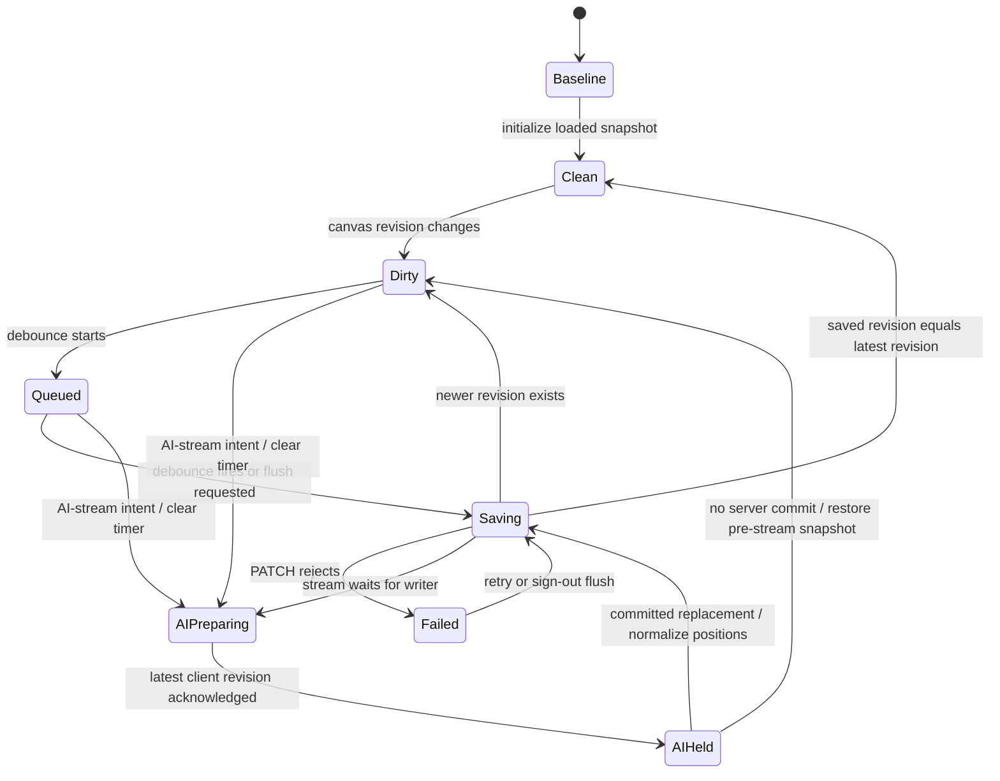

# Application Navigation and Account Coherence - Plan

## Goal Capsule

- **Objective:** Make authenticated StackHatch navigation predictable by separating fast map resume from the stable All Maps home, providing one consistent account entry point, and preserving editor canvas space on compact screens.
- **Product authority:** This plan owns authenticated navigation and account access only. Landing-page promise and proof, plus All Maps library-management behavior, remain separate candidate work areas rather than active scope.
- **Open blockers:** None. Planning must preserve the confirmed product behavior, including awaited save-before-sign-out rather than relying on the editor's current fire-and-forget exit flush.
- **Execution profile:** Code changes across shared app headers, editor controls, account-menu behavior, navigation labels, responsive states, and focused tests.

---

## Product Contract

### Summary

StackHatch will use All Maps as its stable authenticated home while retaining `/app` as a fast resume shortcut. Every authenticated surface will provide the same core navigation capabilities, and a minimal avatar menu will become the consistent entry point for identity, Settings, and safe sign-out.

### Problem Frame

The authenticated application currently changes its navigation vocabulary and available actions by page. Wordmarks on All Maps, New Map, and Settings point to `/app`, which can open a project rather than a stable home; New Map and the editor omit the avatar; and the avatar itself is display-only even though the application supports sign-out. These differences make familiar controls behave differently across the product and make account access feel unfinished.

The editor adds a competing constraint: its map canvas is the primary workspace, so navigation consistency cannot come from adding a second header row or exposing every action at once on a narrow screen. Sign-out also crosses the editor's save boundary. The current exit flush is not awaited, so it cannot by itself guarantee that pending map changes are preserved before the session ends.

### Key Decisions

- **Separate resume from home.** Keep `/app` as the resume route and make the StackHatch wordmark open `/app/maps` wherever the wordmark appears. (session-settled: user-approved — chosen over making the wordmark and `/app` share one destination: fast return and predictable home serve different intents.)
- **Use one minimal account menu.** Make the avatar the account entry point for identity, Settings, and Sign out; remove the separate Settings gear and keep workspace actions outside the account menu. (session-settled: user-approved — chosen over separate account controls or a larger profile menu: the product needs one clear account boundary without fictional destinations.)
- **Keep the compact editor to one row.** On narrow screens, keep All Maps, project identity, available Export, More, and Account in the project bar; place New Map, Theme, and existing secondary tools inside More. (session-settled: user-directed — chosen over a two-row header or detached project tray: the selected option preserves canvas height while retaining access.)
- **Save before signing out.** Await pending editor persistence before ending the session, remain signed in when saving fails, and return to the public landing page after successful sign-out without an extra confirmation dialog. (session-settled: user-approved — chosen over immediate sign-out or a confirmation prompt: protecting map changes is the meaningful safety boundary.)

The selected header composition is structural rather than a pixel specification:

```mermaid
flowchart TB
  subgraph Shared[Shared authenticated pages]
    SW[Wordmark: All Maps] --> SC[Contextual workspace action]
    SC --> ST[Theme]
    ST --> SA[Account]
  end

  subgraph EditorWide[Editor at comfortable width]
    EW[All Maps] --> EN[New Map]
    EN --> EI[Project identity]
    EI --> EE[Available editor actions]
    EE --> ET[Theme]
    ET --> EA[Account]
  end

  subgraph EditorCompact[Editor at compact width, one row]
    CW[All Maps] --> CI[Project identity]
    CI --> CE[Export when available]
    CE --> CM[More: New Map, Theme, secondary tools]
    CM --> CA[Account]
  end
```



### Requirements

**Navigation hierarchy and vocabulary**

- R1. `/app` must resume the remembered last-opened accessible map, fall back to the most recently updated map owned by the user when that reference is absent or stale, and send a user with no maps to `/project/new`.
- R2. The StackHatch wordmark must open `/app/maps` on every authenticated surface that displays it; surfaces without a wordmark must expose an explicit All Maps action.
- R3. Authenticated navigation labels must describe their destination using the shared vocabulary All Maps, New Map, Settings, and Open or Resume when an action targets resume behavior.
- R4. Every authenticated surface must provide reachable access to All Maps, New Map, Theme, and Account, although the current destination need not be duplicated as a separate active control.
- R5. Navigation must preserve the current page or map until the user deliberately selects another destination; opening an account or overflow menu must not itself navigate.

**Responsive application controls**

- R6. Shared-page headers must present their contextual workspace action, Theme, and Account without a separate Settings gear; the wordmark supplies All Maps access.
- R7. The editor must retain one project-bar row and prevent horizontal page overflow at supported compact widths.
- R8. In the compact editor, All Maps, project identity, available Export, More, and Account must remain directly visible; More must provide New Map, Theme, and the editor's existing secondary tools.
- R9. Moving an action into More at a compact width must not remove it, rename its outcome, or change its enabled and disabled conditions.

**Account access and sign-out safety**

- R10. Account must be an accessible avatar button that opens a menu showing the signed-in name and email plus Settings and Sign out.
- R11. The account menu must not introduce Profile, Billing, Teams, or other destinations without corresponding product capabilities.
- R12. The account menu must support pointer and keyboard operation and close on Escape or outside interaction. Escape or trigger dismissal must return focus to Account; pointer light-dismiss must leave focus on the clicked target.
- R13. Choosing Settings must navigate to `/settings` from every authenticated surface, including New Map and the editor.
- R14. Choosing Sign out with no pending editor changes must end the session and return the user to the public landing page without a confirmation dialog.
- R15. Choosing Sign out with pending editor changes must await an explicit save result before ending the session; a failed save must keep the user signed in, explain that changes could not be saved, and allow a later retry.

### Key Flows

- F1. Resume work
  - **Trigger:** A signed-in developer opens `/app` directly or arrives there after authentication.
  - **Steps:** StackHatch resolves the remembered accessible map, falls back to the user's most recently updated map when needed, or opens New Map when the user owns no maps.
  - **Outcome:** The resume shortcut remains fast without defining the product's stable home.
  - **Covered by:** R1, R3
- F2. Return to the stable home
  - **Trigger:** The developer selects the StackHatch wordmark or All Maps from an authenticated surface.
  - **Steps:** StackHatch opens `/app/maps` without first resuming or loading another map.
  - **Outcome:** The same action has the same destination across the application.
  - **Covered by:** R2, R4, R5
- F3. Open account settings
  - **Trigger:** The developer opens Account and selects Settings.
  - **Steps:** The menu exposes current identity and account actions, then navigates to `/settings` only after Settings is selected.
  - **Outcome:** Settings is available from every authenticated surface through one consistent entry point.
  - **Covered by:** R10-R13
- F4. Use compact editor navigation
  - **Trigger:** The project editor enters a supported compact width.
  - **Steps:** The project bar keeps its direct compact controls in one row and groups New Map, Theme, and existing secondary tools under More.
  - **Outcome:** All capabilities remain reachable without reducing the map to a second-row header or causing horizontal overflow.
  - **Covered by:** R4, R7-R9
- F5. Sign out safely from an edited map
  - **Trigger:** The developer selects Sign out while the editor has a pending change.
  - **Steps:** StackHatch attempts and awaits the pending save. It ends the session and opens the public landing page only after save success; on save failure it stays signed in and explains the failure.
  - **Outcome:** Signing out does not silently race pending map persistence.
  - **Covered by:** R14-R15

### Acceptance Examples

- AE1. **Covers R1.** Given a signed-in developer with an accessible remembered map, when they open `/app`, then StackHatch opens that map. Given a stale remembered reference, it opens the developer's most recently updated owned map; given no owned maps, it opens `/project/new`.
- AE2. **Covers R2-R5.** Given the developer is on All Maps, New Map, or Settings, when they activate the StackHatch wordmark, then `/app/maps` opens and no project is resumed first.
- AE3. **Covers R4, R6, R10-R13.** Given any authenticated surface, when the developer inspects its navigation, then All Maps, New Map, Theme, and Account are reachable; Account exposes identity, Settings, and Sign out, and no separate Settings gear is required.
- AE4. **Covers R7-R9.** Given the editor at a supported compact width, when the project bar renders, then it remains one row with no horizontal page overflow; New Map and Theme remain available through More, while Account stays directly reachable.
- AE5. **Covers R10-R12.** Given keyboard-only interaction, when the developer opens Account, moves through its actions, presses Escape, and reopens it, then focus order is usable, Escape closes the menu, and focus returns to the avatar trigger.
- AE6. **Covers R14-R15.** Given no pending map changes, when the developer selects Sign out, then the session ends and the public landing page opens. Given pending changes that save successfully, sign-out occurs only after that save succeeds.
- AE7. **Covers R15.** Given pending changes whose save fails, when the developer selects Sign out, then the session remains active, the current map stays available, and StackHatch explains that it could not save the changes so the developer can retry.

### Success Criteria

- All Maps is a predictable authenticated home, while `/app` continues to satisfy returning-user resume behavior.
- All authenticated surfaces expose the same four core capabilities at desktop and compact widths without adding a second editor header row or horizontal overflow.
- The avatar is no longer display-only, Settings has one consistent entry point, and no speculative account destinations appear.
- Sign-out behavior has automated coverage for no-change, save-success, and save-failure states; no tested path ends the session before a required save result is known.

<!-- ce-section: work-relationships -->

### How This Work Fits Together

This plan owns application navigation and account coherence. The broader three-part breakdown is the current product understanding, not a committed roadmap:

- **Landing promise and proof**
  - Depends on the navigation vocabulary settled here when public calls to action describe Start, Open, or Resume behavior.
  - Can proceed independently of the account-menu implementation once those destination meanings are fixed.
  - Still to decide how the landing page demonstrates the real product and which capabilities deserve prominence.
- **All Maps library management**
  - Shares `/app/maps` as the stable application home established here.
  - Can proceed independently of compact editor navigation and sign-out safety.
  - Still to decide which organization and map-lifecycle controls belong in the library outcome.

### Scope Boundaries

- This plan includes authenticated navigation destinations and labels, shared and editor header capabilities, the avatar account menu, responsive action grouping, and safe sign-out behavior.
- It does not add a dashboard, redesign page content or the map canvas, rewrite the public landing page, or change All Maps organization and lifecycle behavior.
- It does not add Profile, Billing, Teams, organizations, permissions, account editing, or new Settings capabilities.
- It does not change authentication providers, `/app` resume selection rules, map export behavior, or the meaning of existing editor secondary tools.

### Dependencies and Assumptions

- GitHub-backed authentication continues to provide the signed-in identity displayed in Account and a supported session-ending operation.
- `/app/maps`, `/project/new`, and `/settings` remain the canonical destinations for All Maps, New Map, and Settings.
- The editor can expose whether changes are pending and provide an awaited save result to the sign-out flow; its current unmount flush is insufficient as the sole safety mechanism.
- Existing editor actions retain their current permission, availability, and project-state conditions when rearranged responsively.

### Sources

- `src/app/app/page.tsx` and `src/lib/project-resume.ts` define current resume and fallback behavior.
- `src/components/shells/AppPageActions.tsx`, `src/components/projects/ProjectStartWorkspace.tsx`, and `src/app/project/[id]/page.tsx` show the current page-by-page navigation differences.
- `src/components/UserAvatar.tsx` and `src/lib/auth-config.ts` establish the display-only avatar and available authentication operations.
- `docs/plans/2026-07-16-001-single-entry-map-flow-plan.md` preserves the intended `/app` resume contract.
- `docs/plans/2026-07-21-001-feat-observatory-ui-redesign-plan.md` establishes the single-row, map-dominant editor constraint.
- `docs/plans/2026-07-22-001-feat-self-service-account-controls-plan.md` establishes Settings as the existing home for self-service account controls.

---

## Planning Contract

### Product Contract Preservation

The confirmed Product Contract is preserved except for R12's direct internal conflict: it now distinguishes keyboard/trigger focus restoration from normal pointer focus. This Planning Contract otherwise implements the requirements without reopening the settled product direction. Unavailable GitHub identity fields use truthful fallback text.

### Key Technical Decisions

- KTD1. **Keep `/app` as the existing resume resolver and make `/app/maps` the canonical authenticated home.** (session-settled: user-approved — chosen over making the wordmark and `/app` share one destination.) Do not change `src/lib/project-resume.ts` or the resolver selection rules; update authenticated wordmarks and explicit All Maps actions instead.
- KTD2. **Encode the shared-page destination in `AppPageShell`.** `AppPageShell` owns a `/app/maps` wordmark with an All Maps label so callers cannot drift back to `/app`. `AppPageActions` consistently renders New Map, Theme, and Account; Settings moves inside Account and the separate gear is removed.
- KTD3. **Replace the display-only avatar with a native account disclosure.** Create `AccountMenu` as a client component backed by `popover="auto"`, a normal button trigger, static identity text, a Settings link, and a Sign out button. Do not apply ARIA `menu`/`menuitem` roles or add custom arrow-key behavior because this panel combines information, navigation, and a command rather than acting as a composite command menu.
- KTD4. **Use the installed Auth.js client API without adding session context or upgrading auth.** Call `signOut({ redirectTo: "/" })` from `next-auth/react` only after an optional awaited `beforeSignOut` succeeds. `/api/me` remains the identity source; `SessionProvider`, new auth endpoints, undocumented sign-out response fields, and an Auth.js migration are out of scope.
- KTD5. **Serialize canvas persistence with a pure revision coordinator in `src/lib`.** Chosen over a React hook or more page-local refs, the framework-agnostic coordinator owns immutable snapshot revisions, debounce, writer serialization, acknowledgements, drain state, and navigation disposal. The editor remains the adapter for React Flow conversion, fetch/toast behavior, AI-stream state, and lifecycle. Autosave and explicit sign-out flush use the same queue; acknowledging an older revision advances coordinator metadata only and never replaces newer live editor state.
- KTD6. **Treat every architecture-producing AI stream as an exclusive persistence barrier.** (session-settled for repository scans: user-approved during implementation scoping — chosen over saving an in-progress generated map or waiting indefinitely.) Automatic initialization, normal chat, and repository scans can all replace `canvasState` server-side. Mark stream intent synchronously, block sign-out and canvas mutation, cancel debounce, and drain accepted client writes before starting the request. Terminal success—including a completed repository result marked partial—adopts and normalizes the server replacement. An error after request start reconciles against the authoritative project before deciding whether to adopt a committed replacement or restore the pre-stream snapshot. AI-stream start and the sign-out transition are mutually exclusive.
- KTD7. **Use the existing `sm` boundary and native popover for the compact editor action matrix.** Below 640px, keep All Maps, project identity, available Export, More, and Account directly visible. More exists even for an empty map and contains New Map and Theme always, Re-scan for repository maps, and PRD/template actions only for non-empty maps. At 640px and wider, preserve the current direct editor actions and add Account. Native `popover="auto"` places More in the top layer and preserves normal link/button semantics.
- KTD8. **Split semantic tests from native-browser behavior.** Vitest verifies identity states, callbacks, save ordering, conditional actions, and page composition. Playwright verifies native popover keyboard/light-dismiss behavior, focus restoration, top-layer visibility, and the single-row layout at 320px and 390px because JSDOM does not implement the Popover API.
- KTD9. **Establish a stable mutation cut for sign-out and state bounded guarantees honestly.** From Sign out activation through redirect or detectable auth failure, the editor accepts no new canvas mutations and no architecture-producing AI stream can start. Auth failure restores editing. Live-editor autosave and explicit sign-out are strictly ordered within one editor instance; full-document teardown remains best-effort delivery, and concurrent tabs remain subject to the unchanged server last-writer-wins contract.

### High-Level Technical Design

```mermaid
flowchart TB
  Resume[/app resume resolver] --> Editor[Project editor]
  Home[/app/maps All Maps]
  Shared[AppPageShell] --> Wordmark[Wordmark to All Maps]
  Shared --> Actions[New Map + Theme + Account]
  NewMap[New Map workspace] --> NewMapHeader[Wordmark + Theme + Account]
  Editor --> ProjectBar[Responsive project bar]
  Actions --> Account[AccountMenu]
  NewMapHeader --> Account
  ProjectBar --> Account
  Account --> Identity[/api/me]
  Account --> Settings[/settings]
  Account --> SignOut[Auth.js client signOut]
  ProjectBar --> Persistence[Canvas persistence coordinator]
  Persistence --> Patch[PATCH /api/projects/:id]
  Persistence --> SignOut
  ProjectBar --> StreamGate[Exclusive AI-writer barrier]
  StreamGate --> Persistence
  StreamGate --> Streams[ChatSidebar initialization, chat, or scan]
  Wordmark --> Home
  ProjectBar --> Home
```

The shared-page seam remains `AppPageShell` plus `AppPageActions`. New Map keeps its custom workspace header but uses the same wordmark and account primitives. The editor composes the account control directly because it supplies the save-before-sign-out callback and AI-stream-blocked state.



The coordinator records immutable serialized canvas snapshots with monotonically increasing revisions. It performs at most one PATCH at a time. A flush clears the debounce, waits for any older write, and continues saving the latest snapshot until `savedRevision === latestRevision`; a rejection leaves the latest revision dirty and rejects the flush. Navigation disposal queues the latest dirty snapshot behind the same writer and switches to keepalive transport only when that write reaches the head. Delivery during full-document destruction cannot be guaranteed without a server revision protocol and remains explicitly best effort.

```mermaid
sequenceDiagram
  actor User
  participant Menu as AccountMenu
  participant Editor as Project editor
  participant Saves as Persistence coordinator
  participant API as Project PATCH
  participant Auth as Auth.js signOut

  alt Architecture stream active
    Menu-->>User: Sign out unavailable; explain stream is still running
  else No active architecture stream
    User->>Menu: Choose Sign out
    Menu->>Menu: Disable repeat activation
    Menu->>Editor: Freeze mutations and architecture-stream start
    Menu->>Editor: beforeSignOut()
    Editor->>Saves: flushLatest()
    opt Dirty or write in flight
      Saves->>API: Serialize pending PATCH writes
      API-->>Saves: Latest revision acknowledged
    end
    alt Save succeeds or canvas was clean
      Saves-->>Menu: Resolved
      Editor->>Editor: Recheck AI-stream gate and latest revision
      Menu->>Auth: signOut({ redirectTo: "/" })
      Auth-->>User: Public landing page
    else Save fails
      Saves-->>Menu: Rejected
      Editor->>Editor: Restore editing
      Menu-->>User: Stay signed in, show retryable error
    end
  end
```

### Account Disclosure Contract

- The trigger is a native button with the stable accessible name `Account`, a generated panel ID, and the native popover invoker relationship. The visible avatar initial may update after identity loads without changing the control's functional name.
- Identity loading never blocks Settings or Sign out. Show available name and email values; use `Name unavailable` or `Email unavailable` for nullable provider fields and `Identity unavailable` when `/api/me` fails. Constrain the panel to compact viewport margins and allow long, unbroken provider values to wrap without truncating their accessible text.
- The panel uses ordinary document tab order: Settings, then Sign out, with Shift+Tab reversing it. Static identity text is not focusable.
- Enter or Space opens from the trigger. Escape closes and returns focus to Account. Pointer light-dismiss closes while leaving focus on the clicked target; trigger activation closes with focus on the trigger.
- Settings always links to `/settings`. Sign out remains focusable in blocked and pending states, guards activation with `aria-disabled`, and references visible explanatory or progress copy. A save failure appears inside the panel as an announced, retryable error.
- Shared pages omit `beforeSignOut`, so clean sign-out proceeds directly. The editor supplies the persistence drain, the current AI-stream-blocked reason, and an idempotent failure callback that restores editing and stream availability after callback or Auth.js failure.

| Sign-out state              | Control and announcement                                                                                                                                  | Transition                                                                                         |
| --------------------------- | --------------------------------------------------------------------------------------------------------------------------------------------------------- | -------------------------------------------------------------------------------------------------- |
| Ready                       | Enabled Sign out button                                                                                                                                   | Begin the surface-specific pre-sign-out callback, then Auth.js.                                    |
| AI stream blocked           | Focusable `aria-disabled` button described by visible “Architecture update in progress” copy                                                              | Guard activation until the stream and normalization write settle.                                  |
| Saving                      | Focusable, activation-guarded button with announced “Saving changes…” status                                                                              | Continue only after the latest accepted revision is acknowledged.                                  |
| Signing out                 | Focusable, activation-guarded button with announced “Signing out…” status                                                                                 | Await redirect; a detectable rejection enters failure.                                             |
| Save/auth failure           | Re-enabled button plus announced explanation                                                                                                              | Retry without discarding the immutable dirty snapshot; restore editor mutation after auth failure. |
| Session expired during save | No intentional Auth.js call; preserve and freeze the in-memory snapshot, keep client export reachable, and explain that the original tab must remain open | Open sign-in for the same project in a new tab, then retry the save from the original tab.         |

### Responsive Editor Action Matrix

| Action           | Under 640px       | 640px and wider              | Availability rule                                           |
| ---------------- | ----------------- | ---------------------------- | ----------------------------------------------------------- |
| All Maps         | Direct            | Direct                       | Always                                                      |
| Project identity | Direct, truncates | Direct, expands              | Always                                                      |
| New Map          | More              | Direct                       | Always                                                      |
| Export           | Direct            | Direct                       | Existing export condition; currently non-empty maps         |
| More             | Direct            | Direct for secondary actions | Always compact; wide may retain existing secondary grouping |
| Theme            | More              | Direct                       | Always                                                      |
| Re-scan          | More              | Direct                       | Repository-backed maps only                                 |
| Generate PRD     | More              | More                         | Non-empty maps only                                         |
| Save as Template | More              | More                         | Non-empty maps only                                         |
| Account          | Direct            | Direct                       | Always, including loaded editor and transient editor shells |

Render Account, editor More, and Export format choices as native `popover="auto"` disclosures in the browser top layer, with ordinary links/buttons and anchored placement. Remove the editor More `role="menu"`/`menuitem` markup and its manual outside-click/Escape machinery. Keep the bar itself single-row and horizontally contained; do not solve clipping by allowing page-level horizontal scrolling.

### Editor Disclosure Transitions

- New Map closes More through navigation.
- Theme is a visible row that includes the current value, keeps More open for repeated cycling, and announces each new value.
- Re-scan, Generate PRD, and Save as Template close More before invoking existing handlers. A dialog-opening action transfers focus into its dialog; a non-dialog command restores focus to the More trigger.
- Export closes after format activation and restores focus to its direct trigger unless browser navigation or download behavior takes ownership.
- Escape returns focus to the invoking More or Export trigger. Pointer light-dismiss leaves focus on the clicked target. Browser tests assert that Account, More, Export, and any opened dialog never stack unintentionally.

### Persistence and Sign-Out Contract

- The loaded project seeds an acknowledged baseline without issuing a PATCH. A project-ID change disposes the old coordinator and creates a new baseline; revisions never cross project instances.
- Every persisted input—nodes, edges, positions, and alternatives—publishes a new immutable snapshot revision, including position-only and alternatives-only changes. The snapshot matches the current PATCH payload and is internally consistent.
- Debounced autosave enqueues that revision through the serialized writer. Only a confirmed successful response advances the matching `savedRevision`; a failure or ambiguous response retains the immutable snapshot as dirty for idempotent retry.
- `flushLatest()` is a no-op when the latest revision is already acknowledged. When dirty, it cancels the timer, waits behind the current write, and repeats if a newer revision appeared while awaiting.
- The editor exposes reactive AI-stream intent/state rather than only scan refs. Before `ChatSidebar` starts automatic initialization, normal chat, or repository scan, the editor synchronously blocks new save/sign-out transitions and canvas-mutating controls, cancels debounce, and awaits the serialized writer becoming clean. Failure to establish the barrier prevents the AI request; edits are not buffered against a replacement canvas.
- A successful architecture event is not clean merely because the server committed it. The editor adopts the returned architecture, computes its layout, builds the complete nodes/edges/positions/alternatives snapshot, then writes and acknowledges that normalized revision through the coordinator before releasing the stream/sign-out barrier. A terminal repository result whose analysis status is `partial` follows this success path; an incomplete in-progress stream does not.
- An error or dropped stream after request start has an ambiguous commit outcome. Refetch the project: if authoritative canvas/provenance or update state advanced, adopt and normalize that committed replacement; if it did not advance, restore the pre-stream dirty/latest snapshot. Release mutation/sign-out exclusion only after reconciliation and any required normalization save.
- Sign out establishes a stable cut: freeze map-mutating controls and AI-stream initiation, run `flushLatest()`, recheck that no stream began and the latest accepted revision is acknowledged, then invoke Auth.js. A callback/save failure or detectable auth rejection invokes the editor failure callback; save failure preserves dirty state and an announced retry path.
- Detectable Auth.js promise rejection leaves the current page in place with an error and calls the editor recovery callback. Do not infer success from undocumented response shapes. A 401 save response enters the session-expired state: keep the original tab and immutable snapshot in memory, offer same-project reauthentication in a new tab, and retry from the original tab rather than redirecting away and losing work. Real session invalidation is verified outside development-auth Playwright because that mode deliberately bypasses token enforcement.
- Navigation disposal cancels debounce and queues the latest snapshot through the existing writer; it never launches a concurrent keepalive PATCH. Explicit flush prevents a duplicate disposal write. SPA unmount can preserve ordering while execution continues, but tab close/full-page teardown remains best-effort delivery.
- Client ordering is scoped to one editor instance. With the API unchanged, simultaneous tabs remain last-writer-wins and are not represented as conflict-safe.

### System-Wide Impact

- **Routing:** `/app`, `src/lib/project-resume.ts`, project ownership checks, and resume fallback order remain unchanged. Authenticated wordmarks stop invoking resume and point directly to `/app/maps`.
- **Shared UI:** All Maps and Settings shed per-caller wordmark destinations and the Settings gear. New Map and editor transient states gain the account entry point. Public navigation is unchanged.
- **Authentication:** The existing `/api/me` endpoint and Auth.js client sign-out are reused. No provider, cookie, middleware, SessionProvider, database, or API contract changes are required.
- **Persistence:** Project PATCH payloads and server last-writer-wins behavior remain unchanged. A pure client coordinator strictly orders live autosave, AI-stream preparation, and explicit sign-out within one editor instance; response acknowledgement never replaces newer live state. Cross-tab conflicts and full-document delivery remain outside that guarantee.
- **AI architecture streams:** Initialization, normal chat, and repository scans are server-side canvas writers. `ChatSidebar` must await the editor's client drain before any such request begins, and AI/sign-out transitions are mutually exclusive. Success requires an acknowledged client normalization write; ambiguous failure reconciles through the project GET before restoring or adopting state.
- **Accessibility:** Native popover behavior supplies top-layer rendering, Escape dismissal, and invoker semantics. Normal link/button roles and tab order are preserved; ARIA composite-menu semantics are deliberately avoided.
- **Responsive layout:** Compact editor composition changes at the existing 640px breakpoint only. Editor canvas, chat/sidebar behavior, export semantics, and secondary-action conditions remain intact.
- **Testing:** Development-auth browser tests can prove interaction, redirect initiation, and mocked save ordering but not cookie invalidation. A non-development-auth smoke check remains part of release verification.
- **Analytics and operations:** No new analytics event, database migration, feature flag, environment variable, or deployment step is introduced.

### Risks and Mitigations

- **Stale PATCH overwrites the sign-out save:** Route every live-editor write through one serialized revision queue, freeze mutations at sign-out, and test deferred older/newer responses rather than issuing an independent flush request.
- **Client autosave overwrites an AI replacement:** Establish an exclusive drain before any architecture-producing `ChatSidebar` request. Deferred-response tests must prove initialization, chat, and scan cannot start until the client writer is clean and that the reloaded canvas remains the normalized AI result.
- **AI stream starts during sign-out:** Make AI-stream intent and sign-out pending mutually exclusive, check the gate both before and after flush, and restore normal controls only on a handled failure.
- **Stream disconnect is mistaken for server rollback:** Reconcile through the authoritative project GET after any post-start error. Adopt an advanced server canvas and restore the pre-stream snapshot only when server state did not advance.
- **AI result is marked clean before positions persist:** Keep the barrier active through the client layout/normalization PATCH and make a failed normalization write dirty and retryable.
- **Unload keepalive recreates write reordering:** Queue disposal behind the same writer and make no global delivery claim for full-document destruction. No migration can restore an overwritten canvas, so interleaving tests are release-blocking.
- **Older acknowledgement regresses live state:** Advance only coordinator metadata for the matching revision; never copy an older response snapshot over newer React/editor state. Cover alternatives-only, position-only, and older-response/newer-live cases.
- **Popover is clipped or positioned off-screen:** Use native top-layer popovers for Account and render More outside the bar's clipping boundary; assert bounding boxes at 320px and 390px.
- **Incorrect ARIA menu behavior:** Keep semantic links/buttons with normal Tab order and test the exposed roles and accessible names. Do not add `role="menu"` unless full composite keyboard behavior is intentionally implemented in a future scope.
- **Nullable identity looks like corrupted data:** Distinguish loading, partial identity, unavailable fields, and fetch failure while leaving actions available.
- **Repeated sign-out or concurrent edits create another race:** Disable repeat activation, freeze canvas-mutating controls during drain/auth work, and make `flushLatest()` loop until the acknowledged revision matches the latest revision. Restore editing on detectable auth rejection.
- **Committed response is lost in transit:** Treat an ambiguous write as dirty and retry the same immutable snapshot. Verification compares the persisted canvas after reload, not just client call order.
- **Expired session strands unsaved work:** Do not navigate the original editor away. Freeze the in-memory snapshot, keep client export available, provide new-tab reauthentication, and verify that retry can persist the unchanged snapshot after session recovery.
- **Native popover behavior is invisible to JSDOM:** Limit unit assertions to markup and callbacks; use Chromium Playwright for open, dismissal, focus, and clipping.
- **Development auth gives false confidence about logout:** Mock client ordering in unit/browser tests and perform one staging or local non-development-auth protected-route smoke before release.
- **Auth.js beta response behavior changes:** Use only documented `redirectTo` and returned Promise behavior from the installed beta.31; do not upgrade Auth.js in this feature.

### Sequencing

1. Build and test the reusable Account disclosure without changing page composition.
2. Standardize shared-page and New Map headers around `/app/maps`, Theme, and Account.
3. Extract and test the revision-aware persistence coordinator, then integrate AI-stream state and explicit flush into the editor.
4. Recompose the wide/compact editor bar and attach the editor-aware Account action.
5. Complete real-browser accessibility, layout, save-ordering, and non-development-auth smoke verification; remove obsolete avatar/settings-control code.

### Research Breadcrumbs

- `src/components/UserAvatar.tsx` currently fetches `/api/me` but renders a display-only identity circle.
- `src/components/shells/AppPageShell.tsx` and `src/components/shells/AppPageActions.tsx` are the shared authenticated-header seams.
- `src/components/projects/ProjectStartWorkspace.tsx` has a custom header whose wordmark and controls currently diverge from shared pages.
- `src/app/project/[id]/page.tsx` contains the editor bar, debounced PATCH, unmount keepalive, repository-scan suppression, and More actions that must be coordinated.
- `src/components/chat/ChatSidebar.tsx` starts initialization, normal chat, and repository-scan streams; each architecture-producing path needs the same awaited writer barrier supplied by the editor.
- `src/app/globals.css` gives `.observatory-editor-project-bar` `overflow: hidden`, which currently clips absolutely positioned descendants.
- `src/app/api/projects/[id]/route.ts` accepts last-writer-wins project PATCH requests, making client serialization load-bearing.
- `playwright.config.ts` enables development auth, so browser tests cannot prove real session invalidation.
- The installed `next-auth` version is beta.31; its documented client API supports `signOut({ redirectTo: "/" })`.
- No `CONCEPTS.md` or `docs/solutions/` corpus exists, so there are no institutional learnings to apply.

---

## Implementation Units

### U1. Replace the display-only avatar with Account

- **Goal:** Provide one reusable, accessible entry point for identity, Settings, and safe sign-out.
- **Requirements:** R5, R10-R15; F3, F5; AE3, AE5-AE7.
- **Files:** Create `src/components/AccountMenu.tsx` and `src/components/AccountMenu.test.tsx`. Keep `src/components/UserAvatar.tsx` and `src/components/UserAvatar.test.tsx` until all callers migrate in U2/U4; final removal belongs to U5 cleanup.
- **Approach:** Move the `/api/me` fetch and avatar initial into `AccountMenu`; model loading, partial, unavailable, and failed identity states; render a viewport-bounded native `popover="auto"` disclosure with Settings and Sign out; accept optional pre-sign-out, blocked-reason, Settings-active, and sign-out-failure callbacks; await the pre-sign-out work before documented client sign-out; invoke failure recovery for callback or auth rejection; guard repeat activation while keeping status discoverable and announcing progress/errors.
- **Patterns:** Preserve the cancellation guard from `UserAvatar`, the repository's 44px minimum control size, theme token classes, Next `Link`, and client-only Auth.js imports.
- **Test scenarios:** Full identity, missing name, missing email, both missing, non-OK response, rejected fetch, unmount cancellation, long unbroken identity values, Settings destination/current state, clean sign-out, awaited callback ordering, callback failure preventing auth sign-out, failure callback on auth rejection, double activation, focusable `aria-disabled` AI-stream state, saving/signing progress, expired-session recovery copy, and retry. Assert semantic button/link markup without attempting to emulate native popover focus in JSDOM.
- **Verification:** Focused component tests pass with `AccountMenu` ready for later surface migration; U1 does not require page-composition changes or removal of the existing avatar.
- **Dependencies:** None.

### U2. Standardize authenticated page headers

- **Goal:** Make All Maps the stable wordmark destination and expose New Map, Theme, and Account consistently outside the loaded editor.
- **Requirements:** R1-R6, R10-R14; F1-F3; AE1-AE3.
- **Files:** Modify `src/components/shells/AppPageShell.tsx`, `src/components/shells/AppPageActions.tsx`, `src/components/shells/PageShells.test.tsx`, `src/components/AllMapsPage.tsx`, `src/components/AllMapsPage.test.tsx`, `src/components/projects/ProjectStartWorkspace.tsx`, `src/components/projects/ProjectStartWorkspace.test.tsx`, `src/app/settings/page.tsx`, and `src/app/settings/settings-page.test.tsx`.
- **Approach:** Remove caller-configurable wordmark destinations from `AppPageShell` and encode `/app/maps`; make `AppPageActions` consistently render New Map, Theme, and Account; remove the Settings gear and current-page All Maps branch; update All Maps and Settings callers; change the New Map wordmark to `/app/maps`, retain Theme, add Account, and remove redundant All Maps/Settings controls because the current New Map destination need not duplicate itself.
- **Patterns:** Reuse `StackHatchWordmark`, `IconControl`, current shell spacing, and existing page-specific navigation slots such as Settings setup return navigation.
- **Test scenarios:** All Maps and Settings wordmarks target `/app/maps`; both expose New Map, Theme, and Account with no Settings gear; New Map exposes wordmark, Theme, and Account; Settings remains reachable through Account; `/app` resume tests remain unchanged and passing; opening Account does not navigate.
- **Verification:** Shell, All Maps, New Map, Settings, and resolver tests pass; a UI-link search finds no authenticated wordmark targeting `/app` and no standalone Settings gear in these surfaces.
- **Dependencies:** U1.

### U3. Serialize editor persistence and expose an awaited flush

- **Goal:** Guarantee that sign-out and server-side AI canvas replacement cannot race pending or in-flight client writes.
- **Requirements:** R14-R15; F5; AE6-AE7.
- **Files:** Create `src/lib/canvas-persistence.ts` and `src/lib/canvas-persistence.test.ts`; modify the persistence, architecture, and repository-scan sections of `src/app/project/[id]/page.tsx`, focused cases in `src/app/project/[id]/page.test.tsx`, `src/components/chat/ChatSidebar.tsx`, and `src/components/chat/ChatSidebar.test.tsx`.
- **Approach:** Extract a pure revision coordinator with an injected writer; keep React Flow-to-PATCH snapshot conversion, fetch/toast behavior, and React state adaptation in the editor; initialize an acknowledged baseline; publish immutable revisions for nodes, edges, positions, and alternatives; expose drain, AI-writer suspend/reconcile/resume, and queued navigation disposal; replace timer-presence checks; make every architecture-producing `ChatSidebar` path await the exclusive writer barrier; reconcile ambiguous errors against the project GET; normalize an adopted AI replacement through an acknowledged coordinator write before releasing the barrier.
- **Patterns:** Preserve `fromReactFlowNodes`, `fromReactFlowEdges`, the existing project PATCH payload, toast copy, initialization guard, and keepalive transport option. Keep the API route and stored canvas shape unchanged; do not copy acknowledged request bodies back over newer live editor state.
- **Test scenarios:** Clean baseline sends no PATCH; position-only and alternatives-only changes become dirty; snapshots are immutable; debounce coalesces changes; older in-flight then newer revision completes in order without regressing live state; mutation during flush causes a second save; ambiguous/failing response retains dirty state and identical retry payload; double flush shares ordered work; disposal queues behind an older in-flight write and never starts a concurrent keepalive; explicit flush prevents duplicate disposal; project-ID change resets baseline; initialization/chat/scan requests each wait for pending save; failed barrier prevents the request; canvas mutation is blocked during the stream; success and terminal partial results require normalized positions/provenance before release; dropped stream after server commit adopts authoritative state; pre-commit failure restores pre-stream state; 401 preserves the snapshot for reauthentication and retry.
- **Verification:** Deferred-Promise tests assert exact payloads, matching acknowledgement revisions, and maximum writer concurrency of one; editor/ChatSidebar integration reloads the project to prove the final persisted canvas and provenance rather than checking call order alone.
- **Dependencies:** None.

### U4. Recompose editor navigation for wide and compact states

- **Goal:** Apply the one-row option-A composition without losing editor actions or clipping overlays.
- **Requirements:** R2-R9, R10-R15; F2-F5; AE3-AE7.
- **Files:** Modify `src/app/project/[id]/page.tsx`, `src/app/project/[id]/page.test.tsx`, `src/app/globals.css`, `src/components/ThemeToggle.tsx`, `src/components/ThemeToggle.test.tsx`, `src/components/canvas/ExportDropdown.tsx`, and `src/components/canvas/ExportDropdown.test.tsx`; reuse `src/components/AccountMenu.tsx` and `src/lib/canvas-persistence.ts` from prior units.
- **Approach:** Split direct and overflow action groups at the existing `sm` breakpoint; keep compact direct controls to All Maps, identity, conditional Export, More, and Account; render More and Export choices as native popovers; apply the documented action-specific close/focus transitions; preserve wide direct actions; attach the persistence drain and reactive AI-writer gate to Account; freeze map mutation and stream start across sign-out, recheck the gate after drain, and use the failure callback to restore editing; add stable navigation/account access to loading, resume-recovery, and unavailable editor shells.
- **Patterns:** Preserve current action handlers, confirmation dialogs, project identity truncation, export behavior, `buildProjectStartChooserPath`, routing trace, and control labels/casing normalized to All Maps and New Map.
- **Test scenarios:** Empty/non-empty standalone and repository maps at compact and wide states; native More always compact; conditional Re-scan/PRD/template/export rules; Theme stays open and announces repeated cycling; commands/dialogs close More with correct focus; Export uses top-layer keyboard interaction; no duplicate direct compact controls; account Settings link; clean/dirty/failing sign-out; mutation during initial drain triggers another save; mutation after the stable cut is unavailable; auth rejection restores editing through the callback; active initialization/chat/scan blocking; sign-out and AI streams cannot cross-start; stream success/failure restores controls only after normalization/reconciliation; transient shells expose stable navigation; no horizontal overflow.
- **Verification:** Editor component tests pass and focused browser assertions show every popover/menu within the viewport without reducing the project bar to two rows.
- **Dependencies:** U1, U3.

### U5. Prove cross-surface behavior in a real browser and remove drift

- **Goal:** Validate native interaction and responsive geometry, then remove superseded controls and assumptions.
- **Requirements:** R1-R15; F1-F5; AE1-AE7.
- **Files:** Modify `e2e/ui-polish.test.ts` and, only where an existing journey assertion changes, `e2e/full-flow.test.ts`, `e2e/new-project.test.ts`, or `e2e/personal-tools.test.ts`; update affected selectors in existing tests without broad test rewrites; remove `src/components/UserAvatar.tsx` and `src/components/UserAvatar.test.tsx` after all callers migrate.
- **Approach:** Add role/name-based Playwright coverage for Account on All Maps, New Map, Settings, and editor; exercise Enter/Space, Tab/Shift+Tab, Escape focus restoration, pointer light-dismiss, Settings navigation, sign-out initiation, AI-stream-blocked copy, and compact geometry at 320px/390px. Mock save/auth seams where deterministic ordering is required, then complete one non-development-auth session smoke outside the default Playwright configuration.
- **Patterns:** Extend existing `ui-polish` viewport helpers, development-auth fixtures, role locators, dark-mode checks, and editor project-bar geometry assertions.
- **Test scenarios:** Account, More, and Export open by Enter and Space; normal tab order reaches their actions; Escape returns focus; outside click closes and keeps the clicked target focused; long name/email and all panels stay inside 320px/390px viewports; progress and blocked reasons are announced; controls stay inside viewport; project bar is one row with no page overflow; dirty save succeeds before sign-out; failed save stays on editor with retry; every AI architecture stream blocks sign-out; expired-session new-tab recovery preserves the original snapshot; real auth smoke invalidates the session and a protected route requires authentication; reopening the project proves nodes, edges, positions, alternatives, and repository provenance match the last accepted revision.
- **Verification:** Focused and full Playwright suites pass in configured projects, the non-development-auth smoke passes, and dead imports/selectors/styles for `UserAvatar` and standalone Settings controls are removed.
- **Dependencies:** U2, U4.

---

## Verification Contract

| Gate                            | Command or check                                                                                                                                                                                                                                                   | Proves                                                                                            | Applies after  |
| ------------------------------- | ------------------------------------------------------------------------------------------------------------------------------------------------------------------------------------------------------------------------------------------------------------------ | ------------------------------------------------------------------------------------------------- | -------------- |
| Formatting                      | `npm run format:check`                                                                                                                                                                                                                                             | Modified TypeScript, CSS, tests, and Markdown match repository formatting.                        | Every unit     |
| Account and shell tests         | `npm test -- src/components/AccountMenu.test.tsx src/components/ThemeToggle.test.tsx src/components/shells/PageShells.test.tsx src/components/AllMapsPage.test.tsx src/components/projects/ProjectStartWorkspace.test.tsx src/app/settings/settings-page.test.tsx` | Identity fallbacks, sign-out recovery/states, canonical wordmarks, and shared action composition. | U1-U2          |
| Persistence and editor tests    | `npm test -- src/lib/canvas-persistence.test.ts src/components/chat/ChatSidebar.test.tsx src/components/canvas/ExportDropdown.test.tsx 'src/app/project/[id]/page.test.tsx'`                                                                                       | Serialized revisions, exclusive AI-writer gating, disclosure behavior, and safe sign-out.         | U3-U4          |
| Resume regression               | `npm test -- src/lib/project-resume.test.ts src/app/app/page.test.tsx src/components/AppResolver.test.tsx`                                                                                                                                                         | `/app` still resumes remembered/newest maps or sends map-less users to New Map.                   | U2, final      |
| Full Vitest suite               | `npm test`                                                                                                                                                                                                                                                         | Existing auth, settings, editor, project, and creation behavior remains compatible.               | After U4       |
| Static types                    | `npm run typecheck`                                                                                                                                                                                                                                                | Native popover props, client Auth.js calls, persistence generics, and component props are valid.  | U1-U5          |
| Lint                            | `npm run lint`                                                                                                                                                                                                                                                     | Effects, async handlers, accessibility JSX, imports, and dead code satisfy repository rules.      | U1-U5          |
| Focused browser suite           | `npm run test:e2e -- e2e/ui-polish.test.ts`                                                                                                                                                                                                                        | Native popover interaction, focus behavior, compact geometry, and clipping in Chromium.           | U5             |
| Journey browser suites          | `npm run test:e2e -- e2e/full-flow.test.ts e2e/new-project.test.ts e2e/personal-tools.test.ts`                                                                                                                                                                     | Navigation changes do not regress map creation, editing, or Settings journeys.                    | U5             |
| Full browser suite              | `npm run test:e2e`                                                                                                                                                                                                                                                 | No smoke, error-path, BYOK, or cross-route browser regression remains.                            | Final          |
| Production build                | `npm run build`                                                                                                                                                                                                                                                    | Next.js client/server boundaries and production compilation succeed.                              | Final          |
| Real logout smoke               | Run with development auth disabled: sign in, sign out from a clean shared page and dirty editor, then revisit a protected route.                                                                                                                                   | The real session cookie is invalidated and protected navigation requires authentication.          | Before release |
| Manual accessibility spot-check | VoiceOver or NVDA: inspect Account announcement, identity text, Settings/Sign out semantics, Escape, and compact editor reachability.                                                                                                                              | Assistive-technology output matches the semantic contract beyond automated DOM checks.            | Before release |

`release:validate` does not apply because the repository defines no such script. Playwright's default development-auth mode is sufficient for UI and mocked ordering assertions but is not evidence of actual session invalidation.

### Behavioral Proof Matrix

| Contract                | Primary proof                                                                                                |
| ----------------------- | ------------------------------------------------------------------------------------------------------------ |
| R1 / F1 / AE1           | Existing resume helper/resolver tests plus the resume regression gate.                                       |
| R2-R6 / F2-F3 / AE2-AE3 | Shell, All Maps, Settings, New Map, and authenticated-link assertions in U2.                                 |
| R7-R9 / F4 / AE4        | Editor state matrix tests and 320px/390px Playwright geometry assertions in U4-U5.                           |
| R10-R13 / F3 / AE3, AE5 | Account component semantics plus real-browser keyboard, focus, Settings, and light-dismiss coverage.         |
| R14 / AE6               | Clean coordinator no-op, Auth.js call ordering, redirect initiation, and real logout smoke.                  |
| R15 / F5 / AE6-AE7      | Deferred-write coordinator tests, editor integration, save failure/retry UI, and AI-stream-blocked coverage. |

### Failure Handling

- A save failure or ambiguous response must leave the latest immutable revision dirty, make no intentional Auth.js call, announce the failure in Account, and permit safe retry. An expired session uses the documented new-tab reauthentication path while preserving the original in-memory snapshot.
- An AI architecture stream must never be represented as a completed client save. It cannot start until client writes drain, and Sign out remains unavailable until authoritative reconciliation plus any normalization write settles.
- A detectable Auth.js rejection restores editing and AI-stream availability without discarding dirty-state metadata.
- A 401 save response preserves and freezes the in-memory snapshot, avoids intentional logout/navigation, and supports new-tab reauthentication followed by original-tab retry.
- An identity request failure must not remove Settings or Sign out; it changes identity copy only.
- A detectable client sign-out rejection stays on the current surface and exposes retry. The implementation must not claim to distinguish every Auth.js server failure from redirect success using undocumented response fields.
- Any browser layout failure at compact widths blocks release even when unit tests pass.

---

## Definition of Done

### Global Completion

- `/app` retains its remembered-map, newest-owned-map, and no-map behavior, while every authenticated wordmark opens `/app/maps` directly.
- All Maps, New Map, Settings, loaded editor, and editor transient states expose the agreed All Maps, New Map, Theme, and Account capabilities without a separate Settings gear.
- Account presents truthful identity state, Settings, and Sign out using accessible disclosure semantics; it introduces no Profile, Billing, Teams, or speculative destination.
- Compact editor navigation remains one row at 320px and 390px, has no horizontal page overflow, and preserves every action's outcome and availability through the documented direct/More matrix.
- Live-editor autosave, every architecture-producing AI stream, and explicit sign-out are revision-ordered within one editor instance. Clean sign-out sends no save; dirty sign-out freezes mutation and awaits the latest acknowledged revision; failure makes no intentional auth call and remains retryable; an AI replacement cannot be overwritten by a pre-stream PATCH and is not released before positions normalize. Full-document teardown remains best-effort and concurrent tabs remain server last-writer-wins.
- The default component/browser suites and production build pass, followed by the non-development-auth logout smoke and assistive-technology spot-check.
- The final diff contains no display-only `UserAvatar`, authenticated wordmark to `/app`, standalone Settings gear, duplicate save timer logic, clipped editor overlay, stale test selector, or unused import/style introduced by the old composition.
- Landing-page content, All Maps library management, authentication providers, Settings capabilities, export semantics, and editor canvas behavior remain outside the diff except for necessary navigation/test adjustments.
- Implementation work is tracked in `bd`; completed issue state is recorded; changes are committed, rebased, and pushed; `git status` confirms the branch is up to date with its remote.

### Unit Completion

- U1 is done when every identity state and sign-out callback outcome is tested and Account works independently of identity loading.
- U2 is done when shared and New Map headers use the stable home and consistent action set while all `/app` resolver regressions pass.
- U3 is done when deferred-Promise tests prove maximum client-writer concurrency of one, pre-stream drain ordering for initialization/chat/scan, immutable complete snapshots, monotonic acknowledgements, authoritative reconciliation, normalized AI-replacement durability after reload, and safe dirty retry/disposal behavior.
- U4 is done when the full compact/wide action matrix, native More/Export disclosures, deterministic action focus, transient editor states, stable sign-out mutation cut, AI-writer mutual exclusion, expired-session recovery, and editor-aware Account integration pass.
- U5 is done when native keyboard/focus/status behavior, long-identity and 320px/390px geometry, changed journeys, persisted-state reload comparison, real logout, and cleanup checks all pass.

### Traceability

- Every R1-R15 requirement is mapped in the Behavioral Proof Matrix and at least one implementation unit.
- Every F1-F5 flow and AE1-AE7 example has an automated primary proof; actual session invalidation additionally has the required non-development-auth smoke.
- Every implementation unit names its production files, focused test files, dependencies, and completion evidence.
