# Application Navigation and Account Coherence - Plan

## Goal Capsule

- **Objective:** Make authenticated StackHatch navigation predictable by separating fast map resume from the stable All Maps home, providing one consistent account entry point, and preserving editor canvas space on compact screens.
- **Product authority:** This plan owns authenticated navigation and account access only. Landing-page promise and proof, plus All Maps library-management behavior, remain separate candidate work areas rather than active scope.
- **Open blockers:** None. Planning must preserve the confirmed product behavior, including awaited save-before-sign-out rather than relying on the editor's current fire-and-forget exit flush.
- **Execution profile:** Code changes across shared app headers, editor controls, account-menu behavior, navigation labels, responsive states, and focused tests.

---

## Product Contract

### Summary

StackHatch will use All Maps as its stable authenticated home while retaining `/app` as a fast resume shortcut. Every authenticated surface will provide the same core navigation capabilities, and a minimal avatar menu will become the consistent entry point for identity, Settings, and safe sign-out.

### Problem Frame

The authenticated application currently changes its navigation vocabulary and available actions by page. Wordmarks on All Maps, New Map, and Settings point to `/app`, which can open a project rather than a stable home; New Map and the editor omit the avatar; and the avatar itself is display-only even though the application supports sign-out. These differences make familiar controls behave differently across the product and make account access feel unfinished.

The editor adds a competing constraint: its map canvas is the primary workspace, so navigation consistency cannot come from adding a second header row or exposing every action at once on a narrow screen. Sign-out also crosses the editor's save boundary. The current exit flush is not awaited, so it cannot by itself guarantee that pending map changes are preserved before the session ends.

### Key Decisions

- **Separate resume from home.** Keep `/app` as the resume route and make the StackHatch wordmark open `/app/maps` wherever the wordmark appears. (session-settled: user-approved — chosen over making the wordmark and `/app` share one destination: fast return and predictable home serve different intents.)
- **Use one minimal account menu.** Make the avatar the account entry point for identity, Settings, and Sign out; remove the separate Settings gear and keep workspace actions outside the account menu. (session-settled: user-approved — chosen over separate account controls or a larger profile menu: the product needs one clear account boundary without fictional destinations.)
- **Keep the compact editor to one row.** On narrow screens, keep All Maps, project identity, available Export, More, and Account in the project bar; place New Map, Theme, and existing secondary tools inside More. (session-settled: user-directed — chosen over a two-row header or detached project tray: the selected option preserves canvas height while retaining access.)
- **Save before signing out.** Await pending editor persistence before ending the session, remain signed in when saving fails, and return to the public landing page after successful sign-out without an extra confirmation dialog. (session-settled: user-approved — chosen over immediate sign-out or a confirmation prompt: protecting map changes is the meaningful safety boundary.)

The selected header composition is structural rather than a pixel specification:

```mermaid
flowchart TB
  subgraph Shared[Shared authenticated pages]
    SW[Wordmark: All Maps] --> SC[Contextual workspace action]
    SC --> ST[Theme]
    ST --> SA[Account]
  end

  subgraph EditorWide[Editor at comfortable width]
    EW[All Maps] --> EN[New Map]
    EN --> EI[Project identity]
    EI --> EE[Available editor actions]
    EE --> ET[Theme]
    ET --> EA[Account]
  end

  subgraph EditorCompact[Editor at compact width, one row]
    CW[All Maps] --> CI[Project identity]
    CI --> CE[Export when available]
    CE --> CM[More: New Map, Theme, secondary tools]
    CM --> CA[Account]
  end
```

### Requirements

**Navigation hierarchy and vocabulary**

- R1. `/app` must resume the remembered last-opened accessible map, fall back to the most recently updated map owned by the user when that reference is absent or stale, and send a user with no maps to `/project/new`.
- R2. The StackHatch wordmark must open `/app/maps` on every authenticated surface that displays it; surfaces without a wordmark must expose an explicit All Maps action.
- R3. Authenticated navigation labels must describe their destination using the shared vocabulary All Maps, New Map, Settings, and Open or Resume when an action targets resume behavior.
- R4. Every authenticated surface must provide reachable access to All Maps, New Map, Theme, and Account, although the current destination need not be duplicated as a separate active control.
- R5. Navigation must preserve the current page or map until the user deliberately selects another destination; opening an account or overflow menu must not itself navigate.

**Responsive application controls**

- R6. Shared-page headers must present their contextual workspace action, Theme, and Account without a separate Settings gear; the wordmark supplies All Maps access.
- R7. The editor must retain one project-bar row and prevent horizontal page overflow at supported compact widths.
- R8. In the compact editor, All Maps, project identity, available Export, More, and Account must remain directly visible; More must provide New Map, Theme, and the editor's existing secondary tools.
- R9. Moving an action into More at a compact width must not remove it, rename its outcome, or change its enabled and disabled conditions.

**Account access and sign-out safety**

- R10. Account must be an accessible avatar button that opens a menu showing the signed-in name and email plus Settings and Sign out.
- R11. The account menu must not introduce Profile, Billing, Teams, or other destinations without corresponding product capabilities.
- R12. The account menu must support pointer and keyboard operation, close on Escape or outside interaction, and return focus to its trigger when closed.
- R13. Choosing Settings must navigate to `/settings` from every authenticated surface, including New Map and the editor.
- R14. Choosing Sign out with no pending editor changes must end the session and return the user to the public landing page without a confirmation dialog.
- R15. Choosing Sign out with pending editor changes must await an explicit save result before ending the session; a failed save must keep the user signed in, explain that changes could not be saved, and allow a later retry.

### Key Flows

- F1. Resume work
  - **Trigger:** A signed-in developer opens `/app` directly or arrives there after authentication.
  - **Steps:** StackHatch resolves the remembered accessible map, falls back to the user's most recently updated map when needed, or opens New Map when the user owns no maps.
  - **Outcome:** The resume shortcut remains fast without defining the product's stable home.
  - **Covered by:** R1, R3
- F2. Return to the stable home
  - **Trigger:** The developer selects the StackHatch wordmark or All Maps from an authenticated surface.
  - **Steps:** StackHatch opens `/app/maps` without first resuming or loading another map.
  - **Outcome:** The same action has the same destination across the application.
  - **Covered by:** R2, R4, R5
- F3. Open account settings
  - **Trigger:** The developer opens Account and selects Settings.
  - **Steps:** The menu exposes current identity and account actions, then navigates to `/settings` only after Settings is selected.
  - **Outcome:** Settings is available from every authenticated surface through one consistent entry point.
  - **Covered by:** R10-R13
- F4. Use compact editor navigation
  - **Trigger:** The project editor enters a supported compact width.
  - **Steps:** The project bar keeps its direct compact controls in one row and groups New Map, Theme, and existing secondary tools under More.
  - **Outcome:** All capabilities remain reachable without reducing the map to a second-row header or causing horizontal overflow.
  - **Covered by:** R4, R7-R9
- F5. Sign out safely from an edited map
  - **Trigger:** The developer selects Sign out while the editor has a pending change.
  - **Steps:** StackHatch attempts and awaits the pending save. It ends the session and opens the public landing page only after save success; on save failure it stays signed in and explains the failure.
  - **Outcome:** Signing out does not silently race pending map persistence.
  - **Covered by:** R14-R15

### Acceptance Examples

- AE1. **Covers R1.** Given a signed-in developer with an accessible remembered map, when they open `/app`, then StackHatch opens that map. Given a stale remembered reference, it opens the developer's most recently updated owned map; given no owned maps, it opens `/project/new`.
- AE2. **Covers R2-R5.** Given the developer is on All Maps, New Map, or Settings, when they activate the StackHatch wordmark, then `/app/maps` opens and no project is resumed first.
- AE3. **Covers R4, R6, R10-R13.** Given any authenticated surface, when the developer inspects its navigation, then All Maps, New Map, Theme, and Account are reachable; Account exposes identity, Settings, and Sign out, and no separate Settings gear is required.
- AE4. **Covers R7-R9.** Given the editor at a supported compact width, when the project bar renders, then it remains one row with no horizontal page overflow; New Map and Theme remain available through More, while Account stays directly reachable.
- AE5. **Covers R10-R12.** Given keyboard-only interaction, when the developer opens Account, moves through its actions, presses Escape, and reopens it, then focus order is usable, Escape closes the menu, and focus returns to the avatar trigger.
- AE6. **Covers R14-R15.** Given no pending map changes, when the developer selects Sign out, then the session ends and the public landing page opens. Given pending changes that save successfully, sign-out occurs only after that save succeeds.
- AE7. **Covers R15.** Given pending changes whose save fails, when the developer selects Sign out, then the session remains active, the current map stays available, and StackHatch explains that it could not save the changes so the developer can retry.

### Success Criteria

- All Maps is a predictable authenticated home, while `/app` continues to satisfy returning-user resume behavior.
- All authenticated surfaces expose the same four core capabilities at desktop and compact widths without adding a second editor header row or horizontal overflow.
- The avatar is no longer display-only, Settings has one consistent entry point, and no speculative account destinations appear.
- Sign-out behavior has automated coverage for no-change, save-success, and save-failure states; no tested path ends the session before a required save result is known.

<!-- ce-section: work-relationships -->

### How This Work Fits Together

This plan owns application navigation and account coherence. The broader three-part breakdown is the current product understanding, not a committed roadmap:

- **Landing promise and proof**
  - Depends on the navigation vocabulary settled here when public calls to action describe Start, Open, or Resume behavior.
  - Can proceed independently of the account-menu implementation once those destination meanings are fixed.
  - Still to decide how the landing page demonstrates the real product and which capabilities deserve prominence.
- **All Maps library management**
  - Shares `/app/maps` as the stable application home established here.
  - Can proceed independently of compact editor navigation and sign-out safety.
  - Still to decide which organization and map-lifecycle controls belong in the library outcome.

### Scope Boundaries

- This plan includes authenticated navigation destinations and labels, shared and editor header capabilities, the avatar account menu, responsive action grouping, and safe sign-out behavior.
- It does not add a dashboard, redesign page content or the map canvas, rewrite the public landing page, or change All Maps organization and lifecycle behavior.
- It does not add Profile, Billing, Teams, organizations, permissions, account editing, or new Settings capabilities.
- It does not change authentication providers, `/app` resume selection rules, map export behavior, or the meaning of existing editor secondary tools.

### Dependencies and Assumptions

- GitHub-backed authentication continues to provide the signed-in identity displayed in Account and a supported session-ending operation.
- `/app/maps`, `/project/new`, and `/settings` remain the canonical destinations for All Maps, New Map, and Settings.
- The editor can expose whether changes are pending and provide an awaited save result to the sign-out flow; its current unmount flush is insufficient as the sole safety mechanism.
- Existing editor actions retain their current permission, availability, and project-state conditions when rearranged responsively.

### Sources

- `src/app/app/page.tsx` and `src/lib/project-resume.ts` define current resume and fallback behavior.
- `src/components/shells/AppPageActions.tsx`, `src/components/projects/ProjectStartWorkspace.tsx`, and `src/app/project/[id]/page.tsx` show the current page-by-page navigation differences.
- `src/components/UserAvatar.tsx` and `src/lib/auth-config.ts` establish the display-only avatar and available authentication operations.
- `docs/plans/2026-07-16-001-single-entry-map-flow-plan.md` preserves the intended `/app` resume contract.
- `docs/plans/2026-07-21-001-feat-observatory-ui-redesign-plan.md` establishes the single-row, map-dominant editor constraint.
- `docs/plans/2026-07-22-001-feat-self-service-account-controls-plan.md` establishes Settings as the existing home for self-service account controls.
