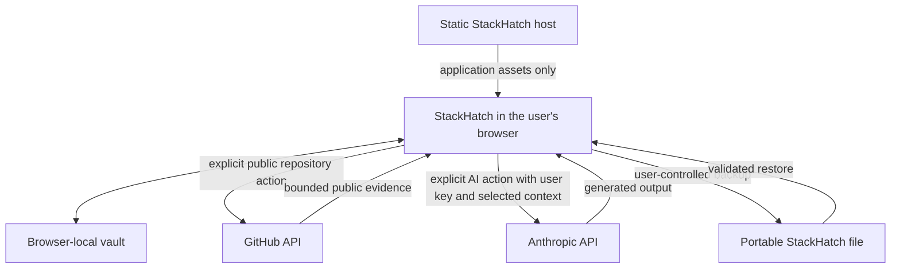
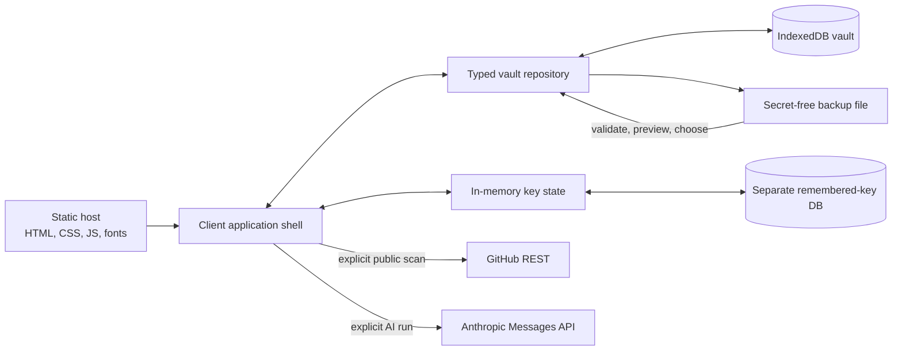
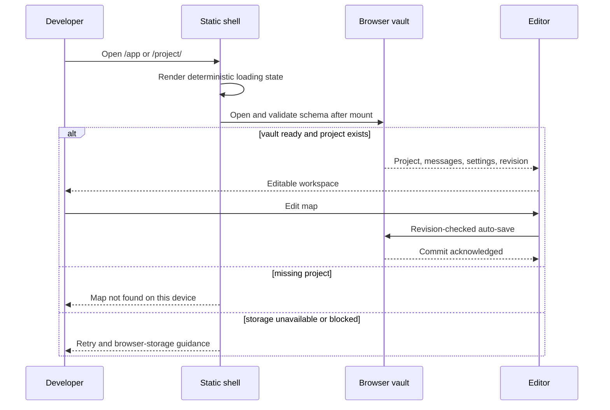
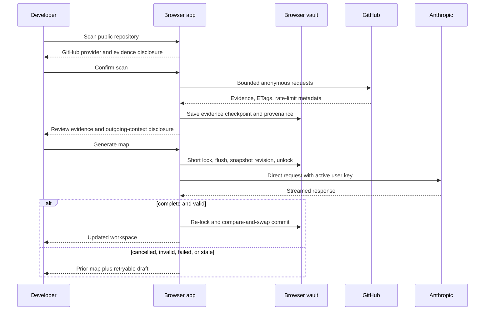
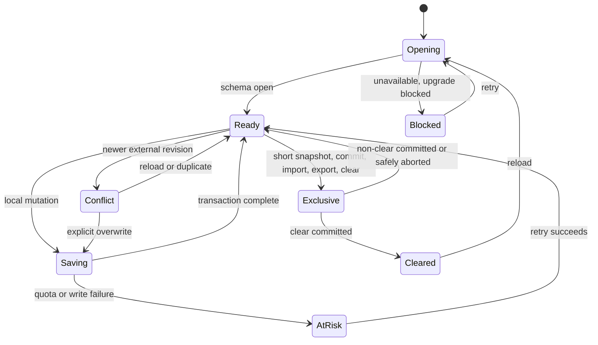
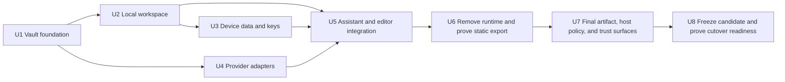

# Local-First Privacy Architecture - Plan

## Goal Capsule

- **Objective:** Convert StackHatch from an account-backed hosted service into a static, local-first browser application that never receives users' keys, repository contents, prompts, maps, projects, or messages.
- **Product authority:** The individual developer owns all application data in their browser. StackHatch serves application assets, while user-initiated provider requests travel directly from the browser to GitHub or Anthropic.
- **Execution profile:** Cross-cutting refactor across persistence, routing, provider execution, application surfaces, deployment, documentation, and automated browser verification.
- **Stop conditions:** Stop rather than weaken R1-R33 if the supported production origin cannot serve a strict static artifact, provider CORS becomes unavailable, or destructive cutover scope cannot be resolved exactly.
- **Tail ownership:** The executor owns implementation through the Verification Contract and documentation handoff. Production database, backup, volume, OAuth, analytics, and secret deletion remain a separately authorized human cutover.
- **Open blockers:** None.

**Product Contract preservation:** R1-R33, A1-A5, F1-F6, and AE1-AE10 retain their confirmed meaning and stable IDs; planning adds edge-case examples and implementation decisions without weakening them.

---

## Product Contract

### Summary

Implement StackHatch as a versioned IndexedDB workspace behind a typed local repository, a direct browser-provider coordinator, and a static exported shell.
Remove the account, API, database, analytics, and writable-runtime surfaces rather than leaving dormant server paths, while preserving the current editor, assistant, repository-evidence, template, and export capabilities.

### Problem Frame

StackHatch currently provisions GitHub-authenticated users, stores account and project data in SQLite, retains encrypted Anthropic keys, and proxies AI and repository-analysis work through its server.
That model creates secret management, database, backup, deletion, authentication, migration, and account-support obligations that work against the product's free open-source positioning.

The change is motivated by a stronger open-source identity and lower operational burden.
Privacy becomes a product property that follows from the architecture rather than a promise enforced by operator process.

### Actors

- A1. **Individual developer:** Creates maps, supplies provider credentials, decides what leaves the browser, and owns backups.
- A2. **StackHatch browser application:** Runs the product, stores local state, and makes user-initiated direct requests.
- A3. **Anthropic:** Receives the API key and selected project context only when A1 invokes an AI feature.
- A4. **GitHub:** Receives public repository requests only when A1 starts repository analysis.
- A5. **Static host:** Serves StackHatch assets and may process minimized network metadata under the host's own infrastructure policy.

### Key Decisions

- **Remove StackHatch from the content path.** (session-settled: user-directed — chosen over a stateless StackHatch relay: the operator must never receive keys or content.) Governs R1, R5, R18, R20.
- **Use a browser vault as the product's source of truth.** (session-settled: user-directed — chosen over file-first storage, hosted sync, or a desktop client: the website should remain immediately usable with less operational burden.) Governs R7-R12.
- **Keep keys ephemeral by default.** (session-settled: user-directed — chosen over always remembering or never remembering keys: session-only is the safe default while device storage remains an explicit convenience.) Governs R13-R17.
- **Make a clean production cutover.** (session-settled: user-directed — chosen over migrating existing accounts and projects: no hosted user data needs to be preserved.) Governs R27-R29.
- **Operate without application telemetry.** (session-settled: user-directed — chosen over aggregate analytics or removing the hosted app: the product will collect no application data while remaining instantly accessible.) Governs R2-R6.
- **Keep self-hosting community-led for now.** (session-settled: user-directed — chosen over polished self-hosting instructions and downloadable releases: the migration should focus on the hosted browser product.) Governs R32.
- **Use anonymous public GitHub access initially.** (session-settled: user-approved — chosen over requesting a user GitHub token: rate limits are preferable to introducing another remembered secret.) Governs R20-R22.

### Requirements

**Privacy and deployment**

- R1. StackHatch must be deliverable as static application assets with no application server that receives or processes user content or provider credentials.
- R2. The product must have no user accounts, authentication flow, application sessions, account cookies, user profiles, or account ownership concepts.
- R3. StackHatch infrastructure must not persist projects, maps, messages, templates, preferences, repository evidence, prompts, generated output, or provider keys.
- R4. The product must not include application analytics, telemetry, automatic event capture, remote crash reporting, behavioral cookies, or content logging.
- R5. Executable runtime assets must come from the StackHatch origin, and automated cross-origin requests may occur only for a user-visible provider action covered by R18 or R20.
- R6. The privacy disclosure must distinguish application data, which StackHatch does not receive, from minimized network metadata processed by the static host.

**Local data**

- R7. The browser vault must persist projects, canvas state, messages, personal templates, model and theme preferences, custom subtypes, repository scan provenance, and last-opened-project state on the current device.
- R8. Local edits must auto-save without requiring an account or manual save action, and the product must surface recoverable storage or quota failures.
- R9. Users must be able to export one project or all local application data in a portable, versioned StackHatch backup.
- R10. Import must show a validated preview and require a non-destructive restore choice before changing local data.
- R11. Provider credentials must never appear in project or full-vault exports.
- R12. The product must explain that browser data can be cleared by the browser or device and must make backup actions easy to find from the project list and settings.

**Provider credentials**

- R13. An Anthropic key must remain in memory by default and be forgotten when the browser session ends.
- R14. "Remember on this device" must be an explicit opt-in that explains the risk of storing a reusable credential in browser-controlled storage.
- R15. Remembered and session-only key states must be visibly distinguishable without revealing the credential.
- R16. Users must be able to forget the active and remembered key in one action.
- R17. The product must never describe browser-side key storage as server-encrypted or operator-protected.

**Provider flows**

- R18. AI generation, chat, architecture revision, and PRD export must call Anthropic directly from the browser after an explicit user action.
- R19. Each Anthropic action must make clear that the selected context leaves the device for Anthropic and is governed by Anthropic's terms and privacy practices.
- R20. Public repository discovery and evidence collection must call GitHub directly from the browser without a StackHatch or user-supplied GitHub token.
- R21. Public repository analysis must preserve the current bounded-evidence behavior and must not imply that a generated map is a complete codebase audit.
- R22. GitHub rate limiting must produce a recoverable state that explains when the user can retry or choose another creation method.
- R23. Private GitHub repository authentication is not part of the initial local-first conversion.

**Product experience**

- R24. A new visitor must be able to enter the application and create a map without signing in.
- R25. Blank maps, requirements-file starts, public-repository starts, and personal templates must remain available without an account.
- R26. The product list, editor, assistant, template management, settings, resume behavior, and export flows must use the browser vault rather than remote ownership checks.
- R27. Account, sign-in, sign-out, account deletion, expired-session recovery, and account-support interfaces must be removed.
- R28. Device settings must replace account settings and must include local storage status, backup, restore, clear-local-data, key-memory, model, theme, and custom subtype controls.
- R29. Landing, privacy, terms, documentation, and in-product trust copy must describe the local-first data flow accurately and must not retain account-backed claims.

**Cutover and operations**

- R30. The privacy-first release is a clean reset with no application migration or recovery path for the existing hosted database.
- R31. The operator must remove the legacy hosted database, application secrets, persistent data volume, server-only user-data routes, and old backups according to a documented cutover procedure.
- R32. The supported deployment must require no database, authentication secret, key-encryption secret, server GitHub token, analytics configuration, or writable application data volume.
- R33. Source code remains publicly available, but polished self-hosting documentation, downloadable builds, and platform-specific installers are not deliverables of this work.

### Data Flow

No project-content, credential, analytics, or recovery-data path terminates at StackHatch infrastructure.

### Key Flows

- F1. First launch
  - **Trigger:** A1 opens StackHatch in a new browser profile.
  - **Actors:** A1, A2, A5
  - **Steps:** The static app loads, initializes an empty local vault, explains local ownership, and offers the four creation methods.
  - **Outcome:** A1 reaches a usable application without authentication.
  - **Covers:** R1-R7, R24-R25

- F2. Local map creation and editing
  - **Trigger:** A1 creates or opens a project.
  - **Actors:** A1, A2
  - **Steps:** The browser reads the project from the vault, applies edits, auto-saves revisions, and records resume state locally.
  - **Outcome:** Reloading the application restores the latest confirmed local state.
  - **Covers:** R7-R8, R24-R26

- F3. Anthropic setup and use
  - **Trigger:** A1 invokes an AI feature without an active key.
  - **Actors:** A1, A2, A3
  - **Steps:** A1 supplies a key, chooses whether to remember it on the device, reviews the provider disclosure, and starts the request.
  - **Outcome:** The browser calls Anthropic directly and stores returned output in the local project.
  - **Covers:** R13-R19

- F4. Public repository analysis
  - **Trigger:** A1 enters a public GitHub repository URL.
  - **Actors:** A1, A2, A3, A4
  - **Steps:** The browser gathers bounded public evidence from GitHub, reports partial or rate-limited evidence, and sends selected evidence to Anthropic only after A1 proceeds.
  - **Outcome:** The generated map and scan provenance remain in the browser vault.
  - **Covers:** R18-R23, R25-R26

- F5. Backup and restore
  - **Trigger:** A1 exports one project or the full vault, or imports a prior backup.
  - **Actors:** A1, A2
  - **Steps:** Export omits provider keys; import validates the file, previews its contents, and avoids silent replacement.
  - **Outcome:** A1 can move or recover work without a StackHatch account or server.
  - **Covers:** R9-R12

- F6. Clear local data
  - **Trigger:** A1 chooses to clear StackHatch data on the device.
  - **Actors:** A1, A2
  - **Steps:** The app explains what will be removed, offers a backup first, requires confirmation, and deletes vault data plus any remembered credential.
  - **Outcome:** No StackHatch application data remains in the browser profile.
  - **Covers:** R12, R16, R28

### Acceptance Examples

- AE1. **Covers R2, R7, R24-R26.** Given a fresh browser profile, when a developer opens StackHatch and creates a blank map, then no sign-in appears and reloading restores the map from local storage.
- AE2. **Covers R13-R16.** Given a session-only Anthropic key, when the browser session ends and StackHatch opens again, then the key is absent while local projects remain.
- AE3. **Covers R14-R16.** Given a key remembered on the device, when the developer chooses "Forget key," then the active and remembered key disappear without deleting projects.
- AE4. **Covers R1, R5, R18-R20.** Given a developer creates and edits a map without invoking a provider, when network activity is inspected, then StackHatch sends no project content and makes no analytics request.
- AE5. **Covers R18-R19.** Given a developer starts an AI action, when the request is sent, then it travels from the browser to Anthropic and the interface identifies the context being shared.
- AE6. **Covers R20-R23.** Given GitHub's anonymous API limit is exhausted, when repository analysis starts, then the app preserves current local work and offers a recoverable retry or another creation method.
- AE7. **Covers R9-R11.** Given an exported full-vault backup, when it is inspected and imported into a new browser profile, then projects, templates, messages, and preferences restore while no Anthropic key is present.
- AE8. **Covers R10.** Given an import contains a project identifier already present locally, when the user restores it, then existing work is not silently overwritten.
- AE9. **Covers R12, R16, R28.** Given local projects and a remembered key, when the developer clears all local data and confirms, then both project data and the credential are removed from that browser profile.
- AE10. **Covers R27, R32.** Given the privacy-first production release, when all public and application routes are exercised, then no account flow or user-data API remains and the deployment runs without database or application-secret configuration.
- AE11. **Covers R7-R8, R12, R24.** Given IndexedDB is unavailable or a vault upgrade is blocked, when StackHatch initializes, then it does not offer a volatile map with a false auto-save promise and instead shows a recoverable storage state.
- AE12. **Covers R7-R8, R26.** Given two tabs have opened the same project, when one tab advances the project revision while the other has edits, then auto-save pauses and the second tab can reload, duplicate its snapshot, or explicitly overwrite rather than losing work silently.
- AE13. **Covers R13, R18-R19, R26.** Given an Anthropic stream is cancelled, interrupted, or returns invalid architecture output, when the run terminates, then the prior map remains authoritative, partial generated output is not committed, and the prompt remains available for an explicit retry.
- AE14. **Covers R18-R22, R25-R26.** Given a public repository scan completes without an Anthropic key, when evidence is ready, then the project retains bounded evidence and provenance locally and sends nothing to Anthropic until the developer reviews the disclosure and chooses to generate.
- AE15. **Covers R9-R11.** Given a backup has an unsupported future format, invalid references, or a failed checksum, when it is selected for import, then StackHatch rejects it before mutation and leaves the current vault unchanged.
- AE16. **Covers R1-R3, R24-R26.** Given a static editor URL identifies a project that is absent on this device, when it opens, then the app shows a local “map not found” state with library and creation actions rather than creating or requesting that identifier remotely.
- AE17. **Covers R5, R18-R20.** Given a fresh application document, when the developer starts the first GitHub or Anthropic action, then the app identifies the provider and outgoing context before dispatch; later actions retain a visible reminder and no durable consent record.

### Success Criteria

- A complete create-edit-chat-export-return flow works without an account or application backend.
- Reloading restores local work, and an export/import round trip preserves all non-secret user content.
- Provider and network inspection demonstrates that user content leaves the browser only for an explicit GitHub or Anthropic action.
- The production deployment has no database, persistent application-data volume, authentication secret, key-encryption secret, analytics script, or operator provider token.
- Landing and trust copy let a reasonable user understand what stays local, what reaches providers, and what the static host may observe.
- Removing hosted persistence measurably eliminates account administration, backup, deletion-request, data-migration, and secret-rotation operations.

### Scope Boundaries

**Deferred for later**

- Private repository access or a user-supplied GitHub token
- Cross-device sync or user-owned cloud storage
- Passphrase-encrypted local vaults
- Installable PWA or offline application shell
- Polished self-hosting guides and downloadable versioned builds

**Outside this product's identity**

- StackHatch-hosted accounts, project storage, provider-key storage, or recovery
- A StackHatch AI or repository proxy, including a stateless relay
- Application analytics, behavioral telemetry, or content-bearing support diagnostics
- A desktop application maintained alongside the browser product

### Dependencies and Assumptions

- Anthropic continues to support explicit browser use of its TypeScript SDK, with the user accepting that active application JavaScript can access the key.
- GitHub continues to support cross-origin browser requests and unauthenticated access to public repository endpoints, subject to rate limits.
- Supported browsers provide durable local storage, while users retain responsibility for browser-profile deletion and backups.
- The static host can disable application analytics and minimize access-log collection and retention.
- The production database contains no user work that requires migration before deletion.

### Outstanding Questions

**Resolved During Planning**

- IndexedDB supplies the canonical vault, with revisioned records, short transactions, storage-status reporting, and cross-tab coordination.
- A discriminated, checksummed JSON envelope supplies project and full-vault backup; unknown future versions fail closed and conflicts default to keeping both.
- A single exported editor shell uses URL fragments for device-local identifiers, so static-host requests do not carry project IDs or repository start context.
- The production static host supplies a hash-compatible script policy, a provider-only connection allowlist, no application access log, and no writable data volume.
- A human-gated cutover runbook owns database, backup, volume, secret, OAuth, analytics, and legacy-route retirement after the static artifact passes verification.

**Deferred to Implementation**

- Tune presentation copy, storage-warning thresholds, and import file-size limits without changing the decisions above.

### Sources and Research

- `src/lib/auth-config.ts` and `src/proxy.ts` establish the current GitHub OAuth, user provisioning, JWT session, and route-gating model.
- `src/db/schema.ts`, `src/db/index.ts`, and `src/app/api/settings/route.ts` establish current server persistence of accounts, projects, messages, settings, templates, resume state, and encrypted Anthropic keys.
- `src/lib/ai/stream-chat.ts`, `src/app/api/projects/[id]/repo-scan/route.ts`, and `src/app/api/projects/[id]/export-prd/route.ts` establish current server-side provider processing.
- `src/lib/github-analyzer.ts` establishes bounded public repository evidence, private-repository rejection, and optional operator-token use.
- `src/lib/project-start.ts`, `src/lib/analytics.ts`, and `src/app/project/[id]/page.tsx` show that current browser storage is limited to narrow session and display preferences rather than canonical projects.
- `docs/plans/2026-07-22-001-feat-self-service-account-controls-plan.md` documents the account-backed operational model this plan supersedes.
- [Anthropic TypeScript SDK requirements](https://github.com/anthropics/anthropic-sdk-typescript#requirements) document that browser use is supported only through an explicit risk-bearing opt-in.
- [GitHub browser CORS documentation](https://docs.github.com/en/rest/using-the-rest-api/using-cors-and-jsonp-to-make-cross-origin-requests) documents cross-origin REST API support.

---

## Planning Contract

### Key Technical Decisions

- KTD1. Introduce one typed browser-vault repository over a versioned IndexedDB database. (session-settled: user-directed — chosen over file-first storage, hosted sync, or a desktop client: the browser remains the product while StackHatch leaves the data path.) The repository owns projects, messages, templates, device preferences, repository evidence, resume metadata, and provider-run metadata through short atomic transactions. Add `idb` as the promise-based adapter and `fake-indexeddb` as the unit-test driver rather than exposing raw event-based IndexedDB calls to components. Governs R7-R12, R24-R26.
- KTD2. Keep the active Anthropic key in module memory and place an opted-in remembered key in a separate credential database that the backup subsystem cannot enumerate. (session-settled: user-directed — chosen over always remembering or never remembering keys: session-only is safe by default while device storage is an explicit convenience.) The separation is structural, not a security boundary; same-origin JavaScript, browser extensions, and local device access can still expose the key. Forget atomically advances a persistent credential generation and deletes remembered storage; every provider dispatch revalidates that generation so a suspended or stale tab cannot reuse an invalidated key. Governs R11, R13-R17.
- KTD3. Replace arbitrary `/project/[id]` pages with one exported `/project/` client shell and encode the local project ID after `#`. (session-settled: user-approved — chosen over query parameters, dynamic paths, or host rewrites: fragments preserve reloadable links without sending local identifiers to the host.) Repository-start inputs also remain in browser state or fragments. Missing or malformed IDs render AE16 rather than creating a project implicitly. Governs R1-R3, R6, R24-R26.
- KTD4. Extend the existing revision coordinator with vault revision preconditions, persistent vault generations, browser invalidation, and cooperative locks. (session-settled: user-approved — chosen over silent last-writer-wins: a local-first trust promise cannot discard edits from another tab.) IndexedDB transactions remain authoritative; `BroadcastChannel` triggers rereads, and Web Locks serialize short snapshot, commit, import, export, clear, and schema-upgrade phases. Every mutation revalidates the vault generation, and clear permanently invalidates existing coordinators until reload. Acquire the global vault lock before any project lock; no path may reverse that order. A conflicting editor pauses persistence until the user reloads, duplicates, or explicitly overwrites. Governs R7-R10, R26.
- KTD5. Define a separate `stackhatch-backup` JSON envelope with a format version, export kind, creation time, application version, record revisions, payload, and SHA-256 corruption checksum over the exact serialized payload bytes. Single-project backups include that project, messages, bounded repository evidence, and provenance; full-vault backups additionally include templates, preferences, custom subtypes, and resume metadata. Both exclude the credential database, transient stream/request bodies, provider-run working state, and session state. Imports enforce byte, record, nesting, array, and string limits before or during parsing; reject unknown or prototype-polluting keys; validate fields and references independently of the forgeable checksum; render a non-executable preview; default collisions to “keep both”; and commit the selected result atomically. Governs R9-R12.
- KTD6. Use one browser provider-run coordinator for chat, initialization, repository generation, alternatives, and AI-assisted PRD generation. (session-settled: user-approved — chosen over automatic/background execution and partial-output persistence: provider disclosure and local-state integrity remain visible.) Each run flushes and captures a committed revision under a short project lock, records non-secret metadata, and releases the lock during network I/O. It obtains the key only at dispatch to the exact compiled Anthropic origin, streams into memory, then reacquires the lock and atomically commits valid output only if the expected project and vault generations still match. Cancellation, reload, network failure, invalid output, or a stale revision preserves the acknowledged map and leaves a retryable draft; opening or importing work never starts a provider request. Governs R5, R13-R19, R26.
- KTD7. Split repository mapping into an anonymous GitHub evidence phase and a separately confirmed Anthropic generation phase. Preserve the existing evidence limits, selection rules, commit provenance, partial warnings, and public/private ambiguity. Canonicalize only supported `github.com/{owner}/{repo}` inputs, construct encoded paths against one compiled GitHub API origin, refuse credentials/subdomains/ports and cross-origin redirects, and never follow response-provided URLs without revalidation. Remove `process.env`, `Buffer`, operator tokens, and browser-forbidden headers; expose retry timing from `Retry-After` and rate-limit headers, cache ETags/evidence locally, and never retry in the background. Governs R18-R23, R25-R26.
- KTD8. Build with Next.js `output: "export"` and serve only the generated static artifact from the existing production origin over HTTPS with HSTS. Runtime browser state initializes after mount behind a deterministic shell; no component imports an API, authentication, database, operator, or server-secret module. The host supplies a build-derived, deny-by-default policy for scripts, connections, images, fonts, media, frames, forms, objects, base URLs, framing, manifests, and workers; only exact self-origin assets plus Anthropic and GitHub connections are allowed. Apply the policy, `Referrer-Policy: no-referrer`, static cache rules, and disabled application access logging to normal, legacy, error, and not-found routes. Prohibit raw-HTML sinks and enable Trusted Types where the final dependency graph is compatible. Governs R1-R6, R30-R32.
- KTD9. Delete the server surface after all callers use the browser repository and provider coordinator. Remove API routes, Auth.js, SQLite/Drizzle, account/operator utilities, analytics, server-only provider paths, server runtime packaging, secrets, and writable volumes rather than preserving disabled compatibility code. (session-settled: user-directed — chosen over account/project migration: production is a clean reset with no hosted recovery path.) Cutover uses one immutable verified artifact: stop and isolate every legacy ingress and writer, expire every legacy cookie variant, revoke OAuth/session capability, switch traffic, verify the live origin for 60 minutes, then require fresh exact-target authorization and an independent witness before destroying data, backups, logs, volumes, images, and secrets. Before destruction, fallback is limited to the verified static artifact or a holding page; the account-backed runtime never restarts. Governs R1-R4, R27, R30-R33.
- KTD10. Preserve assistant context and action parity inside the current project while keeping human-only controls outside assistant authority. The assistant reads the latest committed canvas, transcript, custom subtype vocabulary, and selected repository evidence through the same browser workspace as manual editing. Key entry, remember/forget, provider consent, import conflict choices, backup, and clear-data confirmation remain human actions; unrelated projects and templates never enter assistant context. Governs R9-R11, R13-R19, R26, R28.
- KTD11. Replace account/email support with static help and GitHub community links while retaining concise Privacy and Terms pages. (session-settled: user-approved — chosen over an account-support mailbox or removing trust pages entirely: it lowers operational burden while preserving honest provider and host disclosures.) Security reports continue through `SECURITY.md`; ordinary product help carries no promise of private content-bearing support. Governs R6, R27, R29, R33.

### High-Level Technical Design

These sketches fix boundaries and sequencing, not class names or exact APIs.

Provider operations have a separate lifecycle: `idle → disclosed → running → completed | failed |
cancelled | stale`. Only `completed` may attempt a revision-checked vault commit; the other terminal
states leave repository health unchanged.

### Implementation Constraints

- Preserve the current production origin. IndexedDB is origin-scoped, so an origin change would strand the new local vault and contradict the supported browser experience.
- Initialize `indexedDB`, `navigator.storage`, `BroadcastChannel`, Web Locks, and credential state only after client mount. Static/build rendering must not infer user state.
- Treat `transaction.complete`, not request success or optimistic UI, as the persistence acknowledgement.
- Do not await unrelated network or UI work inside an IndexedDB transaction.
- Request persistent storage only after a meaningful user gesture, report whether it was granted, and continue to promote backups because persistence never protects against user clearing.
- Do not claim remembered-key encryption. If no user-held passphrase exists, browser-side ciphertext and its colocated key would be security theater.
- Pin GitHub’s REST version in browser requests and use the headers GitHub exposes through CORS. Do not depend on setting `User-Agent`.
- Use the Anthropic SDK’s browser opt-in and exported error/status types. Do not add a second uncontrolled retry loop around SDK retries.
- Keep diagram JSON/YAML/PNG/SVG exports distinct from recoverable StackHatch project/vault backups.
- Preserve sanitization for model, repository, and imported strings. No backup or provider content may enter executable HTML.
- Keep dependency direction one-way: domain schemas have no browser or provider imports; the vault repository depends only on domain and storage adapters; provider adapters depend only on neutral request/response contracts; the provider-run application service depends on repository, key, and provider ports; UI depends on those facades.
- Compile exact provider origins into the adapters. User, imported, repository, and model data may supply identifiers or content but never a host, redirect target, credential destination, or executable URL.
- Production deletion commands must resolve exact application targets and require separate authorization; implementation and tests may create the runbook but must not execute the destructive cutover.

### System-Wide Impact

| Surface             | Change                                                                       | Failure propagation                                                                        |
| ------------------- | ---------------------------------------------------------------------------- | ------------------------------------------------------------------------------------------ |
| Persistence         | SQLite ownership becomes origin-scoped IndexedDB records                     | Open, upgrade, quota, conflict, and transaction failures become visible application states |
| Routing             | Dynamic authenticated project routes become static fragment-addressed shells | Missing local IDs stay local and offer recovery navigation                                 |
| Assistant           | Server SSE/database orchestration becomes a browser run coordinator          | Partial streams remain transient; stale or failed runs cannot overwrite the map            |
| Repository analysis | Server token and Node helpers disappear                                      | Anonymous rate limits become expected, timed, retryable states                             |
| Settings            | Account settings become device settings plus storage/key controls            | Remember/forget and clear-data failures cannot be reported as success prematurely          |
| Backup              | New local portability boundary spans related stores                          | Invalid or future backups fail before mutation; conflicts require a choice                 |
| Public trust        | Account, encryption, analytics, and support claims are removed               | Copy must distinguish local app data, static-host metadata, and provider processing        |
| Deployment          | Node runtime and writable volume become static files plus host headers       | A build or host-policy regression is release-blocking                                      |
| Tests               | DB/auth fixtures become browser-vault and provider-origin fixtures           | Browser network assertions become the privacy proof                                        |

### Risks and Dependencies

| Risk or dependency                                             | Mitigation and exit signal                                                                                                                        |
| -------------------------------------------------------------- | ------------------------------------------------------------------------------------------------------------------------------------------------- |
| Active browser JavaScript can read a remembered key            | Self-origin executable assets, strict script policy, no telemetry/plugins, explicit risk copy, session-only default, and key-exclusion tests      |
| Browser storage is cleared, evicted, private, or unavailable   | Storage-status UI, persistence request, quota handling, prominent backups, blocked initialization state, and fresh-profile tests                  |
| Two tabs or late provider output overwrite newer work          | Expected revisions, cooperative locks, invalidation rereads, mutation barriers, and AE12/AE13 coverage                                            |
| A stale tab recreates cleared data or uses a forgotten key     | Persistent vault/credential generations revalidated on every write and provider dispatch; clear invalidates coordinators until reload             |
| Static export retains a hidden server dependency               | Build fails on dynamic features; artifact audit rejects API/server/auth/database references and runtime secrets                                   |
| GitHub anonymous budget is exhausted quickly                   | Preserve bounded evidence, serialize/cache requests, use ETags, expose retry timing, retain partial checkpoints, and offer other creation methods |
| Anthropic changes browser or model support                     | Pin the SDK/model contract, keep provider errors typed, and make CORS/browser smoke tests release gates                                           |
| Static CSP hashes drift with build output                      | Generate policy material from the final artifact and exercise every route under enforcement before release                                        |
| Import accepts hostile or incompatible data                    | File-size guard, strict schemas, reference checks, checksum, in-memory migration, preview, atomic commit, and sanitization                        |
| Untrusted content uses a non-fetch exfiltration channel        | Deny-by-default policy across all resource and egress directives, exact provider origins, non-executable rendering, and hostile-payload tests     |
| Clean cutover removes data or secrets outside StackHatch scope | Exact-target inventory, named approver/witness, deletion evidence, and no destructive automation in the implementation run                        |

### Operational and Documentation Notes

- Keep `stackhatch.io` as the supported origin and deploy the exported artifact before retiring the old runtime.
- The static deployment must expose only same-origin assets and provider connections. Disable the application container’s access log; document any unavoidable CDN/TLS metadata and retention separately.
- Legacy account, auth callback, and API URLs return a generic static not-found/retired response with no identifiers or recovery promises.
- The cutover runbook inventories the SQLite database plus WAL/SHM files, `shastack-data` volume, backups, operator artifacts, OAuth application, encryption/auth/GitHub secrets, Umami configuration, old container image, and host log policy.
- Before the irreversible gate, quiesce the legacy runtime and record its database fingerprint, schema and safe record counts, WAL/SHM files, volume consumers, backups/snapshots, alternate hosts and direct ports, cookies, OAuth/session capability, secrets, analytics, images, and every CDN/TLS/application log plane. Unexpected user data, shared resources, target drift, or unresolved ownership is a stop condition.
- Record the source revision plus static-artifact, CSP, and host-policy digests. Deploy those exact bytes without rebuilding, compare production-served assets and headers to the manifest, and redact credentials and content from all evidence.
- Assign a release commander, deployment operator, privacy reviewer, data custodian, independent witness, and evidence location before traffic changes.
- Rollback restores only a previously verified static artifact. It must not restart the account-backed service or restore hosted user data after the destructive gate.
- Mark account-backed PRDs and plans as historical/superseded where they otherwise read as current product documentation.

---

## Implementation Units

### U1. Establish the browser vault and domain repository

- **Goal:** Create the canonical transactional storage boundary for every non-secret local record.
- **Requirements:** R7-R12, R24-R26; F1, F2, F5, F6; AE1, AE7-AE12, AE15.
- **Dependencies:** None.
- **Files:** `package.json`, `package-lock.json`, `src/lib/id.ts`, `src/lib/canvas-persistence.ts`, `src/lib/vault/schema.ts`, `src/lib/vault/indexed-db.ts`, `src/lib/vault/repository.ts`, `src/lib/vault/coordination.ts`, `src/lib/vault/storage-status.ts`.
- **Test files:** `src/lib/vault/schema.test.ts`, `src/lib/vault/indexed-db.test.ts`, `src/lib/vault/repository.test.ts`, `src/lib/vault/coordination.test.ts`, `src/lib/vault/storage-status.test.ts`, `src/lib/canvas-persistence.test.ts`.
- **Approach:** Implement KTD1 and the transaction/revision portion of KTD4. Port the camelCase record shapes from the current schema, retain UUID generation, preserve the revision coordinator’s ordered/coalesced writes, and replace authentication/keepalive assumptions with commit-aware vault errors. Add persistent vault generations, migrations, cascade operations across stores, version-change close behavior, blocked-upgrade reporting, storage estimates, and injectable database factories for tests. Enforce the Planning Contract dependency direction so storage cannot import UI or provider modules.
- **Test scenarios:** Fresh schema and sequential upgrade; project/message/evidence/provenance atomic write and rollback; cascade delete; last-opened resolution; ordered auto-save retry after failure; quota/security/unavailable normalization; blocked upgrade; external revision notification; stale expected revision/generation rejection; import-boundary audit.
- **Verification:** Repository tests prove no partial logical mutation commits and the coordinator remains dirty after any failed write.

### U2. Move navigation and core workspace flows onto local state

- **Goal:** Make first launch, project list, creation, resume, templates, and static direct links work without auth or APIs.
- **Requirements:** R1-R3, R7-R8, R12, R24-R27; F1-F2; AE1, AE4, AE11-AE12, AE16.
- **Dependencies:** U1.
- **Files:** `src/app/app/page.tsx`, `src/app/app/maps/page.tsx`, `src/app/project/new/page.tsx`, `src/app/project/[id]/page.tsx` (move to `src/app/project/page.tsx`), `src/components/AppResolver.tsx`, `src/components/AllMapsPage.tsx`, `src/components/projects/ProjectStartWorkspace.tsx`, `src/components/templates/TemplatePicker.tsx`, `src/lib/app-route.ts`, `src/lib/project-start.ts`, `src/lib/project-resume.ts`.
- **Test files:** `src/app/app/page.test.tsx`, `src/app/app/maps/page.test.tsx`, `src/app/project/new/page.test.tsx`, `src/app/project/page.test.tsx`, `src/components/AppResolver.test.tsx`, `src/components/AllMapsPage.test.tsx`, `src/components/projects/ProjectStartWorkspace.test.tsx`, `src/components/templates/TemplatePicker.test.tsx`, `src/lib/app-route.test.ts`, `src/lib/project-start.test.ts`, `src/lib/project-resume.test.ts`.
- **Approach:** Implement KTD3 with a deterministic loading shell and fragment parser. Replace fetches with the vault facade, initialize only after mount, permit every non-provider creation method without a key, and keep repository/requirements starts as explicit staged project states instead of automatic provider triggers. Preserve loading, empty, delete-confirmation, responsive, and accessible navigation behavior.
- **Test scenarios:** Fresh visitor creates a blank map; requirements and template starts persist; local resume chooses the last valid project; direct refresh opens a hash-addressed project; unknown/cleared IDs show AE16; storage initialization failure blocks creation; project list/delete reflects cross-tab invalidation; no route performs a provider request on load.
- **Verification:** Route and component tests use injected vault facades rather than API mocks, and a source search finds no `/api` call in the migrated workspace surfaces.

### U3. Add device settings, key lifecycle, backup, restore, and clear-data controls

- **Goal:** Give the device owner transparent control over local durability, portability, credentials, preferences, and deletion.
- **Requirements:** R7-R17, R28; F3, F5-F6; AE2-AE3, AE7-AE9, AE11-AE12, AE15, AE17.
- **Dependencies:** U2.
- **Files:** `src/app/settings/page.tsx`, `src/components/settings/CustomSubtypesSettings.tsx`, `src/components/settings/AccountDeletionSettings.tsx` (replace with `src/components/settings/DeviceDataSettings.tsx`), `src/components/canvas/ExportDropdown.tsx`, `src/components/AllMapsPage.tsx`, `src/lib/provider-key.ts`, `src/lib/vault/backup.ts`, `src/lib/vault/clear.ts`.
- **Test files:** `src/app/settings/settings-page.test.tsx`, `src/app/settings/settings-theme.test.tsx`, `src/components/settings/CustomSubtypesSettings.test.tsx`, `src/components/settings/DeviceDataSettings.test.tsx`, `src/components/canvas/ExportDropdown.test.tsx`, `src/lib/provider-key.test.ts`, `src/lib/vault/backup.test.ts`, `src/lib/vault/clear.test.ts`.
- **Approach:** Implement KTD2 and KTD5. Keep session keys outside React-rendered state after entry, distinguish absent/session/remembered status, acknowledge durable remember only after commit, and make credential generations authoritative across tabs. Add project and full-vault backup actions, enforce resource limits before preview, validate/resolve import before the exclusive commit, render preview data as text, keep diagram exports distinct, request persistent storage from user actions, and replace account deletion with exact device-data clearing plus backup-first confirmation. Clear advances the vault generation, closes/deletes owned databases, and invalidates existing coordinators.
- **Test scenarios:** Reload forgets a session key but retains projects; remembered key restores and forget invalidates a suspended tab; remember/delete failures remain visible; backup bytes and diagnostic objects contain no key; project/full round trips preserve bounded evidence; unknown version, forged checksum, excessive size/depth/count, prototype key, unsafe URL/event-handler, and invalid reference rejection; non-executable preview; keep-both/skip/replace conflicts; atomic import failure; blocked multi-tab clear; stale tab cannot write after clear; successful clear removes all StackHatch-owned storage and returns to first launch.
- **Verification:** Secret-exclusion fixtures inspect serialized bytes, and destructive tests confirm success is shown only after every owned store is absent on reopen.

### U4. Build browser-safe GitHub and Anthropic adapters

- **Goal:** Provide direct, bounded, typed provider primitives without application-server participation.
- **Requirements:** R5, R13-R23; F3-F4; AE4-AE6, AE13-AE14, AE17.
- **Dependencies:** U1.
- **Files:** `src/lib/github-analyzer.ts`, `src/lib/ai/browser-client.ts`, `src/lib/ai/provider-errors.ts`, `src/lib/ai/context-builder.ts`, `src/lib/ai/default-prompts.ts`, `src/lib/ai/models.ts`, `src/lib/ai/output-parser.ts`, `src/lib/ai/request-context.ts`, `src/lib/ai/system-prompt.ts`.
- **Test files:** `src/lib/github-analyzer.test.ts`, `src/lib/ai/browser-client.test.ts`, `src/lib/ai/provider-errors.test.ts`, and the existing pure AI module tests.
- **Approach:** Implement the adapter portions of KTD6-KTD7 behind neutral domain contracts. Make repository decoding, exact-origin path construction, redirect handling, headers, timeouts, ETags, rate metadata, request queueing, and error shapes browser-safe while preserving evidence selection and partial warnings. Construct the Anthropic client only through the exact compiled origin with browser opt-in, consume SDK streams with an AbortSignal, normalize exported error/status types, and keep accumulated output transient until parsing and validation succeed.
- **Test scenarios:** Exact anonymous GitHub request surface; credentials/subdomains/ports and cross-origin redirects rejected; response-provided URLs cannot create requests; bounded complete/partial scans; ETag reuse; malformed response; unavailable/private ambiguity; primary and secondary rate limits with retry clocks; Anthropic constructor opt-in; key appears only in the expected header to the exact Anthropic origin; successful delta accumulation; abort; mid-stream failure; typed auth/billing/permission/rate/transient errors; invalid architecture output; request IDs; no secret in errors or logs.
- **Verification:** Adapter tests prove calls target only official provider origins and do not read server environment variables or persist credentials.

### U5. Integrate direct provider runs with the editor and assistant

- **Goal:** Preserve chat, generation, re-scan, alternatives, and PRD behavior through the shared local workspace.
- **Requirements:** R7-R8, R13-R23, R25-R26; F2-F4; AE4-AE6, AE13-AE14, AE17.
- **Dependencies:** U2, U3, U4.
- **Files:** `src/app/project/page.tsx`, `src/components/chat/ChatSidebar.tsx`, `src/components/canvas/AlternativesSection.tsx`, `src/components/canvas/ExportDropdown.tsx`, `src/lib/canvas-persistence.ts`, `src/lib/ai/provider-run.ts`, `src/lib/merge-architecture.ts`.
- **Test files:** `src/app/project/page.test.tsx`, `src/components/chat/ChatSidebar.test.tsx`, `src/components/canvas/ExportDropdown.test.tsx`, `src/lib/canvas-persistence.test.ts`, `src/lib/ai/provider-run.test.ts`, `src/lib/merge-architecture.test.ts`.
- **Approach:** Implement the application-service portions of KTD6 and KTD10. The coordinator depends on repository, key, and provider ports while those layers never import it. Flush and capture the latest revision under a short lock, release it for streaming, then reacquire and compare project/vault generations before committing the completed message/map/provenance in one transaction. Split GitHub disclosure and evidence review from Anthropic generation, preserve evidence after provider failure, use the latest committed canvas consistently for every AI action, and distinguish local diagram/backup exports from AI-assisted PRD generation.
- **Test scenarios:** No automatic init/scan on open or import; disclosure precedes the first GitHub or Anthropic request; later reminder; key prompt and remembered state; latest canvas/custom subtypes/locked nodes reach each AI action; editing remains available during network I/O; complete stream compare-and-swap commits once; cancel/network/invalid/stale output keeps the prior map and retryable prompt; provider failure after GitHub leaves evidence ready; stale generation blocks dispatch/commit; no duplicate message on retry; local exports make no provider call.
- **Verification:** Assistant tests prove context parity and human-only gates, while editor tests preserve ordered auto-save and locked-node semantics.

### U6. Remove accounts, APIs, database, analytics, and server runtime

- **Goal:** Make the privacy boundary true by deletion and dependency removal.
- **Requirements:** R1-R5, R27, R30-R33; F1-F6; AE4, AE10.
- **Dependencies:** U5.
- **Files:** Delete `src/app/api/`, `src/db/`, `drizzle/`, `drizzle.config.ts`, `src/proxy.ts`, auth/account/operator/database/secrets modules under `src/lib/`, `src/lib/ai/settings.ts`, the server form of `src/lib/ai/stream-chat.ts`, `src/lib/analytics.ts`, `src/types/next-auth.d.ts`, operator scripts, `src/app/login/`, account/auth/analytics components, and corresponding tests. Update `src/components/Providers.tsx`, `src/components/shells/AppPageActions.tsx`, `next.config.ts`, `package.json`, and `package-lock.json`.
- **Test files:** Update `src/app/layout.test.tsx`, `src/components/shells/PageShells.test.tsx`, and all migrated component tests; delete API/auth/database/operator/analytics tests and `e2e/real-auth-logout.test.ts`.
- **Approach:** Implement KTD9 only after all browser callers are covered. Remove tracking calls and wrappers rather than no-oping them; replace tracked source links with ordinary anchors; remove database, Auth.js, Drizzle, SQLite, operator-build, account, and `next start` dependencies/scripts. Switch to `output: "export"` here and require a successful provisional `out/` artifact before host-policy work begins. Retain historical plans but prevent current docs from presenting them as the live architecture.
- **Test scenarios:** Public and app shells contain no sign-in/out/account/profile/deletion UI; no client import reaches removed modules; no application API route exists; ordinary GitHub links remain usable; app startup sets no account cookie and emits no analytics request.
- **Verification:** Typecheck and static build resolve no removed dependency, `out/` is produced, and import/source/artifact audits find no layer inversion, auth callback, database, API, Umami, operator, encryption-secret, or GitHub-token runtime path.

### U7. Produce the static artifact, host policy, and accurate trust surfaces

- **Goal:** Ship only self-origin static assets with enforceable provider/network and operational boundaries.
- **Requirements:** R1-R6, R27, R29-R33; F1; AE4, AE10, AE16-AE17.
- **Dependencies:** U6.
- **Files:** `src/app/layout.tsx`, `src/app/page.tsx`, `src/app/privacy/page.tsx`, `src/app/terms/page.tsx`, `src/app/support/page.tsx`, `src/app/robots.ts`, `src/app/sitemap.ts`, `src/lib/github-stars.ts`, `Dockerfile`, `docker-compose.yml`, `.env.example`, `.env.local.example`, `scripts/verify-static-output.mjs`, static-host header/config assets, `README.md`, `SECURITY.md`, `docs/features.md`, `docs/launch-readiness.md`, `docs/operations/local-first-cutover.md`.
- **Test files:** `src/app/layout.test.tsx`, `src/app/page.test.tsx`, `src/app/privacy/page.test.tsx`, `src/app/terms/page.test.tsx`, `src/app/support/page.test.tsx`, plus static-artifact verification fixtures.
- **Approach:** Implement KTD8 and KTD11 after U6 proves static export. Remove runtime star fetching and third-party executable assets, keep bundled fonts/assets self-origin, rewrite landing/legal/help/docs around local ownership, direct providers, browser-data loss, host metadata, remembered-key risk, community support, and no migration, then rebuild the final `out/` artifact. Generate deny-by-default policy material from those final bytes and serve them without Node or a data volume.
- **Test scenarios:** Static metadata and public routes build deterministically; no sign-in/account/encrypted-server-key/analytics claims remain; Privacy distinguishes app, host, GitHub, and Anthropic; Terms describe user responsibility and generated-output limits; Help routes ordinary support to GitHub without requesting account/content data; policy blocks script, image, font, media, frame, form, worker, navigation, and connection exfiltration from hostile imported/provider/repository content; legacy/error/not-found routes carry the same headers; direct refresh works for every static route.
- **Verification:** The static verifier rejects server outputs, remote executable assets, unsafe connection origins, secret names, writable runtime requirements, and stale account/data-handling claims.

### U8. Prove the privacy boundary and complete the authorized cutover

- **Goal:** Reach a verifiable static-release-ready state, then complete R31 only through the separately authorized and witnessed production cutover.
- **Requirements:** R1-R33; F1-F6; AE1-AE17.
- **Dependencies:** U7.
- **Files:** `playwright.config.ts`, `e2e/helpers/sse-mock.ts`, `e2e/smoke.test.ts`, `e2e/full-flow.test.ts`, `e2e/new-project.test.ts`, `e2e/personal-tools.test.ts`, `e2e/error-paths.test.ts`, `e2e/launch-experience.test.ts`, `e2e/tierless-byok.test.ts`, `e2e/ui-polish.test.ts`, `docs/operations/local-first-cutover.md`.
- **Test files:** The listed Playwright suites become the final-artifact tests; remove auth/database fixtures and add provider-origin and vault helpers.
- **Approach:** Freeze the final post-U7 `out/` artifact and its host policy as the immutable candidate, then serve that exact candidate through the production-equivalent static configuration. Seed and clear IndexedDB through browser helpers, mock official provider origins, inspect network requests and browser storage, exercise compact/wide UI, and bind results to the source/artifact/policy digests. At the human gate, quiesce and inventory the legacy runtime; switch the real origin to the exact candidate; expire legacy cookies and revoke legacy session/OAuth capability; verify live routes, CORS, storage, egress, runtime absence, and logs for 60 minutes; then revalidate exact targets and request witnessed destruction authorization. Do not execute production deletion during automated work.
- **Test scenarios:** Fresh create-edit-reload-resume; requirements/template/repository starts; no-network blank editing; disclosure-before-provider; provider success/error/cancel; anonymous GitHub partial/rate-limit recovery; project/full backup round trip in a fresh profile; forged/hostile/resource-exhaustion import payloads; conflict preview; session versus remembered key; a suspended tab attempting provider dispatch after forget; a stale tab attempting writes after clear; cross-tab conflict/import/clear; quota/storage unavailable; unknown static project; hostile model/repository/import content causing no execution or third-party request; responsive/keyboard/accessibility regressions; no StackHatch data API, analytics, cookie, or remote executable request.
- **Verification:** Every acceptance example is covered by a named unit or browser scenario and the production-equivalent suite passes for the immutable candidate. Static release readiness is recorded before the human gate; production cutover completion is recorded only after live-origin checks and witnessed absence evidence.

---

## Verification Contract

| Gate                                         | Scope                                                                                                 | Required outcome                                                                                                               |
| -------------------------------------------- | ----------------------------------------------------------------------------------------------------- | ------------------------------------------------------------------------------------------------------------------------------ |
| `npm test`                                   | Co-located vault, provider, component, route, and pure-domain tests                                   | All tests pass with no DB/auth/API fixture                                                                                     |
| `npm run typecheck`                          | TypeScript client boundary and deleted server graph                                                   | No server-only or removed-package reference resolves                                                                           |
| `npm run lint`                               | Source and test quality                                                                               | No new lint error                                                                                                              |
| Changed-file Prettier check                  | Files touched by this plan                                                                            | All changed files pass; the separate repository-wide baseline task is not expanded into this refactor                          |
| `npm run build`                              | Next.js static export                                                                                 | `out/` is produced without dynamic runtime features                                                                            |
| Static artifact verifier                     | Exported HTML, JS, metadata, and host policy                                                          | No application API/server output, analytics, remote executable asset, runtime secret, or forbidden connection origin           |
| `npm run test:e2e`                           | Fast development browser suite                                                                        | Unit-integrated user flows pass in Chromium                                                                                    |
| Production-equivalent static Playwright gate | Built `out/` behind final host policy                                                                 | Direct refresh, CSP, vault, provider, and AE1-AE17 scenarios pass                                                              |
| Manual network/storage inspection            | Fresh and populated browser profiles                                                                  | Editing/backup contact no provider; explicit actions contact only GitHub or Anthropic; credentials never enter backup or logs  |
| Candidate manifest                           | Source revision, `out/`, CSP, and host policy                                                         | Digests are recorded once, no rebuild occurs, and production-served bytes/headers match                                        |
| Live production-origin verification          | New, hostile, and previously authenticated browser profiles                                           | Routes are static; old cookies/session/OAuth are inert; provider CORS works; no unexpected egress, runtime, mount, or log data |
| Cutover review                               | `docs/operations/local-first-cutover.md`                                                              | Exact inventory, owners, approver, witness, evidence location, log policy, stop/go criteria, and fallback are complete         |
| Destruction and absence evidence             | Revalidated database, WAL/SHM, volumes, backups, images, secrets, OAuth, analytics, ingress, and logs | Every authorized target is absent, every result is witnessed, and evidence contains no credential or user content              |

---

## Definition of Done

### Static Release Ready

- R1-R30, R32-R33, and AE1-AE17 are traceable to passing automated or named manual verification.
- The supported production artifact is static, origin-stable, self-contained, and usable without account, database, secret, or writable volume configuration.
- Project content, repository evidence, prompts, messages, templates, preferences, and provider credentials have no StackHatch infrastructure path.
- Browser storage failures, conflicts, provider failures, and destructive actions are recoverable and never claim success before confirmation.
- Landing, Help, Privacy, Terms, README, features, launch, security, and operations documentation describe the same architecture.
- Dead server code, unused dependencies, stale tests, abandoned migration experiments, and no-op compatibility shims are absent from the final diff.
- The immutable candidate, host policy, live-check plan, owners, evidence location, and exact inventory are ready; production destruction remains unexecuted until a user authorizes the revalidated targets.

### Production Cutover Complete

- R31 is complete only after the exact legacy ingress, cookies, session/OAuth capability, database plus WAL/SHM, writable volumes, backups/snapshots, images, application secrets, analytics configuration, and retained application-log data are witnessed absent.
- The real production origin serves the recorded static artifact and policy digests, passes provider and privacy checks, and has no Node process, database consumer, writable application mount, runtime secret, or alternate legacy ingress.
- The evidence record names the release commander, deployment operator, privacy reviewer, data custodian, independent witness, observation window, authorization, each target outcome, and the static-only fallback without recording credentials or user content.

### Per Unit

- U1 is done when every durable non-secret record has one typed transactional owner and storage failure/concurrency tests pass.
- U2 is done when all accountless creation, list, resume, template, and fragment-route flows read and write only the vault.
- U3 is done when storage status, backup/restore, remember/forget, preferences, and clear-data controls satisfy AE2-AE3, AE7-AE9, AE11-AE12, and AE15.
- U4 is done when browser-safe provider adapters preserve bounded evidence, typed errors, streaming cancellation, retry timing, and secret isolation.
- U5 is done when assistant and AI-export actions use the latest local workspace, explicit disclosure, atomic completion, and human-only gates.
- U6 is done when no account, API, database, analytics, operator, authentication-session, or server-provider surface remains in source or dependencies.
- U7 is done when the final export and host policy enforce the network boundary and every live trust surface states it accurately.
- U8 reaches static-release-ready when the immutable production-equivalent candidate and cutover package pass. It is fully done only after separate authorization, live-origin verification, and witnessed destruction/absence evidence satisfy R31.
